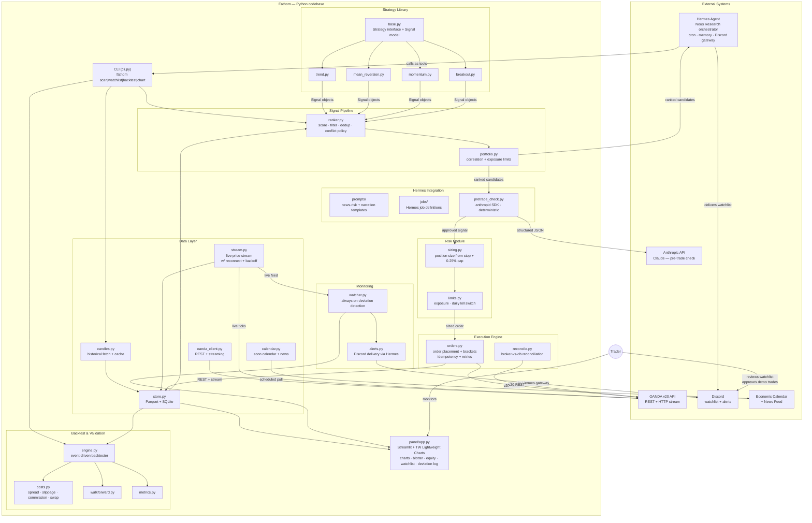

# Fathom — Architecture Overview

## Container Diagram



---

## Key Boundaries

### The Hermes Boundary
Hermes Agent orchestrates everything up to and including the ranked watchlist. It calls `fathom scan` / `fathom chart` as CLI tools, runs Claude to assess news/event risk and write rationale, and delivers the result to Discord. **Hermes's authority ends at the watchlist.** It never calls the execution engine or places orders. See [INV-01](invariants.md#inv-01--hermes-must-not-place-orders).

### The Claude Boundary
Claude is used in exactly two ways inside the Fathom pipeline:
1. **News/event-risk assessment** — inside Hermes sessions; produces a structured `{event_risk, reason, suggest_action}` JSON payload per pair.
2. **Pre-trade sanity check** — a deterministic call via the `anthropic` SDK immediately before order submission; a veto blocks the trade. Both return structured JSON; malformed → safe default (skip). See [INV-02](invariants.md#inv-02--all-claude-outputs-feeding-automation-must-be-structured-json-with-safe-defaults).

### The Risk Gate
Every signal from the ranker passes through `risk/sizing.py` (0.25% equity cap, stop-derived lot size) and `risk/limits.py` (exposure, correlation, daily kill switch) before reaching the execution engine. The gate is deterministic Python, fully unit-tested, and cannot be bypassed. See [INV-04](invariants.md#inv-04--every-trade-has-a-bracket-stop-loss--take-profit) and [INV-05](invariants.md#inv-05--per-trade-risk-capped-at-025-of-equity).

### The Demo/Live Switch
One code path; two endpoints. The `env: demo | live` switch in config selects the OANDA practice vs live endpoint and token. Only `oanda_client.py` reads this switch — no logic branches elsewhere. See [INV-09](invariants.md#inv-09--demo-and-live-share-one-code-path).

---

## Data Flow — Daily Watchlist Run

```
Hermes cron trigger
  → fathom scan
      → data layer refreshes candles + calendar
      → strategy library evaluates all approved (strategy, pair, timeframe) combos
      → signal ranker scores, filters, de-duplicates, applies portfolio limits
      → returns ranked candidate list
  → Hermes: Claude assesses news/event risk per candidate, writes rationale
  → fathom chart <pair> per surviving candidate
  → Hermes delivers ranked watchlist + charts to Discord
```

## Data Flow — Trade Execution (demo, Phase 4+)

```
Trader approves watchlist entry (on demo)
  → pretrade_check.py: final Claude sanity check via anthropic SDK
      → malformed or veto → abort
  → risk/sizing.py: lot size from stop distance + 0.25% equity cap
  → risk/limits.py: exposure + correlation + daily-loss checks
      → any limit breached → reject
  → execution/orders.py: submit bracket order to OANDA v20 REST
      → idempotent (client order ID); retries on network error
  → store.py: record fill
  → monitor/watcher.py: begins tracking against live stream
```

---

## Repository Layout

```
fathom/
├── CLAUDE.md
├── cli.py                         # fathom scan|watchlist|backtest|chart
├── pyproject.toml
├── .env.example
├── config/
│   └── settings.py                # pydantic config, demo/live switch
├── data/
│   ├── oanda_client.py
│   ├── candles.py
│   ├── stream.py
│   ├── calendar.py
│   └── store.py
├── strategies/
│   ├── base.py                    # Strategy interface + Signal model
│   ├── trend.py
│   ├── mean_reversion.py
│   ├── momentum.py
│   └── breakout.py
├── backtest/
│   ├── engine.py
│   ├── costs.py
│   ├── walkforward.py
│   └── metrics.py
├── signals/
│   ├── ranker.py
│   └── portfolio.py
├── hermes_integration/
│   ├── prompts/
│   ├── jobs/
│   └── pretrade_check.py
├── risk/
│   ├── sizing.py
│   └── limits.py
├── execution/
│   ├── orders.py
│   └── reconcile.py
├── monitoring/
│   ├── watcher.py
│   └── alerts.py
├── panel/
│   └── app.py
├── docs/
│   ├── product-spec.md            # scope, decisions, build phases
│   ├── invariants.md              # non-negotiable cross-cutting rules
│   ├── architecture-overview.md   # this file
│   ├── features/INDEX.md          # one-line feature summaries
│   └── forex-algo-trading-plan.md # original design narrative
└── tests/
```

---

## Technology Stack

| Layer | Technology | Notes |
|---|---|---|
| Language | Python 3.11+ | Typed (`pydantic`), `structlog` for logging |
| OANDA | `oandapyV20` / `httpx` | v20 REST + HTTP streaming (not WebSocket) |
| Data | `pandas` / `numpy` / `polars` | Parquet via `pyarrow` |
| Backtest | `backtesting.py` / `vectorbt` + custom event-driven | Prototype → validate |
| Orchestration | Hermes Agent (Nous Research) | Cron, memory, Discord gateway, Claude routing |
| LLM | Claude via Hermes + `anthropic` SDK | Hermes for daily reasoning; SDK for pre-trade check |
| Config + models | `pydantic` v2 | All Signal/Order objects; config validation |
| Storage | SQLite → PostgreSQL/TimescaleDB; Parquet | Operational state + candle/tick archive |
| Admin panel | Streamlit + TradingView Lightweight Charts | Apache 2.0; attribution logo required |
| Quality | `pytest`, mypy/pyright, CI | Heavy coverage on risk + execution |
