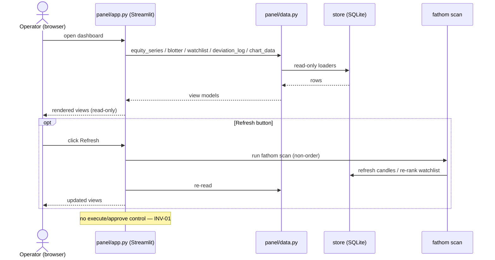

# Feature: admin-panel

**Status.** draft
**Phase.** Phase 4
**Owner.** saambaby
**Last updated.** 2026-05-29

## Summary

The self-hosted Streamlit dashboard — the single screen for everything the system
is doing. It renders the five views over `panel/data.py`'s view models: per-pair
candle charts (TradingView Lightweight Charts™ with our entry/stop/target/signal
overlays), an equity curve + drawdown, a live blotter, the ranked watchlist, and
the deviation log. Its only mutating action is a **refresh button** that runs
`fathom scan`. It is **read-only over execution** — no order/approve/execute action;
order authority stays the operator CLI (INV-01).

## User-facing behaviour

`panel/app.py`, launched with `streamlit run panel/app.py` (optionally
`-- --db-path PATH`). A tabbed/sidebar layout:

1. **Charts** — pick an instrument/timeframe → candles via the Lightweight Charts
   component, overlaid with the active/proposed entry (from the open position or
   watchlist candidate), stop, target, and the signal marker. Apache-2.0
   attribution shown (the component's attribution logo).
2. **Equity** — equity curve + drawdown from `equity_series()`.
3. **Blotter** — open positions, unrealized P&L, today's realized `day_pl`, and
   risk-in-use vs `max_book_risk`.
4. **Watchlist** — the latest ranked `Candidate[]` (mirrors the Discord watchlist).
5. **Deviation log** — the monitor's alerts, newest first.

A **Refresh** button (sidebar) runs the scan synchronously (spinner) and re-reads
the store. No other action mutates anything; there is **no execute/approve control**.

**Scan entrypoint (DRIFT-01 resolution).** The refresh button calls an **order-free,
kwargs-callable** `run_scan(...)` extracted into `signals/scan.py` (a coordinator
pre-step) — **not** `cli.cmd_scan`. Importing `cli` is forbidden here: `cli.py`
imports `execution.orders.submit_order` / `execution.models.build_bracket` /
`risk.*` at module level, so `from cli import cmd_scan` would drag the order path
into the panel's import graph and break the INV-01 boundary. `run_scan` imports
only the ranker/portfolio/store/data path; `cli.cmd_scan` becomes a thin argparse
adapter over it. The INV-01 boundary test below is **transitive** (it walks the
panel's import graph, not just direct imports).

**Chart overlay precedence (AMBIGUOUS-02 resolution).** When an instrument has both
an open `Position` and a fresh watchlist `Candidate`, draw **both**: the open
position as the **"active"** overlay (one style) and the watchlist candidate as the
**"proposed"** overlay (a distinct style). Neither hides the other.

## Acceptance criteria

- [ ] `streamlit run panel/app.py` launches and renders all five views against a seeded demo store (no separate datastore — same SQLite file).
- [ ] Charts render candles via the Lightweight Charts component with entry/stop/target/signal overlays and the required attribution.
- [ ] Equity view plots the curve + drawdown; blotter shows positions + unrealized P&L + `day_pl` + risk-in-use vs limit; watchlist shows the latest `Candidate[]` (INV-13); deviation log shows entries newest-first.
- [ ] The **Refresh** button runs `signals.scan.run_scan(...)` (the order-free scan path) and re-reads; **no order/execute path is reachable from the UI** — it does NOT import `cli` (which carries the order path at module level).
- [ ] **INV-01 read-only boundary (transitive):** the panel's import graph never reaches `execution.orders`, `execution.models.build_bracket`, or `risk` sizing/placement; it never calls `fathom execute`/`submit_order`/`build_bracket`; it exposes no execute/approve action. A test walks the **transitive** imports of `panel.app`/`panel.data` and asserts none of those modules appear (INV-01 enforcement clause).
- [ ] All displayed timestamps are UTC (INV-03); no secret (OANDA token, webhook URL, API key) is rendered or logged (INV-08); reads the demo store only (INV-07).
- [ ] The view code is thin over `panel/data.py` — the rendering layer holds no business logic that isn't covered by the data-layer tests.

## Sequence diagram

## Component design

`panel/app.py` is a thin Streamlit view over `panel/data.py`. The Lightweight
Charts integration uses a Streamlit component (`streamlit-lightweight-charts` or
equivalent — pinned at spec time), fed the `ChartData` view model. The refresh
button calls `signals.scan.run_scan(...)` (the order-free extraction) — **not**
`cli.cmd_scan` and **not** any execution function. The app imports `panel.data`,
`signals.scan`, and Streamlit only; it must not import `cli`, `execution.orders`,
`execution.models.build_bracket`, or `risk` placement/sizing — directly or
transitively.
Because Streamlit apps resist unit testing, correctness lives in `panel/data.py`'s
tests; the app's own test is a thin import-time/boundary test (renders without
error against a seeded store via Streamlit's testing harness if available, plus the
INV-01 no-order-capability assertion).

## Non-goals

- No order/approve/execute action from the UI (INV-01) — execution stays the CLI.
- No auth/multi-user (single private-server operator; bind locally / server-level access control).
- No FastAPI/React rewrite (Streamlit first, per the product spec's "graduate later").
- No new data — renders only what the store already holds.

## Touches

- [INV-01] — the panel monitors only; the one action is the non-order scan-refresh; no order-authority surface.
- [INV-03] — UTC timestamps displayed.
- [INV-07] — demo store only.
- [INV-08] — no secret rendered/logged.
- [INV-13] — watchlist view renders the frozen `Candidate` unchanged.

## Depends on

- [[panel-data-layer]] (the view models), [[equity-snapshots]] (the equity series), the extracted order-free `signals/scan.py::run_scan` (coordinator pre-step — see Component design), `streamlit` + a Lightweight Charts component (new deps — coordinator edit).

## Approach

Drafted last (the join). Build the shell + the 5 views over the tested data layer;
wire the Lightweight Charts component; add the refresh button; assert the INV-01
boundary with a test. Manual acceptance (operator runs the panel against the demo
store) is the phase gate.

## Open questions

- Lightweight Charts component package + version (maintenance check) — pin here;
  fallback to a minimal custom component if the community one is stale.
- Refresh UX: synchronous (spinner) for demo; revisit background refresh later.
- App-level auth: none for demo (private server) — documented.

## Out of scope

- The data/query layer ([[panel-data-layer]]), the snapshot capture ([[equity-snapshots]]), go-live (impl-Phase 5, INV-07).
