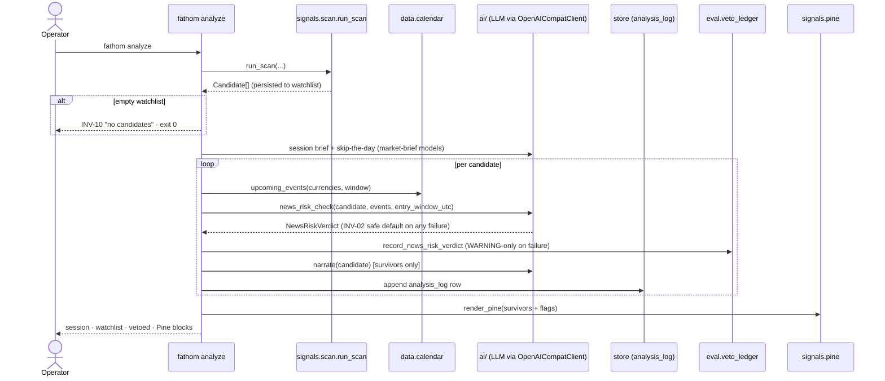

# Feature: analyze-command

**Status:** draft
**Phase:** phase-07
**Owner:** operator + Claude
**Last updated:** 2026-09-01

## Summary

`fathom analyze` is the on-demand trade-time pipeline (ADR-004) that replaces the retired
Hermes daily job: one command runs scan → per-candidate LLM news-risk veto → regime tag +
market brief + session verdict → narration → Pine script, prints the annotated watchlist
to the terminal, and persists every verdict to a new append-only `analysis_log` table.
It orchestrates only: signals produce candidates, `ai/` produces verdicts/text, `pine`
renders — analyze wires them and owns the terminal presentation. It is order-free
(INV-01): the trade itself still goes through `fathom execute`.

## User-facing behaviour

- `fathom analyze [--db-path PATH] [--instruments ALL|…] [--timeframes H1,H4,D]
  [--history-years N] [--dry-run] [--no-pine] [--yes-llm-cost]`… prints, in order:
  1. **Session block** — market brief + regime summary + skip-the-day verdict
     (market-brief feature's models; deterministic "analysis unavailable" fallback offline).
  2. **Watchlist block** — surviving candidates ranked, each with narration line, regime
     tag, and `⚠ reduce size` where the verdict said so.
  3. **Vetoed block** — candidates removed by a `skip` verdict, each with its reason
     (including the INV-02 safe-default reason when the LLM was unreachable) — vetoes are
     visible, never silent.
  4. **Pine block** — the generated script (clipboard + stdout via pine-generation),
     containing survivors only, unless `--no-pine`.
- Empty scan → the INV-10 "no candidates" message; no LLM call is made; exit 0.
- Offline / no `LLM_API_KEY`: every candidate lands in the vetoed block with the INV-02
  safe-default reason; the session block prints its deterministic fallback; exit 0. The
  command degrades honestly — it never fabricates a verdict and never crashes for lack
  of a key.
- Every run appends to `analysis_log`; nothing is overwritten (re-running is a new
  analysis of a possibly-new watchlist).

## Acceptance criteria

1. With a stub LLM client injected (test) or live key (acceptance), a 3-candidate scan
   yields: per-candidate verdict calls with all six `news_risk.md` placeholders filled
   (calendar events rendered from the store's calendar for that instrument's currencies),
   survivors/vetoed split per `suggest_action`, `reduce_size` flags carried through to
   terminal and Pine label, one `analysis_log` row per candidate, and one
   `veto_ledger` row (`source="news_risk"`) recorded **immediately after**
   `news_risk_check` returns and **before** `narrate` (phase-09 hook; a ledger
   write failure logs WARNING and does not change the verdict, the loop, or the
   `analysis_log` write). On `settings.env == "live"` the same pipeline writes
   `analysis_log` rows and **zero** `veto_ledger` rows (INV-09 Phase-9 skip).
2. Offline path: with `LLM_API_KEY` unset and no client, all candidates are vetoed with
   the safe-default reason, zero network I/O occurs (asserted via a socket-guard or
   httpx-mock test), session block prints fallback text, exit 0.
3. Empty watchlist: INV-10 message, zero LLM calls, no `analysis_log` rows, exit 0.
4. `analysis_log` rows match the wire-format table below exactly; timestamps are UTC
   RFC-3339 (INV-03); rows are append-only (no UPDATE path in the store API).
5. Order-free boundary: `signals/analyze.py` (and the CLI handler) import no
   `execution.*`, `risk.*`, or order-capable module — AST test in the
   `test_admin_panel.py` pattern (INV-01).
6. `--dry-run` reaches `run_scan(dry_run=True)` (no candle refresh) and still runs the
   LLM/annotation pipeline on the resulting candidates.
7. The emitted Pine (absent `--no-pine`) contains exactly the survivor set — a `skip`
   verdict's instrument draws nothing unless another surviving candidate shares it.
8. `fathom scan` and `fathom watchlist` remain unchanged in behavior and output (analyze
   is additive; their tests pass untouched).

## Sequence diagram

## Component design

- **`signals/analyze.py`** — `run_analysis(*, db_path, …, client=None) ->
  AnalysisResult`: the orchestration, callable without the CLI (mirrors `run_scan`'s
  role for the panel; the CLI handler is a thin printer around it). `AnalysisResult`
  (pydantic, not frozen — internal, not a wire contract): session fields + per-candidate
  `CandidateAnalysis {candidate, verdict, narration, narration_source, regime}` split
  into `survivors`/`vetoed`.
- **Calendar rendering** — `_render_events(events) -> str`: compact plain-text list
  (UTC time · currency · impact · title) for the `{{calendar_events}}` slot; empty
  calendar renders `"(no calendar events in window)"` — never blocks the call.
  `entry_window_utc` = next bar-open → +1 bar of the candidate's timeframe, from the
  same bar-length map the freshness TTL uses.
- **Store** — `append_analysis(rows)` + `load_latest_analysis(watchlist_run) -> rows`;
  the latter is what standalone `fathom pine` joins against (see pine-generation).
- **Veto ledger (phase-09 contract)** — `run_analysis` owns the
  `record_news_risk_verdict` call. Insertion point is the line after
  `news_risk_check(...)` returns, **before** `narrate`. The same `run_ts` written
  to `analysis_log.run_ts` is passed as `analyze_run_ts` on the ledger row (join
  key). `model_id` uses the same predicate as [[veto-ledger]]: `"offline"` iff
  `client is None and not os.environ.get("LLM_API_KEY")`; otherwise
  `settings.llm_model`. The hook is skipped when
  `settings.env == "live"` (INV-09 Phase-9 measurement-write clause). One UTC RFC-3339
  `run_ts` is minted at the start of `run_analysis` and passed into every
  `record_news_risk_verdict(..., analyze_run_ts=run_ts,
  prompt_version=NEWS_RISK_PROMPT_VERSION, now=<UTC-aware per-candidate hook clock>)`
  and every `analysis_log` row.
  `eval/` is not an order-capable module; AC 5 still forbids `execution.*` / `risk.*`.
- **Terminal output** — plain text, sections in the order above; no color dependency.

## Artefact verdicts

- Sequence diagram: **include** — ≥3 actors (operator, CLI, scan, calendar, LLM, store,
  pine) with a per-candidate loop and an early-exit branch.
- Component design: **include** — the `run_analysis` library/CLI split and the calendar
  rendering contract are load-bearing for phase-08 (companion commands reuse the pattern).
- User flow: **skip** — CLI surface; the terminal block order above is the flow.

## Non-goals

- No order authority, sizing, or execution — `fathom execute` unchanged (INV-01).
- No scheduling — on-demand only (ADR-004); cron-ability via plain OS cron is incidental
  and unsupported.
- No prompt authoring — news-risk/narration prompts move unchanged
  (ai-package-migration); brief/regime/session prompts belong to market-brief.
- No Discord or any push delivery.
- No re-ranking — verdicts veto/flag; they never alter `rank`, `quality_score`, or order
  of survivors (LLM never re-ranks — candidate order is the ranker's, INV-02 spirit).

## Touches

- INV-01 — order-free orchestration; AST-proven (AC 5).
- INV-02 — every LLM verdict feeding the veto path goes through `parse_news_risk`'s
  fail-closed boundary; offline → all-veto (AC 2).
- INV-03 — all persisted/printed timestamps UTC RFC-3339.
- INV-10 — empty watchlist is honest and cheap (AC 3).
- INV-13 — consumes frozen `Candidate` read-only.
- INV-08 — no key in logs/output (inherited via `ai/llm_client`).

## Events

- Written: `analysis_log` rows (one per candidate per run); `veto_ledger` rows
  (`source="news_risk"`, one per candidate per run, via [[veto-ledger]]).
- Consumed: `watchlist` (via `run_scan` return), `calendar` events, approved-set
  (indirectly via scan).

## Environment variables

| Var | Purpose | Arg type | Where set |
|---|---|---|---|
| `LLM_API_KEY` / `LLM_BASE_URL` / `LLM_MODEL` | all LLM calls in the pipeline | runtime secret / runtime / runtime | operator `.env` (existing; no new vars) |
| `ENV` | skip `veto_ledger` news-risk writes when `live` (INV-09 Phase-9) | runtime | operator `.env` (existing) |

## Wire-format contract

`analysis_log` table (SQLite; writer: `run_analysis` only; readers: terminal replay,
`fathom pine` join). Phase-09 joins a news-risk `veto_ledger` row to its
`analysis_log` sibling by `analyze_run_ts = analysis_log.run_ts` plus the
candidate identity triple inside `candidate_snapshot` — not by `created_at`.

| Column | Type | Notes |
|---|---|---|
| `run_ts` | TEXT | UTC RFC-3339 of this analyze run (one value per run) |
| `watchlist_ts` | TEXT | the scanned watchlist's run timestamp (join key) |
| `instrument`,`timeframe`,`strategy_name` | TEXT | candidate identity triple (matches watchlist columns) |
| `event_risk` | TEXT | `high\|medium\|low` (from `NewsRiskVerdict`) |
| `suggest_action` | TEXT | `proceed\|reduce_size\|skip` |
| `reason` | TEXT | verbatim verdict reason (incl. safe-default reason) |
| `narration` | TEXT | final line shown (model or fallback); NULL for vetoed |
| `narration_source` | TEXT | `model\|fallback\|none` |
| `regime` | TEXT | market-brief's regime enum for the instrument; `unavailable` offline |
| `model_id` | TEXT | `LLM_MODEL` in effect; `offline` when no LLM client was used (same predicate as [[veto-ledger]]) |

Primary key `(run_ts, instrument, timeframe, strategy_name)`; append-only (INSERT only —
a re-run gets a new `run_ts`).

## Depends on

- ai-package-migration — `news_risk_check`, `narrate`, shared adapter.
- market-brief — session/brief/regime models + prompts + fallbacks.
- pine-generation — `render_pine` + the survivor-join contract for standalone `fathom pine`.
- signal-ranker / economic-calendar — `run_scan`, `upcoming_events`.
- [[veto-ledger]] (phase-09) — `record_news_risk_verdict` contract, `analyze_run_ts`
  join key, `"offline"` `model_id` rule; this spec owns the call site.

## Approach

1. Store: `analysis_log` DDL + append/load accessors (TDD).
2. `run_analysis` with injected stub client: offline, happy, empty paths (TDD).
3. CLI handler + output formatting + `--no-pine`.
4. AST boundary + socket-guard tests; acceptance run with live key (phase Done-when 1).

## Grounded claims

| Claim | Anchor | Verified how |
|---|---|---|
| `run_scan` is the single order-free non-CLI entrypoint returning `Candidate[]` and persisting the watchlist | signals/scan.py:148-160 | read signature + docstring ("never imports execution.*, risk.*, or cli") |
| Calendar exposes `upcoming_events(...)` on both provider and store-backed classes | data/calendar.py:187,310 | grep + signatures; exact filter params re-read at implementation |
| No analysis table exists today (store DDL enumerated) | data/store.py:106-391 | read full CREATE TABLE list: candles…preflight_attestations only |
| Six news-risk placeholders incl. `{{calendar_events}}`/`{{entry_window_utc}}` are the template's contract | hermes_integration/jobs/daily.md:93-100 + prompts/news_risk.md | read substitution table (line 100 carries `{{calendar_events}}`) — the doc itself is deleted by teardown; the template file survives in `ai/prompts/` |
| Vetoed-candidate display semantics (skip removes from list; reduce_size keeps + flags) mirror the retired job's Step-2 table | hermes_integration/jobs/daily.md:102-118 | read verdict-action table |
| Bar-length map per timeframe exists for the entry-window computation | cli.py:215 | read constant (freshness TTL check uses it) |
| AST forbidden-import probe pattern to copy | tests/test_admin_panel.py | file exists; pattern named by implementation-plan Task 2.1 |

## Constraint blast radius

**Append-only `analysis_log` (no UPDATE accessor).** Protects: an analysis trail that
phase-09's veto ledger and any audit can trust. Blocks: correcting a stored verdict in
place — intended; a wrong verdict is superseded by a new run, never edited.

## Smoke checklist hooks

- `fathom analyze` (live key, demo store): four blocks print, vetoes visible with
  reasons, `analysis_log` row count == candidate count, Pine block contains survivors only.
- `LLM_API_KEY= fathom analyze`: all-vetoed output, exit 0, no network.

## Open questions

1. Should `--instruments/--timeframes` filters be accepted verbatim from `fathom scan`
   (recommended: yes, pass-through) or restricted? Default: pass-through.

## Out of scope

- Verdict **outcome** tracking (what a veto cost: R-multiple, stop/target) —
  phase-09 [[counterfactual-tracker]] / [[veto-report]]. Recording the news-risk
  verdict itself is in this command's per-candidate loop (see Component design).
- `fathom review` / `journal` / `ask` — phase-08.
- Prompt/eval tuning of any LLM step.

## Notes

Amendment queued for pine-generation at the sprint drift radar: standalone `fathom pine`
joins the watchlist with `load_latest_analysis` (when present) to drop `skip` candidates
and add `reduce_size` markers — analyze passes survivors directly.
