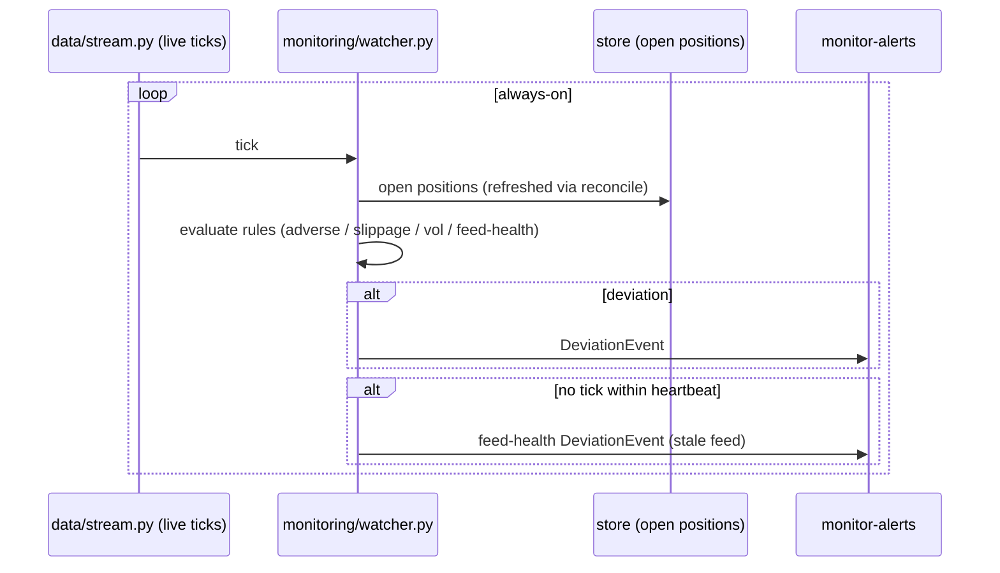

# Feature: deviation-monitor

**Status.** ready
**Phase.** Phase 3
**Owner.** saambaby
**Last updated.** 2026-05-29

## Summary

The always-on Python service that watches open positions against reality and raises
an alert when they diverge from plan: adverse price path, slippage on stop/target
fills, volatility spikes, and feed-health loss (the stream dropped). It holds the
live price stream (Phase 1B) and reads open positions from the store, evaluating
each on every tick/bar. On the most severe triggers it *may* take a configurable
response (default **alert-only** on demo). This is the "operational risk is real
risk" feature — a crashed feed or an unnoticed adverse move costs money independent
of strategy quality.

## User-facing behaviour

Backend module `monitoring/watcher.py` + entrypoint `scripts/run_monitor.py`:

- `Watcher(stream, store, alerter, config)` with a `run()` loop: consume ticks,
  refresh open positions (periodically via [[reconciliation]]), and evaluate
  deviation rules per position.
- **Rules:** adverse excursion past a configurable fraction of stop distance;
  realized slippage beyond a threshold; volatility spike (ATR/range expansion);
  feed-health (no tick within the heartbeat window → stale-feed alert).
- On a trigger → emit a `DeviationEvent` to the alerter ([[monitor-alerts]]).
- **Severe-response policy (AMBIGUOUS-01 resolution):** `alert_only` (default) |
  `auto_flatten` | `tighten_stop`, behind a default-off config flag. On demo the
  default is **alert-only**. Any auto-response is **delegated to a deterministic
  `execution/` function** (close/modify of an *existing* position via
  `execution/orders.py`) — the watcher never calls the v20 order API inline, and
  this path is **not** Hermes-reachable. INV-01 holds: the monitor may at most
  close/modify an existing position when explicitly configured; it never *opens*
  one.

**`DeviationEvent` (pydantic — this spec, the producer, defines it):**
`event_id` (str, stable per (position, rule, debounce-window) so re-persistence is
idempotent), `instrument` (str), `deviation_type`
(`Literal["adverse","slippage","vol","feed_health"]`), `detail` (str — short
human-readable figure), `broker_trade_id` (str | None — None for feed-health),
`severity` (`Literal["info","warn","severe"]`), `created_at` (UTC RFC-3339,
INV-03). [[monitor-alerts]] consumes this exact shape.
- `scripts/run_monitor.py` is the long-lived entrypoint (the always-on process on
  the private server).

## Acceptance criteria

- [ ] Adverse excursion past the configured fraction of stop distance on an open position → exactly one `DeviationEvent` (debounced; not re-fired every tick). Verified with a synthetic tick sequence.
- [ ] A stop/target fill whose slippage exceeds the threshold → a slippage `DeviationEvent`.
- [ ] A volatility spike (range/ATR expansion past threshold) → a vol `DeviationEvent`.
- [ ] No tick within the heartbeat window → a feed-health `DeviationEvent` (stale feed) — reusing the Phase 1B stream's gap/heartbeat detection.
- [ ] Default config is `alert_only`: no position is flattened/modified unless the auto-response flag is explicitly enabled (verified — demo safety).
- [ ] The loop is resilient: a transient stream drop triggers the stream's reconnect/backoff (Phase 1B) and a feed-health alert, not a crash.
- [ ] Events carry UTC timestamps (INV-03); the loop reads positions via the store/reconcile, never places opening orders (INV-01 — it only observes, and at most flattens an existing position when explicitly configured).

## Sequence diagram

## Component design

`monitoring/watcher.py` reuses Phase 1B `data/stream.py` (heartbeat, reconnect,
gap detection) for the feed and its health signal. Deviation rules are pure
predicates over `(position, recent_prices, config)` so each is unit-testable with
synthetic series; the `run()` loop wires them to the live stream. Debounce/state
per position prevents alert storms. The severe-response is a strategy object,
default `AlertOnly`. → sonnet (rules are table-driven; the risky parts — feed
handling — are inherited from shipped Phase 1B code).

## Non-goals

- No alert delivery formatting/transport — that is [[monitor-alerts]].
- No opening trades — observe-only (plus optional flatten/modify of an *existing* position when explicitly enabled, delegated to `execution/orders.py`). INV-01 holds: the monitor never opens a position and is never a Hermes tool.
- No reconciliation logic — it consumes [[reconciliation]] output for fresh positions.

## Touches

- [INV-01] — observes/at-most-closes; never opens an order; not a Hermes tool.
- [INV-03] — UTC event timestamps.
- [INV-09] — uses the shared stream (only `oanda_client.py` reads `env`).

## Depends on

- `data/stream.py` (Phase 1B, on `main`), [[order-model-and-brackets]] (`Position`), [[reconciliation]] (fresh positions + `day_pl`), [[monitor-alerts]] (delivery), `strategies/_indicators.py::atr` (vol rule).

## Approach

`monitoring/watcher.py` + `scripts/run_monitor.py`. Pure rule predicates first
(full synthetic-series tests), then the always-on loop on top of the Phase 1B
stream. Auto-response defaults off.

## Open questions

- Severe-response default — **alert-only on demo** (proposed); `auto_flatten`/`tighten_stop` behind a default-off flag.
- Rule thresholds (adverse fraction, slippage, vol-expansion, heartbeat seconds) — propose defaults; confirm at audit.
- Evaluation cadence: per-tick vs per-bar. Propose per-tick for adverse/feed-health, per-bar for vol.

## Out of scope

- Alert transport ([[monitor-alerts]]), the panel deviation-log UI (impl-Phase 4).
