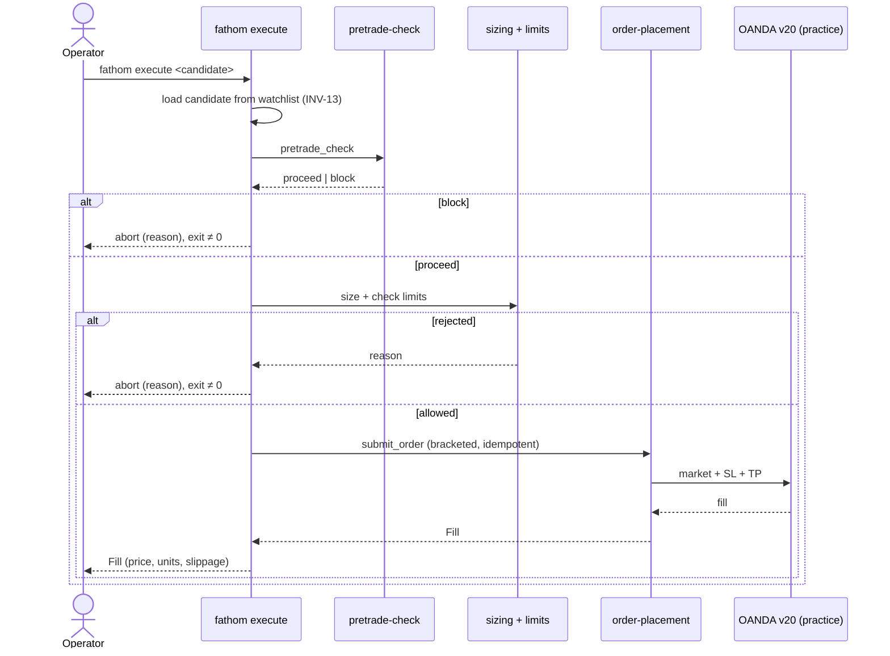

# Feature: execution-cli

**Status.** ready
**Phase.** Phase 3
**Owner.** saambaby
**Last updated.** 2026-05-29

## Summary

The operator entrypoint that joins the whole Phase 3 gate: `fathom execute
<candidate>` takes an approved watchlist candidate and runs it through pre-trade
check → sizing → limits → order placement, reporting the outcome. This is the
**human, deterministic approval act** that turns a suggestion into a trade —
and the canonical INV-01 enforcement point: it is a CLI command an operator runs,
**never registered as a Hermes tool**. Optional read-only helpers (`fathom
positions`, `fathom reconcile`) let the operator inspect state.

## User-facing behaviour

Extends `cli.py` (the single Phase 3 writer of this file):

```
fathom execute <candidate-ref> [--db-path PATH] [--dry-run] [--yes]
```

1. Load the named candidate from the **latest persisted watchlist** via
   `load_watchlist()` (INV-13). The `<candidate-ref>` is
   `instrument:timeframe:strategy_name` (DRIFT-04) — unique within one watchlist
   run; error if it isn't on the latest watchlist (no executing arbitrary input).
   The full `Candidate` row (incl. `generated_at`) is loaded so the
   `client_order_id` (INV-15) is reconstructible.
2. **Candidate freshness TTL** (WS0-T04): refuse the candidate if it is older
   than `max_candidate_age_bars` (`.env` `MAX_CANDIDATE_AGE_BARS`, default
   `1.0`) bars of its **own** timeframe (H1=1h, H4=4h, D=24h), measured
   against `Candidate.generated_at` (the signal bar's close time, INV-03
   UTC) vs. now. This runs immediately after load and **before reconcile** —
   a stale scan-time `entry_ref` must never reach an order (its realized
   R:R drifts with every hour of delay). Refusal prints `STALE CANDIDATE
   REFUSED: <ref> is <Xh> old (limit <Yh> = N x <TF> bar)` to stderr, exit
   1, no downstream gate step runs; applies to `--dry-run` too.
3. **Fresh reconcile** ([[reconciliation]]): fetch account summary + broker open
   trades and refresh the `account_state` (`day_pl`, `start_of_day_equity`) and
   `positions` *before* the limits check (AMBIGUOUS-03 — `fathom execute` is
   operator-initiated and infrequent, so it must not trust a stale `day_pl`).
4. **Pre-trade check** ([[pretrade-check]]) → `block` aborts (exit non-zero, reason printed).
5. **Sizing** ([[position-sizing]], using the freshly-fetched equity) → reject (size 0) aborts with the reason.
   For a non-account-quote instrument (e.g. `USD_JPY` on a USD account) the CLI first
   resolves `quote_to_account_rate` from the latest cached candle mid. If that rate
   cannot be resolved, the CLI **refuses to size** (`SIZING REFUSED: no quote->account
   conversion rate for <pair>`, exit 1, no order, applies to `--dry-run` too) — it never
   assumes 1.0, which would understate risk (under-size) by ~157x for a JPY-quoted
   pair, or overstate risk (over-size) for a quote currency stronger than USD (e.g.
   GBP-quoted, ~27%), against the INV-05 cap.
6. **Limits / kill switch** ([[risk-limits-kill-switch]], reading the fresh `account_state`) → reject aborts with the reason.
7. **Submit** ([[order-placement]]) the bracketed, idempotent order; print the `Fill`.
8. `--dry-run` runs steps 1–6 and prints what *would* be submitted without placing
   an order (safe rehearsal). `--yes` skips an interactive confirm.

Read-only helpers: `fathom positions` (print open `Position[]` JSON), `fathom
reconcile` (run [[reconciliation]] once, print the report).

## Acceptance criteria

- [ ] `fathom execute` only accepts a candidate present on the persisted watchlist; an unknown ref errors without side effects (no executing off-watchlist input).
- [ ] The gate order is exactly candidate-freshness → reconcile → pretrade-check → sizing → limits → submit; **any** stage's rejection aborts with a clear reason and a non-zero exit, and no order is placed.
- [ ] A candidate older than `max_candidate_age_bars` bars of its own timeframe is refused before reconcile runs (WS0-T04); the limit is per-timeframe (H1=1h, H4=4h, D=24h).
- [ ] `--dry-run` performs checks 1–5 and prints the would-be order **without** any v20 submission (verified — no order endpoint called).
- [ ] A successful run prints the `Fill` (fill price, units, slippage, trade id) and persists state; re-running the same execute is idempotent (no double-fill, via [[order-placement]]).
- [ ] When the kill switch is active, `fathom execute` refuses and reports the kill-switch status.
- [ ] `fathom execute` / `positions` / `reconcile` are **not** referenced by any Hermes job; the Phase 2 `daily.md` allow-list (`scan`/`watchlist`/`chart`) is unchanged (INV-01). A test asserts no execution command appears in `hermes_integration/`.
- [ ] Existing `scan`/`watchlist`/`chart`/`backtest` commands remain unbroken; no live HTTP in unit tests (mocked); practice endpoint only (INV-07).

## Sequence diagram


```mermaid
sequenceDiagram
    actor OP as Operator
    participant CLI as fathom execute
    participant PT as pretrade-check
    participant RK as sizing + limits
    participant EX as order-placement
    participant B as OANDA v20 (practice)

    OP->>CLI: fathom execute <candidate>
    CLI->>CLI: load candidate from watchlist (INV-13)
    CLI->>PT: pretrade_check
    PT-->>CLI: proceed | block
    alt block
        CLI-->>OP: abort (reason), exit ≠ 0
    else proceed
        CLI->>RK: size + check limits
        alt rejected
            RK-->>CLI: reason
            CLI-->>OP: abort (reason), exit ≠ 0
        else allowed
            CLI->>EX: submit_order (bracketed, idempotent)
            EX->>B: market + SL + TP
            B-->>EX: fill
            EX-->>CLI: Fill
            CLI-->>OP: Fill (price, units, slippage)
        end
    end
```

## Component design

Extends `cli.py` with the `execute`/`positions`/`reconcile` subparsers, reusing the
Phase 1/2 runner scaffolding (`--db-path`, `--dry-run`, UTC logging). It is the
**only** Phase 3 task that edits `cli.py` (single-writer, like Phase 2's T-07). The
command is pure orchestration — all logic lives in the risk/execution modules; the
CLI wires them and handles exit codes + operator output. → sonnet.

Phase-09 [[veto-ledger]] adds two **additive** recording calls in `cmd_execute`
(after `pretrade_check` returns, before the `block` branch; on demo confirm abort).
Those lines do not change gate order, exit codes, or order authority (INV-01).

## Non-goals

- No new risk/execution logic — orchestration only.
- No Hermes wiring — by design this is never a Hermes tool (INV-01).
- No scheduling — execution is operator-initiated, not cron.

## Touches

- [INV-01] — the enforcement point: execution is operator CLI, never a Hermes tool.
- [INV-07] — practice endpoint only.
- [INV-13] — executes only persisted `Candidate`s.
- [INV-03] — UTC logging.

## Depends on

- [[pretrade-check]], [[position-sizing]], [[risk-limits-kill-switch]], [[order-placement]], [[reconciliation]] — all Phase 3; the persisted watchlist (Phase 2, on `main`).

## Approach

Drafted last (the join). Wire the gate, add `--dry-run` as the safe default
rehearsal, and assert the INV-01 boundary with a test scanning `hermes_integration/`
for any execution-command reference.

## Open questions

- One candidate per invocation (proposed) vs a batch `--all`. Propose single; the
  book cap is enforced by limits regardless.
- Interactive confirm default: require `--yes` for a real submit, or confirm prompt?
  Propose a confirm prompt unless `--yes` (demo safety).

**Resolved at cross-spec audit (2026-05-29):** DRIFT-04 — `<candidate-ref>` =
`instrument:timeframe:strategy_name`, resolved against the latest watchlist run
(`load_watchlist(run_timestamp=None)`); the full row is loaded for the
`client_order_id` derivation. AMBIGUOUS-03 — `fathom execute` triggers a fresh
reconcile before the limits check so the kill switch reads a current `day_pl`.

## Out of scope

- The risk/execution/monitor internals (their own specs); the panel (impl-Phase 4).
