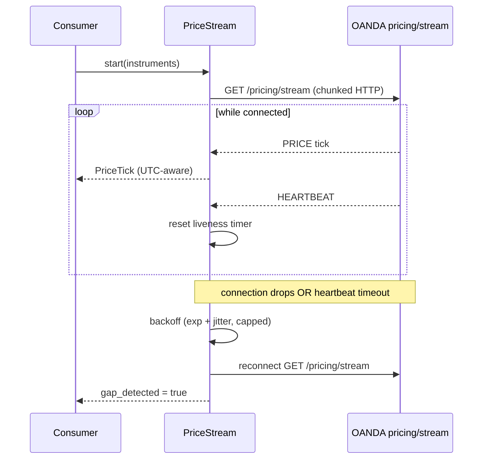

# Feature: live-streaming

**Status.** ready
**Phase.** Phase 1
**Owner.** saambaby
**Last updated.** 2026-05-29

## Summary

Add a long-lived OANDA v20 pricing stream (`data/stream.py`): a persistent HTTP streaming connection that emits live price ticks plus heartbeats, with automatic reconnection (exponential backoff), heartbeat-timeout detection, and gap detection on reconnect. OANDA's v20 stream is **not** a WebSocket — it is a chunked HTTP response from `GET /v3/accounts/{accountID}/pricing/stream`, capped at ~4 prices/sec/instrument.

**Scope note:** this feature does **not** feed the Phase 1 approved-set (which is historical-candle-driven). It is groundwork for Phase 2's live signal evaluation and the deviation monitor. It is an independent branch — a candidate for epic **1B** if Phase 1 is split (see [[../phases/phase-1]]).

## User-facing behaviour

Backend module. `PriceStream(settings, instruments)` exposing an iterator/callback of typed `PriceTick` objects (`instrument`, `time` UTC-aware, `bid`, `ask`, `status`). Heartbeats are consumed internally (connection-liveness), not surfaced as ticks. On disconnect it reconnects automatically; the consumer sees a continuous tick stream with a `gap_detected` flag when a reconnect skipped data.

## Acceptance criteria

- [ ] Establishes a persistent HTTP stream to the **practice** endpoint (per `settings.env`, INV-09) and yields `PriceTick` objects with UTC-aware timestamps (INV-03).
- [ ] Heartbeat messages are recognised and reset a liveness timer; absence of heartbeat beyond a timeout triggers reconnect.
- [ ] Reconnect uses exponential backoff with a cap (e.g. 1s → 2s → … → 30s) and jitter; reconnect attempts are logged (no token in logs — INV-08).
- [ ] On reconnect, a `gap_detected` signal is raised so downstream consumers know data may have been missed.
- [ ] The stream can be cleanly shut down (no orphaned connection / thread).
- [ ] Connection failures raise typed errors, not raw library exceptions, consistent with `OandaAPIError`.

## Sequence diagram

> Included: 3 actors (consumer, stream client, OANDA) + asynchronous coordination (heartbeat timeout, reconnect with backoff) — meets the threshold.

### Failure modes considered

- OANDA drops the connection silently → heartbeat-timeout timer fires → reconnect.
- Reconnect storms → exponential backoff + cap prevents hammering the API.
- Reconnect skipped ticks → `gap_detected` flag so consumers (Phase 2 monitor) can react, not silently trust continuity.
- Clean shutdown mid-stream → no orphaned thread/socket.

## Non-goals

- No persistence of ticks to a long-term tick archive (Phase 2+ concern; may write recent ticks to operational state only).
- No signal evaluation off the stream (Phase 2).
- No order placement — streaming is read-only price data (INV-01 boundary unaffected).

## Touches

- [INV-03] — tick timestamps UTC-aware. [INV-08] — token never logged. [INV-09] — endpoint from `settings.env`.

## Depends on

- `data/oanda_client.py` / `config/settings.py` — exist on `main` (reuses auth + env selection).
- Light dependency on `data/store.py` if recent ticks are persisted to operational state.

External:
- `oandapyV20` pricing-stream endpoint (`oandapyV20.endpoints.pricing.PricingStream`).

## Approach

Wrap `oandapyV20`'s `PricingStream` (a generator over the chunked HTTP body). Run it on a background thread or async task; classify each message as PRICE or HEARTBEAT; maintain a liveness timer; on drop/timeout, reconnect with capped exponential backoff + jitter and raise `gap_detected`. Reuse the env/auth path from `OandaClient` so demo/live selection stays single-source (INV-09).

## Open questions

- Threading vs asyncio for the stream loop? (Lean: a background thread with a thread-safe queue — simplest to integrate with the otherwise-synchronous codebase.)
- Do we persist recent ticks now, or defer all persistence to Phase 2? (Lean: defer; expose the live iterator only.)

## Out of scope

- Economic calendar ([[economic-calendar]]).
- Anything that consumes the stream for signals/monitoring (Phase 2).
