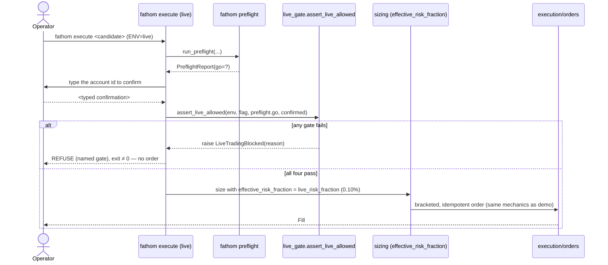

# Feature: live-trading-gate

**Status.** ready
**Phase.** Phase 5
**Owner.** saambaby
**Last updated.** 2026-05-30

## Summary

The real-money safety gate. Today `ENV=live` alone would place live orders; this
feature makes a live order require **four independent gates**, all of which must
pass: `ENV=live` **AND** `live_trading_enabled=True` (default False) **AND** a
passing `fathom preflight` **AND** an interactive typed confirmation. It also
selects a **reduced live position size** (`live_risk_fraction`, default 0.10% ≤ the
0.25% INV-05 cap). Demo is unchanged — no new friction. This is the highest-stakes
code in the system: a bug here is an accidental real-money trade, so the gate logic
is a pure, exhaustively-tested module and the default is always "refuse."

## User-facing behaviour

- `config/settings.py` adds: `live_trading_enabled: bool = False`; **`live_risk_fraction: float = Field(default=0.001, gt=0.0, le=0.0025)`** (0.10%; the `le=0.0025` bound references the INV-05 cap so the two cannot drift) — mirrors `LimitsConfig`'s `Field` constraints. A `Settings` constructed with `live_risk_fraction <= 0` or `> 0.0025` raises `ValidationError` at load time (B-5: the settings-time validator is the only thing between a `.env` typo and a real-money cap breach).
- `execution/live_gate.py` (pure):
  - `assert_live_allowed(*, settings, preflight_report, confirmed: bool) -> None` — raises `LiveTradingBlocked(reason)` unless **all** hold: `settings.env == "live"`, `settings.live_trading_enabled is True`, `preflight_report.go is True`, and `confirmed is True`. The reason names the **first** failing gate. On demo (`env != "live"`) it is a no-op (demo path unchanged).
    - **Default-refuse on a bad preflight (B-1):** treat a `preflight_report` that is `None`, not a `PreflightReport`, or whose `.go` is not **exactly `True`** as a **failed** preflight gate (raise). The caller (`cmd_execute`) must wrap `run_preflight(...)` so that **any exception from it in the live path is caught and converted to a refuse** (non-zero exit, no order) — an exception is never interpreted as GO. Bias is always to block.
  - `effective_risk_fraction(settings) -> float` — `settings.live_risk_fraction` when `env=="live"`, else the demo `DEFAULT_RISK_FRACTION` (0.0025). The **only** place the env-dependent fraction is selected; the sizing function itself is unchanged (INV-09, per the new INV-09 operator-boundary clause).
- `fathom execute` (live context): runs `run_preflight` (exceptions → refuse), then requires a typed confirmation — the operator types the `oanda_account_id` (a plain `str`, safe to echo — not the SecretStr token). This live confirm is a **distinct prompt evaluated before `assert_live_allowed`, NOT guarded by `--yes`/`skip_confirm`** (N-3): the existing `--yes`-gated `[y/N]` confirm (`cli.py:1625`) remains **demo-only**; live always requires the typed account id even with `--yes`. Then calls `assert_live_allowed(...)` before sizing; sizes with `effective_risk_fraction(settings)`. Any gate failing ⇒ refuse with the named reason + non-zero exit, **no order placed**. On demo, `execute` behaves exactly as Phase 3 (no preflight, no typed confirm, 0.25% fraction).

## Acceptance criteria

- [ ] `assert_live_allowed` raises `LiveTradingBlocked` (naming the failing gate) if ANY of {`env=="live"`, `live_trading_enabled`, `preflight.go`, `confirmed`} is false; it returns (allows) only when all four are true. Exhaustively unit-tested across the truth table, **including rows where `preflight_report` is `None`, not a `PreflightReport`, or `.go` is non-`True` → all refuse** (B-1). A `cmd_execute` test pins that an exception raised by `run_preflight` in the live path becomes a refuse (no order), never a GO.
- [ ] On demo (`env != "live"`), `assert_live_allowed` is a no-op and `fathom execute` is byte-identical to Phase 3 — no preflight, no confirmation prompt, no new friction (a test pins the demo path unchanged).
- [ ] `effective_risk_fraction` returns `live_risk_fraction` (≤ 0.0025) for live and `DEFAULT_RISK_FRACTION` for demo; settings validation (the `Field(gt=0.0, le=0.0025)` bound) rejects `live_risk_fraction > 0.0025` or ≤ 0 at load time — a test pins both bounds (INV-05 — live is never larger than the cap).
- [ ] `cmd_execute` (`cli.py:~1528`) passes `risk_fraction=effective_risk_fraction(settings)` to `size_position` **instead of** the hard-coded `DEFAULT_RISK_FRACTION` (B-2). A test pins that the **demo** `size_position` call receives exactly `0.0025` (demo numerically unchanged) and a **live** call receives `live_risk_fraction`.
- [ ] `live_trading_enabled` defaults to **False**; `ENV=live` with the flag False ⇒ refuse. The four gates are independent (no single misconfiguration places a live order).
- [ ] A live `fathom execute` requires the typed confirmation (the account id); a wrong/empty confirmation ⇒ refuse, no order. `--yes` does NOT bypass the live confirmation (live always confirms; `--yes` only affects demo).
- [ ] No code path connects to the live endpoint in tests; the live token is never required to run the suite or logged (INV-07/08). The gate is pure + offline-testable (settings/report/confirmed injected).
- [ ] INV-09 preserved: `risk/sizing.py`/`execution/orders.py` mechanics are unchanged; only the *fraction input* and the *operator-boundary gate* are env-aware.

## Sequence diagram

## Component design

The gate logic is a **pure** `execution/live_gate.py` (no I/O) so the entire truth
table is unit-tested without the CLI or a broker. `fathom execute` (single-writer on
`cli.py`; this task adds the live gate **after** [[preflight-check]] adds `fathom
preflight` — the two Phase-5 `cli.py` edits are serialized in that order, N-1/N-2)
wires: `run_preflight` (exceptions→refuse) → the **separate, non-`--yes`** typed
account-id confirm → `assert_live_allowed` → size with `effective_risk_fraction` →
the unchanged Phase 3 submit path. Concretely, the `cmd_execute` `size_position` call
at `cli.py:~1528` changes `risk_fraction=DEFAULT_RISK_FRACTION` →
`risk_fraction=effective_risk_fraction(settings)`; on demo that returns `0.0025`
(numerically identical) and the gate block is skipped, so the demo path is unchanged.
The reduced fraction flows into the **same** `size_position` (INV-09: mechanics
identical; only the fraction input + the pre-submit gate differ, per the new INV-09
operator-boundary clause). Default-refuse everywhere: the gate's bias is to block.

The new settings fields land first (this task), so [[preflight-check]] reads them
directly with no `getattr` hedge (N-1).

## Non-goals

- No live connection / token wiring (operator-only, deferred — INV-07). The gate is built + tested offline.
- No size-ramp automation (ramping past 0.10% is an operator decision on a live track record).
- No change to sizing/orders/reconcile/monitor mechanics (INV-09).

## Touches

- [INV-07] — the multi-gate that keeps live deliberate; the cutover stays operator-only.
- [INV-05] — `live_risk_fraction` validated ≤ 0.25% (never larger).
- [INV-09] — mechanics unchanged; the env-aware gate + fraction selection are a sanctioned operator-boundary layer (invariant-clarification candidate — see phase-5 open questions).
- [INV-08] — live token in `.env`, never logged.

## Depends on

- [[preflight-check]] (`run_preflight`/`PreflightReport` — the gate requires a passing preflight; also serializes the `cli.py` edit after it), `config/settings.py` (the new flags), `risk/sizing.py` (`DEFAULT_RISK_FRACTION`, `size_position` — unchanged), `execution/orders.py` (unchanged submit path), `cli.py` (`fathom execute`).

## Approach

Build the pure `live_gate` + the settings flags + validation first (exhaustive
truth-table tests, demo-noop test, INV-05 validation test), then wire `fathom
execute` (live: preflight + confirm + gate + reduced fraction; demo: unchanged).
Never require the live token in tests.

## Open questions

- Should `effective_risk_fraction` also enforce an absolute notional ceiling, or just the fraction? Propose fraction-only for Phase 5; a notional ceiling later.

**Resolved at cross-spec audit (2026-05-30):** confirm token = `oanda_account_id`
(plain `str`, safe to echo, forces looking at *which* account); INV-09 amended to
sanction this env-aware operator-boundary gate (B-4/P-1); B-1 default-refuse on
bad/None/exception preflight pinned; B-2 `effective_risk_fraction` threaded into
`cmd_execute`'s `size_position` call; B-5 `Field(gt=0.0, le=0.0025)` bound pinned;
N-1/N-2/N-3 ordering + non-`--yes` live confirm pinned.

## Out of scope

- The readiness checks themselves ([[preflight-check]]); the cutover procedure ([[go-live-runbook]]); the actual live cutover (operator-only, INV-07).
