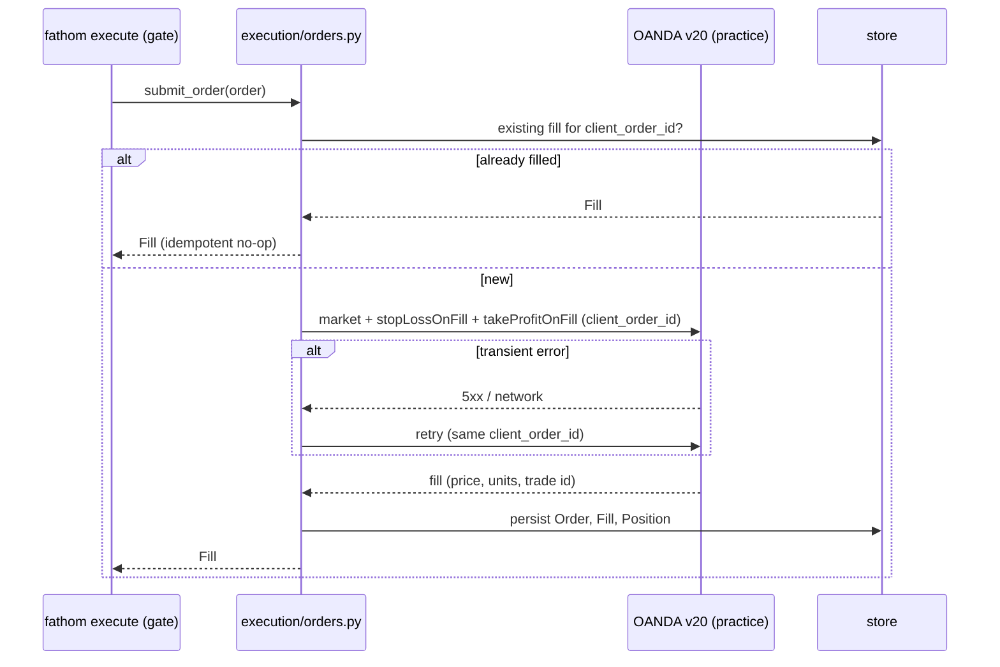

# Feature: order-placement

**Status.** draft
**Phase.** Phase 3
**Owner.** saambaby
**Last updated.** 2026-05-29

## Summary

The execution engine: submit a sized, bracketed `Order` to the OANDA v20 **practice**
account, atomically with its stop-loss and take-profit, idempotently (a retry never
double-fills), capturing the actual fill price and slippage, and persisting the
`Fill`/`Position` to the store. This is the module that actually places trades —
the most safety-critical code in Fathom. It is invoked only by the deterministic
path (`fathom execute`), never by Hermes (INV-01).

## User-facing behaviour

Backend module `execution/orders.py`. `submit_order(order, *, client, store) -> Fill`:

1. **Idempotency:** attach the `Order.client_order_id` as the v20 client extension;
   before submitting, check the store/broker for an existing fill with that id → if
   present, return it (no second submission).
2. **Atomic bracket:** submit a market order with `stopLossOnFill` +
   `takeProfitOnFill` in one v20 request (INV-04) — never an entry followed by a
   separate, skippable bracket call.
3. **Retries:** on transient network/5xx error, retry with backoff, reusing the
   same `client_order_id` so a retry is a no-op if the first attempt actually landed.
4. **Capture:** read the fill price + units; compute `slippage` vs
   `Candidate.entry_ref`; build the `Fill` and `Position`; persist both to the store
   `fills`/`positions`/`orders` tables.
5. On `rejected`/partial, record the actual status; never synthesise a fill.

## Acceptance criteria

- [ ] Every submission includes both `stopLossOnFill` and `takeProfitOnFill` in the same request; there is no path that opens a position without a bracket (INV-04). Verified against a mocked v20 (`responses`).
- [ ] Re-submitting the same `client_order_id` does not create a second broker order — the existing fill is returned (idempotency). Verified by a duplicate-submit test.
- [ ] A transient error then success results in exactly **one** filled position (retry reuses the id; the duplicate is deduped). Verified with a mocked transient failure.
- [ ] `slippage` = actual fill price − `Candidate.entry_ref` (signed by direction), recorded on the `Fill`.
- [ ] A broker rejection is recorded as `status="rejected"` with no `Position` created; a partial fill records `units_filled < units` and `status="partial"`.
- [ ] `Fill`/`Position`/`Order` persist to the store; all timestamps UTC RFC 3339 (INV-03).
- [ ] Only the **practice** endpoint is used; the live token is never referenced (INV-07); only `oanda_client.py` reads the `env` switch (INV-09).
- [ ] No secret appears in logs or persisted rows (INV-08).

## Sequence diagram

## Component design

`execution/orders.py` uses `oandapyV20` order endpoints via the existing
`oanda_client.py` (extended with order + account-summary endpoints; still the only
reader of `env`). The store gains `orders`/`fills`/`positions` tables (this spec
owns the migration). Idempotency is enforced two ways: the v20 client-order-id
client extension *and* a pre-submit store check — belt and suspenders against
double-fills. Unit tests mock v20 with `responses`; no live HTTP in tests. → opus.

## Non-goals

- No sizing/limits — the `order` arrives sized and gated.
- No reconciliation loop — startup/periodic reconcile is [[reconciliation]] (this spec persists fills; that spec audits them vs the broker).
- No monitoring — [[deviation-monitor]] reads the persisted positions.

## Touches

- [INV-04] — atomic bracket submission; no naked positions.
- [INV-07] — practice endpoint only.
- [INV-08] — no secrets logged/persisted.
- [INV-09] — single code path; only `oanda_client.py` reads `env`.
- [INV-03] — UTC timestamps on all persisted rows.

## Depends on

- [[order-model-and-brackets]] (the `Order`/`Fill`/`Position` contract), [[position-sizing]] + [[risk-limits-kill-switch]] (produce the gated, sized order), `data/oanda_client.py` (extended), `data/store.py` (new tables).

## Approach

`execution/orders.py`. Implement idempotency + atomic bracket first (the
double-fill / naked-position risks), then retries and slippage capture. Mock v20
throughout; the live practice submission is exercised at the acceptance gate.

## Open questions

- **Idempotency key scheme** — propose `client_order_id` = hash of
  `(instrument, strategy_name, timeframe, generated_at, execution_date)` so a retry
  of the same approval dedups but a genuine re-approval next day is distinct. Pin here.
- Store schema migration ownership — this spec owns `orders`/`fills`/`positions`;
  reconciliation reads them.
- v20 stop/target as absolute price vs distance — propose absolute price (from
  [[order-model-and-brackets]]), instrument precision applied.

## Out of scope

- Reconciliation ([[reconciliation]]), monitoring ([[deviation-monitor]]), the CLI join ([[execution-cli]]).
