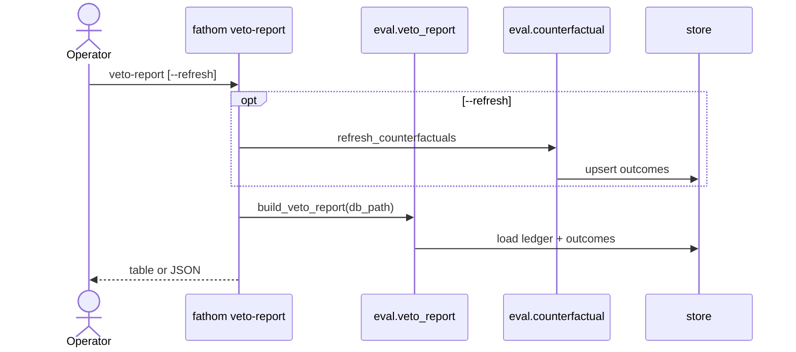

# Feature: veto-report

**Status:** ready
**Phase:** phase-09
**Owner:** saambaby
**Last updated:** 2026-09-01

## Summary

The operator-facing aggregate over [[veto-ledger]] + [[counterfactual-tracker]]
outcomes: block rates, counterfactual win/loss of **blocked** rows, net R
saved vs cost, with an explicit `unknown` bucket. `fathom veto-report` prints
a table (human) and can emit the same payload as JSON. `--refresh` runs the
tracker first. This spec **supersedes** the tracker’s placeholder
“exit 2 without `--refresh`” (`counterfactual-tracker.md` User-facing).

## User-facing behaviour

```
fathom veto-report [--db-path PATH] [--refresh] [--json]
```

1. If `--refresh`: call `refresh_counterfactuals(db_path, now=utc_now)` then
   continue. Refresh JSON counts are **not** printed (tracker stdout is
   swallowed / returned to the printer as an optional `refresh` object in
   `--json` only). Failures inside refresh stay per-row WARNING; the report
   still prints.
2. `Store.load_veto_ledger_rows()` and `Store.load_veto_ledger_outcomes()`. Left-join
   on `ledger_id`. Missing outcomes row → treat as `outcome="unknown"` for
   aggregation (not a skip).
3. Print the aggregate (table unless `--json`). Exit 0 even when the ledger
   is empty (`n=0` payload). Never calls OANDA, `submit_order`, or either
   veto. Does not write `veto_ledger` (INV-22). May write outcomes **only**
   via `--refresh` (tracker).

**Single CLI owner:** `cli.py` `veto-report` subparser is registered **once**,
in this spec's handler (`cmd_veto_report`). It may call
`refresh_counterfactuals` when `--refresh`. `eval/counterfactual.py` has no
CLI. Table stdout is the human rendering of `VetoReport` **without**
`RefreshCounts` fields. `--json` includes `refresh` when `--refresh` else
`null`. `build_veto_report` never calls refresh.

## AC 1 fixture (exact)

Ten ledger rows. `r_multiple` shown only when outcome is stop|target.

| id | source | verdict | outcome | r_multiple |
|---|---|---|---|---|
| 1 | news_risk | skip | stop | -1.0 |
| 2 | news_risk | skip | stop | -1.0 |
| 3 | news_risk | skip | target | 1.5 |
| 4 | news_risk | skip | unknown | NULL |
| 5 | news_risk | proceed | target | 2.0 |
| 6 | news_risk | reduce_size | timeout | NULL |
| 7 | pretrade | block | stop | -0.5 |
| 8 | pretrade | block | timeout | NULL |
| 9 | pretrade | block | target | 2.0 |
| 10 | operator_declined | declined | stop | -1.0 |

Bucket rules: `n_block` = news `skip` **or** pretrade `block` **or**
declined. `n_proceed` = news `proceed` **or** `reduce_size` **or** pretrade
`proceed`. So `n_block + n_proceed == n` per source.
`reduce_size` is **not** a skip (AC 6).

Expected `by_source` (abs-R rule):

- `news_risk`: n=6, n_block=4, n_proceed=2, block_rate=4/6,
  r_saved=2.0, r_cost=1.5, net_r=0.5, n_timeout=1 (id 6), unknown=1 (id 4)
- `pretrade`: n=3, n_block=3, n_proceed=0, block_rate=1.0,
  r_saved=0.5, r_cost=2.0, net_r=-1.5, n_timeout=1, unknown=0
- `operator_declined`: n=1, n_block=1, n_proceed=0, block_rate=1.0,
  r_saved=1.0, r_cost=0, net_r=1.0, n_timeout=0, unknown=0

Top-level `n=10`, `unknown=1` (only missing/`unknown` outcome — id 4;
timeouts are `n_timeout` not `unknown`).
Top-level `net_r` = AI sources only (`news_risk`+`pretrade`) = 0.5 + (-1.5)
= **-1.0**. Declined net_r stays in its slice.

Id 5 proceed+target does **not** enter r_saved/r_cost.

## Acceptance criteria

1. The fixture table above, loaded into a test DB, yields `VetoReport`
   numbers matching the Expected `by_source` / top-level paragraph (float
   compare 1e-9).
2. `--json` stdout is one snake_case object matching Wire-format; table mode
   is a rendering of the same numbers (no extra computed fields). Empty
   ledger: JSON `n=0` with null rates; table **may** print the extra string
   `"veto ledger empty"` (the one allowed table-only line).
3. `--refresh` then report: sticky terminal unchanged (tracker AC 3);
   `unknown` reflects post-refresh. `RefreshCounts` appear only on
   `--json.refresh`, never as table columns.
4. `eval/veto_report.py` AST: may import `eval.counterfactual.refresh_counterfactuals`,
   `data.store`, `signals.ranker.Candidate` — not `execution.orders`,
   `build_bracket`, `risk.sizing`, `cli`. (`cli.py` imports the eval modules,
   not the reverse.)
5. Empty ledger: JSON `n=0`, all rates `null`; exit 0. (Table string: AC 2.)
6. News-risk `skip` = block; `proceed` and `reduce_size` = proceed.
   Pretrade `block` = block; `proceed` = proceed. Declined: `n_block=n`,
   `n_proceed=0`.
7. `net_r` per slice = `r_saved - r_cost` on that slice's **blocked**
   stop/target only. Timeouts/unknown contribute 0 to R. Top-level `net_r`
   excludes `operator_declined`.

## Sequence diagram



## Component design

```python
def build_veto_report(db_path: str | Path) -> VetoReport: ...
```

`VetoReport` pydantic (not frozen — printer DTO): fields in Wire-format.
Breakdowns `by_instrument` / `by_timeframe` / `by_strategy`: every key that
appears on **any** ledger row (including `n_block=0` proceed-only keys).
Each element: `{key, n, n_block, r_saved, r_cost, unknown}` where `n` = all
rows with that Candidate field, `n_block` = block-bucket subset, `r_saved`/
`r_cost`/`unknown` counted on that key's **blocked** rows only (same abs-R
and unknown definitions as `by_source`). No `block_rate`/`net_r` on
breakdowns (table must not invent them — AC 2).

NewsRiskVerdict.suggest_action lives in [[news-risk-assessment]] /
[[ai-package-migration]]; parse `verdict_json` with the same models as
[[veto-ledger]] AC 6.

## User flow

Skip — see Artefact verdicts.

## Artefact verdicts

- Sequence diagram: include — optional refresh then read (ordering vs
  sticky terminals).
- Component design: include — block definition + net-R sign.
- User flow: skip — CLI table/JSON only (phase Out of scope: no panel).

## Non-goals

- No auto-disable of a gate (phase Out of scope).
- No `--force` re-resolution (tracker).
- No live ledger rows (none until INV-07).

## Touches

- INV-01 — report has no order authority.
- INV-03 — no new timestamps except echoing stored RFC-3339 if printed.
- INV-06 — R multiples already costed by tracker; report does not re-simulate.
- INV-09 — does not read `settings.env`; ledger is already demo-only.
- INV-13 — deserialize `candidate_snapshot` for breakdown keys.
- INV-22 — no UPDATE on `veto_ledger`.

## Events

- Written: none except `--refresh` → tracker upserts.
- Consumed: `veto_ledger`, `veto_ledger_outcomes`.

## Environment variables

| Var | Purpose | Arg type (build-arg / runtime) | Where set |
|---|---|---|---|
| _(none)_ | | | |

## Wire-format contract

`--json` / `VetoReport` (snake_case):

| Field | Type | Notes |
|---|---|---|
| `n` | int | ledger rows |
| `net_r` | float \| null | AI sources only (`news_risk`+`pretrade`); null if those `n==0` |
| `unknown` | int | missing outcome or `outcome=="unknown"` |
| `by_source` | list | `{source, n, n_block, n_proceed, block_rate: float\|null, r_saved, r_cost, net_r, n_timeout, unknown}` |
| `by_instrument` | list | `{key, n, n_block, r_saved, r_cost, unknown}` — see Component design |
| `by_timeframe` | list | same DTO; `key` is `Candidate.timeframe` |
| `by_strategy` | list | same DTO; `key` is `Candidate.strategy_name` |
| `refresh` | object \| null | tracker `RefreshCounts` if `--refresh`, else null |

`block_rate` is `n_block/n` as float, or `null` when `n==0` for that slice.
`r_saved` / `r_cost` are sums of `r_multiple` (REAL; treat NULL as 0).

**Sign:** blocked+`stop` → add `r_multiple` to `r_saved` (veto avoided a
loser). Blocked+`target` → add `r_multiple` to `r_cost` (veto missed a
winner). `r_multiple` is already signed by the tracker as
`pnl_net_pips / stop_distance_pips` (losers negative). **Use abs for
buckets:** `r_saved += abs(r_multiple)` on stop; `r_cost += abs(r_multiple)`
on target — so both buckets are ≥0 and `net_r` is comparable.

## Depends on

- [[veto-ledger]] — row schema, sources, verdict models.
- [[counterfactual-tracker]] — outcomes columns, `refresh_counterfactuals`,
  `r_multiple`. This spec takes over CLI default (no `--refresh`) printing.
- [[ai-package-migration]] — `NewsRiskVerdict.suggest_action`.
- [[pretrade-check]] — `PretradeVerdict.decision`.

## Approach

1. Amend tracker CLI: `--refresh` only runs refresh; report printer always
   follows (this spec’s CLI handler owns `veto-report`).
2. Pure `build_veto_report` with table-driven fixtures (10 rows).
3. Wire CLI `--json` / table.

## Grounded claims

| Claim | Anchor | Verified how |
|---|---|---|
| Tracker `--refresh` JSON keys | `docs/features/counterfactual-tracker.md` Wire-format `RefreshCounts` | Read spec |
| Outcomes columns `outcome`, `r_multiple` | same spec table `veto_ledger_outcomes` | Read spec |
| Ledger `source` enum | `docs/features/veto-ledger.md` wire `source` | Read spec |
| CLI subparsers | `cli.py:708` | grep |
| Store has no report table today | `data/store.py:106-401` | CREATE grep |

## Constraint blast radius

**Proceed rows excluded from net R.**
- Protects: “what did vetoes cost/save,” not “how did allowed trades do”
  (that is blotter / journal).
- Blocks: mixing proceed P&L into `net_r`.

**`unknown` is first-class, never dropped.**
- Protects: phase Done-when honesty.
- Blocks: computing block_rate only on resolved rows without showing
  unknown (rates still use all rows for `n`; R uses stop/target only).

## Smoke checklist hooks

- After demo analyze + execute + `--refresh`, `fathom veto-report` shows
  `unknown` bucket and per-source rates (phase Done-when ≥10 resolved is
  an **operator** gate, not this unit fixture).

## Open questions

- None. Timeout R is ignored in net_r (AC 7).

## Out of scope

- Panel. Acting on the numbers. Phase-10 champion-challenger (uses this
  payload later).

## Notes

**Tracker amendment (this sprint):** delete the “without `--refresh`, exit 2”
behaviour. `counterfactual-tracker.md` User-facing first bullets become:
`--refresh` still defined there; default printer is this spec.
