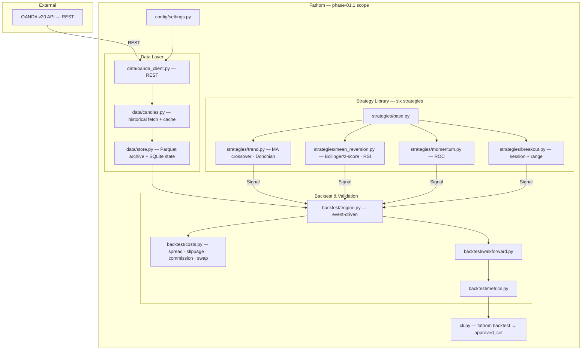

# phase-01.1 — Research Engine (full strategy set → approved set)

**Status:** completed (2026-05-29)
**Commitment level:** Phase N — ships to the operator; its output (`approved_set`) is consumed by every later phase.
**Time horizon:** one epic of `phase-01`, run 2026-05-28 → 2026-05-29.
**Epic of:** [`phase-01`](../phases-manifest.json) · sibling epic [`phase-01.2`](../phase-01.2/phase.md)
**Depends on:** [`phase-00`](../phase-00/phase.md) — approved-set table proven (honest 0/36)
**Unlocks:** [`phase-02`](../phase-02/phase.md)
**Product layer:** [spec](../../product/spec.md) · [architecture](../../product/architecture.md) · [invariants](../../product/invariants.md)
**Results:** [results.md](results.md) — **10/72 approved**

## Purpose

Complete the *research* half of the pipeline. Where `phase-00` validated the thesis with one
strategy on three pairs, this epic broadens to six strategies across four families, adds the
full cost model (swap), and produces the honest walk-forward `approved_set` table that the
Phase 2 ranker is gated on.

The riskiest assumption it tests: **does any baseline strategy survive a strict per-window
out-of-sample gate once all four cost categories are charged?** (Answer: 10 of 72 — thin but real.)

## In scope

1. Six baseline strategies across four families — MA crossover + Donchian breakout (trend),
   Bollinger/z-score + RSI (mean-reversion), ROC momentum, session/range breakout.
2. Overnight swap/financing in the cost model — INV-06 fully satisfied.
3. Walk-forward validation across all `(strategy, pair, timeframe)` combinations, per-timeframe
   windows (H1 12m/3m, H4 18m/6m, D 24m/6m).
4. `fathom backtest` CLI — runs the full suite and persists `approved_set`.
5. Parquet candle archive + SQLite operational state; instrument metadata cache.
6. The approved-set **gate**: downstream ranking must refuse to operate on an empty table (INV-10).

## Out of scope

- Live price streaming and the economic calendar — deferred to sibling epic [`phase-01.2`](../phase-01.2/phase.md).
- Signal ranking, watchlist, charts, narration — deferred to [`phase-02`](../phase-02/phase.md).
- Any order path, sizing, or risk module — deferred to [`phase-03`](../phase-03/phase.md).
- The admin panel — deferred to [`phase-04`](../phase-04/phase.md).
- Anything live-money — deferred to [`phase-05`](../phase-05/phase.md), INV-07-blocked.
- A vectorised pre-screen backtester — rejected outright: two engines create a
  "passed the fast test, failed the real one" gap. One engine, done right.
- The full ~70-pair universe — the acceptance run used the 3 majors; breadth is
  Workstream 3 in [`implementation-plan.md`](../../implementation-plan.md).

## Done when

- [x] Six strategies implemented against the `strategies/base.py` interface.
- [x] `backtest/costs.py` charges spread + slippage + commission + swap on every fill (INV-06).
- [x] `backtest/walkforward.py` produces per-window OOS metrics; the gate is strict
      (every OOS window Sharpe > 0 AND ≥ 5 trades).
- [x] `fathom backtest` writes `approved_set` to the store.
- [x] The run completes in workable time — O(n) precompute engine: 30 min → 22 s (PR #40).
- [x] The result is reported honestly whether positive or negative.

## Architecture (this phase)

Strict subset of [`docs/product/architecture.md`](../../product/architecture.md); superset of
`phase-00`. Adds the remaining five strategies, swap costs, Parquet, and the backtest CLI.
No stream, no calendar (those are `phase-01.2`), no ranker, no execution, no panel.

## Anticipated specs

| Feature | Hint |
|---|---|
| [full-universe-backtest-runner](../../features/full-universe-backtest-runner.md) | `fathom backtest` over the combo grid → `approved_set` |
| [swap-cost-model](../../features/swap-cost-model.md) | overnight financing, the fourth cost category (INV-06) |
| [data-layer-expansion](../../features/data-layer-expansion.md) | Parquet archive + instrument metadata cache |
| [donchian-breakout](../../features/donchian-breakout.md) · [bollinger-zscore-reversion](../../features/bollinger-zscore-reversion.md) · [rsi-reversion](../../features/rsi-reversion.md) · [roc-momentum](../../features/roc-momentum.md) · [session-range-breakout](../../features/session-range-breakout.md) | the five strategies added on top of the PoC's MA crossover |

## Invariants active

INV-03 (UTC) · INV-06 (all four cost categories) · INV-08 (secrets in `.env`) · INV-10 (approved-set gate).

## Scoping assumptions

All resolved at execution time — see [results.md](results.md) and
[taskgraph.md](taskgraph.md). The two open questions this doc carried at scoping time were
settled as follows: the vectorised pre-screen was **rejected** (see Out of scope); OANDA's
`GET /v3/accounts/{id}/instruments` was confirmed as the swap-rate source.
