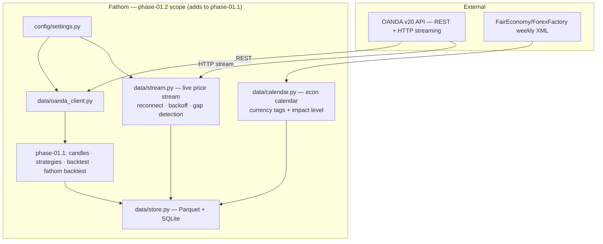

# phase-01.2 — Live-Data Groundwork (stream + economic calendar)

**Status:** completed (2026-05-29)
**Commitment level:** Phase N — ships to the operator; groundwork consumed by Phase 2 and 3.
**Time horizon:** one epic of `phase-01`, run 2026-05-29.
**Epic of:** [`phase-01`](../phases-manifest.json) · sibling epic [`phase-01.1`](../phase-01.1/phase.md)
**Depends on:** [`phase-01.1`](../phase-01.1/phase.md) — the data layer it extends
**Unlocks:** [`phase-02`](../phase-02/phase.md) (news-risk, live signals) and the `phase-03` deviation monitor
**Product layer:** [spec](../../product/spec.md) · [architecture](../../product/architecture.md) · [invariants](../../product/invariants.md)
**Results:** [results.md](results.md) — live ticks received, 97 calendar events stored

## Purpose

The live-data half of `phase-01` that `phase-01.1` deliberately deferred because it sits off
the approved-set critical path. Nothing here feeds the Phase 1 research deliverable — it is
groundwork so that Phase 2 can evaluate signals against live prices and assess news risk.

The riskiest assumption it tests: **can we hold a long-lived OANDA pricing stream and a free
calendar feed reliably enough to build on?** (Both worked; the acceptance walk caught two
real leaks that the mocked unit tests had passed.)

## In scope

1. `data/stream.py` — long-lived OANDA v20 pricing stream (chunked HTTP), single reader
   thread + queue, heartbeat-timeout detection, capped exponential backoff + jitter reconnect,
   `gap_detected` on reconnect, clean shutdown.
2. `data/calendar.py` — `EconomicCalendar` ABC + `FairEconomyCalendar` over the free
   ForexFactory/FairEconomy weekly XML feed; DST-aware feed-TZ → UTC; impact + currency
   tagging; idempotent SQLite upsert.
3. A live acceptance walk against the practice endpoint — real ticks, real feed.

## Out of scope

- WebSockets — OANDA v20 streams over chunked HTTP; no second transport.
- Any use of stream/calendar data in the approved set — the research verdict is
  `phase-01.1`'s and is not revised by live data.
- News *interpretation* (LLM risk assessment) — deferred to [`phase-02`](../phase-02/phase.md).
- Alerting on stream gaps — deferred to the `phase-03` deviation monitor.
- A paid calendar provider — deferred indefinitely; the free feed is behind an ABC so it
  can be swapped without touching callers.
- Next-week calendar feed — its URL 404s live; best-effort and default off.

## Done when

- [x] Stream connects to the live practice endpoint and yields real UTC-aware ticks.
- [x] Reconnect + heartbeat timeout exercised; no thread leak; clean shutdown.
- [x] Calendar fetches the live weekly feed and upserts events with UTC time, impact, currency.
- [x] A 404 on an optional feed degrades gracefully instead of losing stored events.
- [x] Operator-run live acceptance passes (2026-05-29).

## Architecture (this phase)

Strict subset of [`docs/product/architecture.md`](../../product/architecture.md) and a strict
superset of `phase-01.1` — adds exactly two modules and one external feed.

## Anticipated specs

| Feature | Hint |
|---|---|
| [live-streaming](../../features/live-streaming.md) | `PriceStream` — long-lived chunked-HTTP pricing stream |
| [economic-calendar](../../features/economic-calendar.md) | `EconomicCalendar` ABC + FairEconomy weekly feed |

## Invariants active

INV-03 (UTC — sharp for both) · INV-08 (no token/key logged) · INV-09 (env-scoped endpoints).

## Scoping assumptions

Resolved at execution. Calendar provider was an open decision at scoping time and was settled
on 2026-05-29 in favour of the free FairEconomy weekly XML feed behind a pluggable ABC — see
[taskgraph.md](taskgraph.md). Two failure modes were found only by the live walk, not by the
mocked unit tests (daemon-thread leak; next-week 404 losing this-week events) — both fixed
in PRs #47/#48.
