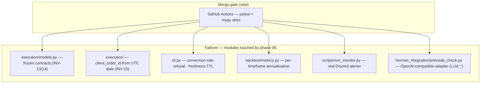

# phase-06 — Workstream 0: audit fixes, portability, CI

**Status:** in_progress
**Commitment level:** Phase N — ships to the operator; hardening of already-merged code, no new product surface.
**Time horizon:** 2026-09-01 → open (sweep closed early at operator request; 2 items outstanding)
**Depends on:** [`phase-05`](../phase-05/phase.md) code merged
**Unlocks:** the remaining workstreams in [`implementation-plan.md`](../../implementation-plan.md) (LLM swap complete, capture/breadth, AI research loop)
**Run artefacts:** [coordinator-brief.md](coordinator-brief.md) · [orchestration-state.json](orchestration-state.json)

## Purpose

The 2026-08-31 audit found the code-complete system carried real correctness bugs — one of
them a money bug — plus machine-specific test paths, unpinned deps, and no CI. This phase is
the followup sweep that fixes them. It ships no new capability; its value is that everything
already built becomes trustworthy and reproducible on a second machine.

Riskiest assumption tested: **is the idle, code-complete system actually safe to run?**
(No — INV-15 idempotency was broken for operator re-runs; fixed in PR #144.)

## In scope

1. Correctness fixes: client-order-id derived from UTC date (INV-15), per-timeframe
   Sharpe/Sortino annualisation, refusal to size without a quote→account conversion rate,
   watchlist candidate freshness TTL, frozen `Candidate`/`Order`/`Fill`/`Position` (INV-13/14).
2. Wiring fixes: the deviation monitor's real Discord alerter (was a no-op).
3. Provider-agnostic LLM adapter for the pre-trade veto (`LLM_*` env, OpenAI-compatible).
4. Portability + merge gate: no hardcoded paths, locked deps, CI.
5. INV-07 attestation persisted and read at execution time; the go-live runbook
   deadlock resolved (#139).
6. Operator docs reconciled with code reality, guarded by a doc-lint test (#140).
7. Outstanding: the real-OANDA-data fixture (#143).

## Out of scope

- Any new strategy, pair, or timeframe — that is Workstream 3 (capture/breadth).
- The AI research loop, trial ledger, and deflation gate — Workstream 4.
- The four operator acceptance gates — see [`operator-acceptance.md`](../../operator-acceptance.md);
  they need external services and human judgement, not code.
- Live trading — still INV-07-blocked.
- Invariant renumbering to the `INV-CATEGORY-N` scheme — deliberately deferred; `INV-01..16`
  is referenced across production code and reviewer greps.
- Restructuring `implementation-plan.md` into per-phase scope docs — a later Layer-3 pass.

## Done when

- [x] All wave 1–3 correctness fixes merged behind fresh review (PRs #144–#151).
- [x] CI exists and is the merge gate; the suite is green on a fresh venv on any machine.
- [x] #139 — `fathom execute` reads a persisted preflight attestation; runbook deadlock resolved (PR #153).
- [x] #140 — operator docs match the code, with a doc-lint test so the dead names cannot return (PR #154).
- [ ] #143 — real-OANDA-data fixture (**blocked on human:** needs an OANDA practice token or a candle-db export).
- [ ] `/halfcycle:cross-spec-audit` re-run — 9 spec amendments landed with their fixes.
- [ ] Operator prereq before the acceptance gates: re-run `fathom backtest --instruments ALL --history-years 5` (the persisted `approved_set` Sharpes are stale).

## Architecture (this phase)

Strict subset of [`docs/product/architecture.md`](../../product/architecture.md): this phase
touches existing modules only and adds no node to the container diagram except CI.

## Anticipated specs

Task specs live in [`implementation-plan.md`](../../implementation-plan.md) → Workstream 0 +
Strategy Verification Protocol + Workstream 1, one section per task; issues `#134`–`#143`
carry the acceptance criteria.

## Scoping assumptions

None outstanding — every item was grounded in the 2026-08-31 audit against real files.
Two latent bugs were discovered *during* the fixes and are recorded in
[orchestration-state.json](orchestration-state.json): the conversion-rate lookup never worked
(`close_mid` never present), and the risk-rationale text was inverted.
