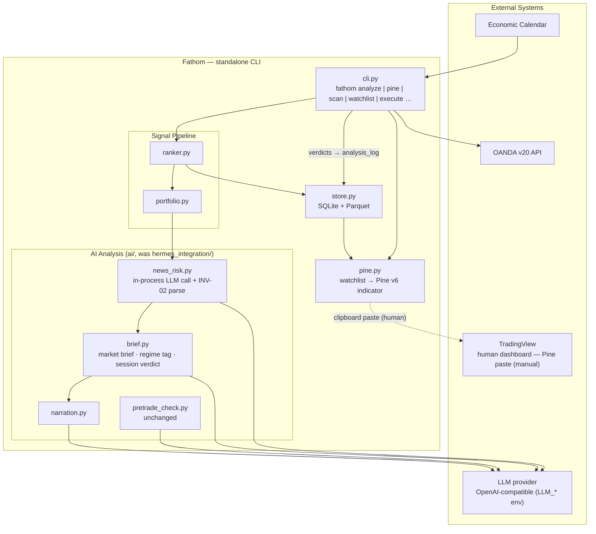

# phase-07 — Standalone platform: de-Hermes, on-demand AI analyze, Pine output

**Status:** not_started
**Commitment level:** Phase N — restructures the operator's daily workflow; ships to the operator immediately.
**Time horizon:** open — next phase after phase-06 close
**Depends on:** [`phase-06`](../phase-06/phase.md) (LLM provider adapter merged — WS1; CI merge gate)
**Unlocks:** [`phase-08`](../phase-08/phase.md) (companion commands reuse the in-process AI call pattern), [`phase-09`](../phase-09/phase.md)

## Purpose

Fathom stops being a Hermes-agent helper and becomes a standalone CLI trading platform.
The external Hermes orchestrator, its cron job, and Discord delivery are removed; the
LLM analysis that Hermes performed (news-risk veto, narration) moves in-process onto the
already-merged OpenAI-compatible adapter. Analysis happens **on demand at trade time**
via one command — `fathom analyze` — instead of on a nightly schedule. The presentation
layer changes from PNG charts (operator-confirmed: unused) to a **generated Pine Script**
the operator pastes into TradingView, so candidates render on the charts they actually look at.

Riskiest assumption tested: **the generated-Pine paste workflow is a usable daily surface.**
There is no TradingView write API (settled decision — see
[`implementation-plan.md`](../../implementation-plan.md) Workstream 2: TradingView MCPs are
ToS-violating scrapers; nothing TradingView-derived enters the automated pipeline; Pine
*output* is the clean inversion). If the paste-per-update loop is too much friction in
practice, the presentation thesis fails — so Pine generation is built and operator-tested
**first**, before the LLM pipeline work.

## In scope

1. **Pine Script generation** — `fathom pine`: render the latest persisted watchlist as a
   Pine v6 indicator (entry/stop/target lines, direction marker, strategy label,
   news/reduce-size flag per candidate), print to stdout + copy to clipboard. Built first
   (riskiest-assumption probe).
2. **`ai/` package** — rename `hermes_integration/` → `ai/`; move the news-risk and
   narration LLM calls in-process using `OpenAICompatClient`
   ([pretrade_check.py:231](../../../hermes_integration/pretrade_check.py)); the INV-02
   parse boundaries (`parse_news_risk`, `parse_pretrade_verdict`) and safe defaults are
   unchanged.
3. **`fathom analyze`** — the on-demand trade-time pipeline: scan → per-candidate LLM
   news-risk veto (INV-02 skip default) → regime tag → market brief → session
   ("skip-the-day") verdict → narration → Pine generation. All advisory output is text to
   the terminal; the LLM vetoes/flags/explains and never picks entries, sizes, or targets
   (INV-01/INV-02 unchanged).
4. **Hermes/Discord teardown** — delete `hermes_integration/jobs/daily.md`, the `fathom
   chart` PNG command and `signals/chart` rendering path, and the Discord watchlist
   delivery contract; retire the T-08 live-Discord operator gate (superseded by an
   analyze/Pine acceptance walk).
5. **Docs re-baseline** — Layer-2 [`architecture.md`](../../product/architecture.md)
   redrawn without Hermes/Discord nodes; `CLAUDE.md` commands; feature INDEX;
   [`operator-acceptance.md`](../../operator-acceptance.md) gate list updated.
6. **`fathom execute` untouched** except the `hermes_integration` → `ai` import path; the
   pre-trade veto and the whole Phase-3 gate remain as merged.

## Out of scope

- `fathom review`, `journal`, `ask`, deviation-log explainer — [`phase-08`](../phase-08/phase.md).
- Counterfactual veto ledger (recording what blocked trades would have done) — [`phase-09`](../phase-09/phase.md).
- AI research loop, trial ledger, deflation gate — [`phase-10`](../phase-10/phase.md).
- Watcher server / bar-close scanning / demo autopilot — implementation-plan Workstream 3; unaffected here.
- Any scheduler inside Fathom — analyze is on-demand only (operator decision, this scoping session).
- TradingView read integrations (MCP scrapers, alert webhooks) — settled out of scope in Workstream 2; webhook intake stays deferred.
- The Streamlit panel — stays as merged this phase; whether Pine+terminal obsoletes any views is a later Layer-3 decision.
- Monitoring's Discord **alerter** (`monitoring/alerts.py`, deviation alerts) — scoping assumption — verify at spec time: it posts via plain webhook with no Hermes dependency, so teardown does not touch it.
- Live trading — still INV-07-blocked; phase-05 gates unchanged.

## Done when

- [ ] `fathom analyze` runs the full pipeline end-to-end against the demo store with a live
      `LLM_*` key: candidates ranked, ≥1 news-risk verdict per candidate, regime tag +
      market brief + session verdict + narration printed, Pine script emitted — and with
      `LLM_API_KEY` unset every LLM step falls back to its INV-02 safe default
      (news-risk → skip) or deterministic fallback (narration), never crashing.
- [ ] Operator pastes generated Pine into TradingView and confirms levels render correctly
      on ≥3 candidates across ≥2 instruments (the riskiest-assumption acceptance walk).
- [ ] `grep -ri hermes` over code + operator docs returns nothing but historical
      phase/results docs; `fathom chart` is gone from the CLI; the test suite and doc-lint
      pass green in CI.
- [ ] `fathom execute --dry-run` still walks the full gate (proof the boundary code
      survived the rename).
- [ ] Layer-2 architecture diagram redrawn; phase diagrams 00–06 untouched (historical).

## Architecture (this phase)

Strict subset of the **post-phase-07** [`architecture.md`](../../product/architecture.md)
(this phase is the one that redraws it — Hermes/Discord removed, `ai/` added):

## Anticipated specs

| Feature | Hint |
|---|---|
| pine-generation | Watchlist → Pine v6 indicator; level lines + labels; clipboard; stdout; deterministic, no LLM |
| ai-package-migration | `hermes_integration/`→`ai/`; in-process news-risk call on `OpenAICompatClient`; parsers/prompts unchanged; import sweep |
| analyze-command | Pipeline orchestration, per-candidate loop, offline fail-safe path, terminal output format |
| market-brief | Brief + regime tag + session verdict: prompt templates, pydantic response models, INV-02 posture (advisory ⇒ fallback-text, not veto) |
| hermes-teardown | Delete chart/PNG + daily job + Discord contract; retire T-08; docs re-baseline + doc-lint update |

## Scoping assumptions

- Verified: the pre-trade veto is already in-process and provider-agnostic
  ([pretrade_check.py:231-309](../../../hermes_integration/pretrade_check.py)); news-risk and
  narration are parser/fallback-only with the LLM call Hermes-side
  ([news_risk.py:16](../../../hermes_integration/news_risk.py),
  [narration.py:23](../../../hermes_integration/narration.py)); the daily job exists only as
  a plain-English Hermes job doc ([daily.md](../../../hermes_integration/jobs/daily.md)) —
  no Hermes runtime lives in this repo.
- scoping assumption — verify at spec time: `fathom chart` / its rendering module is not
  imported by the Streamlit panel's Charts view (the panel is believed to render via
  `streamlit-lightweight-charts` directly from the store; if it does import the chart
  module, teardown must leave the shared code and delete only the CLI command).
- scoping assumption — verify at spec time: `monitoring/alerts.py` posts to Discord via a
  plain webhook with no Hermes dependency, so it survives teardown untouched.
- scoping assumption — verify at spec time: Pine v6 supports enough drawing primitives from
  a single pasted indicator (lines at absolute price levels, labels, colors per instrument
  scoped by `syminfo.ticker`) to render the full watchlist from one script.
- scoping assumption — verify at spec time: the T-08 operator gate can be retired without
  breaking phase-02's recorded results (T-08 was acceptance for a delivery channel this
  phase deletes; the replacement is the Pine acceptance walk above).
