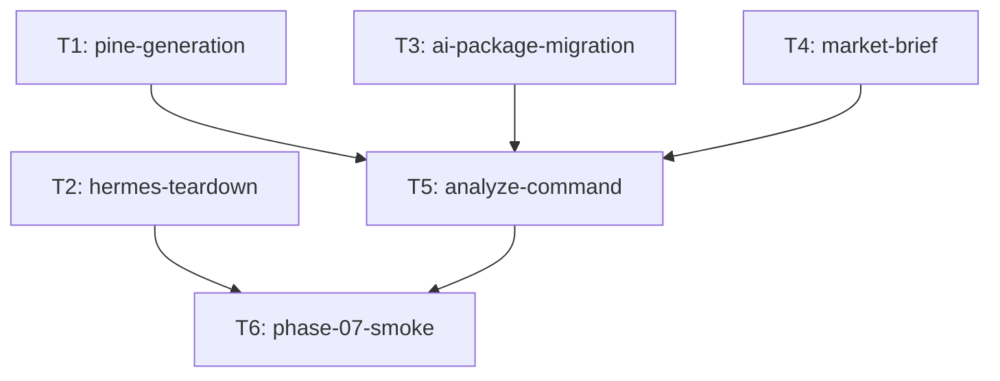

# Taskgraph — phase-07

> **STATUS: approved by saambaby, 2026-09-20 — hash 57d3672ba466a11278595cb6fb2998e5eaee318431fb91d54b3e17fe28d8796f**
> The generating session may not approve this graph. A human edits this banner to `approved by <name>, YYYY-MM-DD` before /halfcycle:orchestrate will run.

## Open decisions

| Decision | Recommendation | Affected tasks | Cost of deciding late | Blocks dispatch? |
|---|---|---|---|---|
| TradingView ticker variants (metals/indices) and line-anchor length (pine Q1–Q2) | Strip `_` from `instrument`; default 50-bar `line.new` anchors. Settle remaining cosmetics on the T1 paste walk. | T1, T6 | Cosmetic re-emit of `render_pine`; no schema change | No |
| `fathom analyze --instruments/--timeframes` (analyze Q1) | Pass-through to `run_scan` (same flags as `fathom scan`). | T5 | Extra argparse aliases after the command ships | No |
| `stand_aside` marker in the Pine status cell (market-brief Q1) | Leave unset until the T6 analyze walk; pine's status cell already exists. | T4, T5, T6 | One extra flag on `PineItem` / status cell | No |

No dispatch blockers.

## Summary

6 schedulable tasks (5 auto + 1 manual stack-assembly) across 2 waves; critical path depth 3 (budget `max(3, ceil(6/3)) = 3`), e.g. T3 → T5 → T6. Wave-1 width 4: `{T1, T2, T3, T4}`.

Spec prose orders pine → teardown → rename → brief → analyze. Only artifact edges are in the DAG; T2→T3 and T3→T4 are omitted so the path stays in budget. T2 and T3 are coordinator-branch (shared `pyproject.toml` / `CLAUDE.md` / `invariants.md` / `code-map.md`). `cli.py` is touched by T1/T2/T3/T5 — serialize merges, do not add file-lock edges.

## Dependency graph



## Task block (machine-readable — the contract orchestrate executes)

```json
{
  "phase": "phase-07",
  "tasks": [
    {
      "id": "T1",
      "title": "pine-generation",
      "area": "signals",
      "feature_spec": "docs/features/pine-generation.md",
      "surface": "backend",
      "depends_on": [],
      "depends_on_why": {},
      "acceptance_criteria": [
        "With a persisted watchlist of ≥3 candidates across ≥2 instruments (matching the phase-07 Done-when), `fathom pine` emits a script that compiles in the TradingView Pine v6 editor unmodified, and on each instrument's chart renders exactly that instrument's candidates (operator walk — the phase-07 riskiest-assumption gate).",
        "Level arithmetic is direction-correct: for LONG, stop < entry < target; for SHORT, target < entry < stop — asserted in unit tests against hand-computed values from `Candidate` fixtures, and the emitted Pine contains those absolute prices formatted with the instrument's display precision.",
        "Zero watchlist rows → compiling no-candidates script (timestamp-free) + stderr notice, exit 0; a missing/unreadable database exits non-zero with a distinct error.",
        "Determinism: two runs over identical watchlist (+ analysis) rows produce byte-identical scripts (candidates ordered by `rank`; the only timestamps in the output are stored `generated_at` values — no run timestamp and no wall-clock).",
        "Clipboard degradation: with `pbcopy` absent from PATH, the command still succeeds (stdout intact, stderr warning); `--no-clipboard` skips the attempt entirely.",
        "Boundary: an AST test (pattern of `tests/test_admin_panel.py`'s forbidden-import probe) proves the pine module imports none of `execution.*`, `risk.*`, `cli`, `ai.*`/`hermes_integration.*`, `httpx`, `oandapyV20`, or `urllib.request` — the enumerated list is the network/order surface; clipboard's `subprocess` use is confined to the CLI handler, not the module.",
        "Per-candidate staleness (AC semantics above): a fixture with one stale-H1 and one fresh-D candidate yields \"(stale)\" on the H1 label only, \"STALE\" in the status cell, a stderr warning, exit 0.",
        "Analysis join: with an `analysis_log` run present for the watchlist, `skip` candidates are absent from the script and `reduce_size` survivors carry the marker; with no analysis rows the full watchlist renders (fixture-tested both ways)."
      ],
      "verification": "auto",
      "human_admin": "TradingView paste walk for AC 1 (compile + levels on ≥2 instruments); shallow so a human blocker is not on T5.",
      "role": "mechanical",
      "role_rationale": "Pure watchlist→Pine renderer and CLI; no migration, money path, or enforcement change — INV-21 staleness is caller-computed in cli.py.",
      "track": "full",
      "files": [
        "signals/pine.py",
        "tests/test_pine.py",
        "data/store.py",
        "cli.py"
      ],
      "worktree": "yes",
      "new_dependency": false,
      "library_defaults": "n/a",
      "notes": "Built first (riskiest-assumption probe). render_pine(PineItem) is clock-free; stale/reduce_size flags are caller-computed. latest_watchlist_run_ts() lives on the store; load_latest_analysis join is a guarded no-op until T5. Do not relocate TIMEFRAME_BAR_LENGTH (T5 owns signals/timeframes.py). Clipboard subprocess stays in the CLI handler (AC 6)."
    },
    {
      "id": "T2",
      "title": "hermes-teardown",
      "area": "hermes_integration",
      "feature_spec": "docs/features/hermes-teardown.md",
      "surface": "backend",
      "depends_on": [],
      "depends_on_why": {},
      "acceptance_criteria": [
        "Deleted and unreferenced: `hermes_integration/jobs/` (daily.md), `tests/test_hermes_job.py`, `tests/test_execution_cli.py::TestInv01Boundary::test_daily_md_allowlist_unchanged`, `signals/charts.py`, `tests/test_charts.py`, the `chart` subparser + `cmd_chart` in `cli.py`, and the `matplotlib` dependency in `pyproject.toml` (its only consumers are the two deleted files). The deletion manifest below is authoritative where it and this list differ. Suite + CI green.",
        "`git grep -i 'hermes'` over code, tests, `CLAUDE.md`, `docs/product/`, `docs/phases/phases-manifest.json`, and `docs/operator-acceptance.md` hits only: the `hermes_integration/` package name itself (renamed next by ai-package-migration), historical phase/results docs — **including the `name` strings of phase entries in `phases-manifest.json`, which are historical phase identity and are never rewritten** — and explicit \"removed/superseded\" notes (the amended phase-02 outcome string is one such note; phase-07's own \"de-Hermes\" name is a removal description and sanctioned on the same basis). **Timing:** the `docs/product/` leg of this grep is accepted at **phase close** together with AC 4 (`architecture.md` keeps its Hermes prose until the deferred redraw); the commit-2 grep excludes `docs/product/architecture.md` and must pass on everything else. This taxonomy (package name pre-rename · historical phase/results docs · explicit removed/superseded notes) refines the phase Done-when's shorthand \"nothing but historical phase/results docs\". The doc-lint guard also asserts the INDEX amendments below (retired statuses + de-Hermesed cli-commands/monitor-alerts summaries) so they have an executable acceptance check. The doc-lint test's dead-name guard is updated so retired names (`fathom chart`, the job doc, T-08) cannot reappear in operator docs.",
        "Invariant re-wordings land in `docs/product/invariants.md` with rule *substance* unchanged: INV-01 restated as \"no AI/analysis surface may import or invoke execution — order authority lives solely behind operator-run `fathom execute`\" (Hermes named only in a note using retired/superseded phrasing, so the mention lands in AC 2's sanctioned-note category); INV-02 generalized off provider vocabulary — title/Rule \"Claude\" → \"LLM\" and enforcement text naming the OpenAI-compatible adapter + parse boundaries instead of \"`anthropic` SDK call\" (consistent with INV-20); INV-13 reworded **in full** — title (\"Frozen Hermes-Facing Wire Contract\" → e.g. \"The `Candidate` Model Is the Frozen Wire Contract\"), Rule, Reason, and Enforcement — replacing the Hermes-job / Discord-watchlist consumer vocabulary with the live consumers (portfolio, cli, narration, pine, panel); the frozen-contract substance and pinned field list are untouched.",
        "`docs/product/architecture.md`'s container diagram is redrawn: HERMES and DISCORD-watchlist nodes gone, `ai/` + PINE + LLM-provider nodes present (matching the phase-07 phase-doc diagram); the \"Hermes Boundary\" prose section is replaced by the AI-surface boundary; data-flow sections describe `fathom analyze`.",
        "`docs/operator-acceptance.md`: T-08 removed from the ordered gate list with a superseded-by note pointing at the pine/analyze acceptance walk; remaining gates (T-11, T-06, T-05) renumber-free and intact **except** the residue rewords: the \"4 remaining gates\" framing becomes 3; T-05's precondition \"gates 1–3 closed positive (INV-07)\" becomes \"T-11 + T-06 closed positive **plus** the phase-07 pine/analyze acceptance walk\"; T-06's \"Watchlist (mirrors Discord)\" phrasing drops the Discord reference; and the prerequisites/one-time-setup rows referencing Hermes-side keys or a running Hermes instance (today :37, :40, :43-44) are removed or reworded. The hermes grep alone is NOT the completeness check for this file — a second residue sweep (`grep -inE 'discord|gate 1|gates 1|four gates'`) catches the Discord/gate-count leftovers (today at least :23 \"Gates 1–3 build the demo track record\", :39 `DISCORD_WEBHOOK_URL` \"Needed for: gate 1 (watchlist)\", :110, :141 \"gates 1–3\", :156 \"the four gates above\"; the grep pattern is illustrative — the \"four gates\" framing at :4-5 and :14 is line-wrapped past it and is verified by read-through under AC 5's 4→3 reword mandate).",
        "`panel/app.py` and `monitoring/alerts.py` are untouched by the deletion commit (verified consumers: panel renders via `streamlit_lightweight_charts`, not `signals.charts`; alerts POST the webhook directly)."
      ],
      "verification": "auto",
      "human_admin": "none",
      "role": "mechanical",
      "role_rationale": "Deletes retired surfaces and rewords docs; invariant substance is unchanged. AC 4 architecture redraw is deferred to T6 (spec Approach step 3).",
      "track": "full",
      "files": [
        "hermes_integration/jobs/daily.md",
        "tests/test_hermes_job.py",
        "tests/test_execution_cli.py",
        "signals/charts.py",
        "tests/test_charts.py",
        "cli.py",
        "pyproject.toml",
        "config/settings.py",
        "signals/ranker.py",
        "signals/scan.py",
        "monitoring/alerts.py",
        "execution/orders.py",
        "tests/test_cli_commands.py",
        "tests/test_docs_lint.py",
        "docs/features/INDEX.md",
        "CLAUDE.md",
        "docs/phases/phases-manifest.json",
        "docs/product/invariants.md",
        "docs/product/spec.md",
        "docs/product/code-map.md",
        "docs/operator-acceptance.md",
        "docs/go-live-runbook.md"
      ],
      "worktree": "coordinator-branch",
      "new_dependency": false,
      "library_defaults": "n/a",
      "notes": "AC 4 is listed because it is a spec AC, but architecture.md is not in files — T6 redraws it after analyze exists. AC 2 docs/product grep excluding architecture.md is this task; the architecture.md leg lands at T6. monitoring/alerts.py is in files only for the watchlist-delivery docstring reword (module behaviour untouched; AC 6). panel/app.py is not in files. Phase-02 manifest: drop T-08 open_gate, status completed, outcome amended — do not rewrite historical phase name strings. Surviving-code Hermes prose (cli/ranker/scan/alerts/orders/settings/tests) is this task's, not T3's. T3 may delete jobs/ and test_hermes_job.py if they remain (idempotent)."
    },
    {
      "id": "T3",
      "title": "ai-package-migration",
      "area": "hermes_integration",
      "feature_spec": "docs/features/ai-package-migration.md",
      "surface": "backend",
      "depends_on": [],
      "depends_on_why": {},
      "acceptance_criteria": [
        "`git grep -l 'hermes_integration'` over tracked `*.py` + `pyproject.toml` returns nothing; the full test suite passes with the `ai.` import paths (tests renamed/updated in the same change). The sweep also updates **path spellings in durable docs** to `ai/`: `docs/product/code-map.md`'s area/dispatch rows and the \"today `hermes_integration/…`\" parentheticals in INV-20/INV-21 (hermes-teardown's rename handoff — its phase-close grep depends on this).",
        "`ai/llm_client.py` owns `OpenAICompatClient` + the `_ClientAdapter` protocol; `ai/pretrade_check.py` imports them from there and its public API (`pretrade_check`, `parse_pretrade_verdict`, `PretradeVerdict`, `MODEL`, re-exported `OpenAICompatClient` — the full existing import surface, per the re-export list in Component design; `cli.py:131` imports the adapter from here) is unchanged — proven by the existing pretrade test suite passing with only import-path edits.",
        "`news_risk_check` follows the exact `pretrade_check` algorithm: no client + no `LLM_API_KEY` → safe default `skip` verdict without network I/O; injected stub client → prompt built from `ai/prompts/news_risk.md` with all six placeholders substituted; any transport/parse failure → `parse_news_risk` safe default (INV-02). Offline tests cover all three paths.",
        "`narrate` returns `NarrationResult(text=<model line>, source=\"model\")` when `should_use_fallback` says usable, else `NarrationResult(text=fallback_narration(candidate), source=\"fallback\")`; with no key/client it returns the fallback result without network I/O; it never raises and `text` is never empty (NOT INV-02 — cosmetic contract preserved).",
        "`parse_news_risk`, `parse_pretrade_verdict`, both pydantic verdict models, and all three prompt template files are moved byte-identical (templates) / behavior-identical (parsers — existing parser tests pass unmodified except import paths).",
        "INV-08 holds: `LLM_API_KEY` appears in no log line or `repr` on any new path (existing key-hygiene tests extended to `news_risk_check`/`narrate`)."
      ],
      "verification": "auto",
      "human_admin": "none",
      "role": "mechanical",
      "role_rationale": "Package rename plus in-process wrappers around unchanged parsers; no new table or money path.",
      "track": "full",
      "files": [
        "hermes_integration/__init__.py",
        "hermes_integration/news_risk.py",
        "hermes_integration/narration.py",
        "hermes_integration/pretrade_check.py",
        "hermes_integration/prompts/pretrade.md",
        "hermes_integration/prompts/news_risk.md",
        "hermes_integration/prompts/narration.md",
        "ai/__init__.py",
        "ai/llm_client.py",
        "ai/pretrade_check.py",
        "ai/news_risk.py",
        "ai/narration.py",
        "ai/prompts/pretrade.md",
        "ai/prompts/news_risk.md",
        "ai/prompts/narration.md",
        "cli.py",
        "pyproject.toml",
        "config/settings.py",
        "tests/test_pretrade_check.py",
        "tests/test_news_risk.py",
        "tests/test_narration.py",
        "tests/test_config.py",
        "tests/test_live_gate.py",
        "tests/test_execution_cli.py",
        "tests/test_cli_commands.py",
        "tests/test_docs_lint.py",
        "docs/product/code-map.md",
        "docs/product/invariants.md"
      ],
      "worktree": "coordinator-branch",
      "new_dependency": false,
      "library_defaults": "n/a",
      "notes": "No directory-level git mv onto a pre-existing ai/ (T4 may already have ai/brief.py). Move named modules file-by-file. Do not touch ai/brief.py or ai/prompts/session.md. If jobs/ or tests/test_hermes_job.py still exist, delete them so AC 1 grep is achievable. Retarget TestInv01Boundary directory scan from hermes_integration/ to ai/. No hermes_integration import shim."
    },
    {
      "id": "T4",
      "title": "market-brief",
      "area": "hermes_integration",
      "feature_spec": "docs/features/market-brief.md",
      "surface": "backend",
      "depends_on": [],
      "depends_on_why": {},
      "acceptance_criteria": [
        "`session_analysis(candidates_summary, calendar_events, market_stats, *, client=None)` with a stub client returning valid JSON yields parsed `SessionAnalysis` with all three parts; instruments missing from the model's `regimes` map get `unavailable` (partial responses tolerated per-instrument, not failed whole).",
        "Fail-safe (NOT INV-02 veto semantics, explicitly): invalid JSON, missing field, out-of-enum value (including a raw `\"unavailable\"`), transport error, or no client + no `LLM_API_KEY` → the full deterministic fallback (`verdict=\"unavailable\"`, all regimes `unavailable`, fallback brief text); the function never raises and the caller can always render — proven for each failure class offline, with the no-client/no-key case asserting **zero network I/O** via a socket guard or httpx mock (INV-20). A future reader must NOT add a skip/veto default here (narration-style guard note in the module docstring).",
        "Prompt: `ai/prompts/session.md` placeholders (`{{candidates_summary}}`, `{{calendar_events}}`, `{{market_stats}}`, `{{utc_now}}`) all substituted; the template instructs JSON-only output matching the wire format below.",
        "Strict validation: pydantic models with `extra=\"forbid\"` and `Literal` enums; any validation failure routes to the fallback (single parse boundary, `parse_session_analysis`, same pattern as `parse_news_risk`).",
        "Boundary: `ai/brief.py` imports no store, execution, risk, or signals module — its inputs are three pre-rendered strings; the boundary scan extends to it (INV-01 posture; store access for stats lives in analyze-command's orchestration).",
        "INV-08: no key in logs/repr on this path (key-hygiene test extended)."
      ],
      "verification": "auto",
      "human_admin": "none",
      "role": "mechanical",
      "role_rationale": "Advisory session models and parse boundary; stand_aside never vetoes. Adapter is the shipped OpenAICompatClient (re-exported from pretrade_check).",
      "track": "full",
      "files": [
        "ai/brief.py",
        "ai/prompts/session.md",
        "tests/test_brief.py"
      ],
      "worktree": "yes",
      "new_dependency": false,
      "library_defaults": "n/a",
      "notes": "No DAG edge on T3: import OpenAICompatClient from pretrade_check (works pre- and post-rename). Wire enums must exclude unavailable; fallback constructors mint it. {{utc_now}} is minted inside session_analysis, not a caller input."
    },
    {
      "id": "T5",
      "title": "analyze-command",
      "area": "cli",
      "feature_spec": "docs/features/analyze-command.md",
      "surface": "backend",
      "depends_on": ["T1", "T3", "T4"],
      "depends_on_why": {
        "T1": "consumes signals/pine.py::render_pine and the PineItem wrapper T1 defines",
        "T3": "consumes ai.news_risk.news_risk_check, ai.narration.narrate, and OpenAICompatClient",
        "T4": "consumes ai.brief.session_analysis plus SessionAnalysis and RegimeTag"
      },
      "acceptance_criteria": [
        "With a stub LLM client injected (test) or live key (acceptance), a 3-candidate scan yields: per-candidate verdict calls with all six `news_risk.md` placeholders filled (calendar events rendered from the store's calendar for that instrument's currencies), survivors/vetoed split per `suggest_action`, `reduce_size` flags carried through to terminal and Pine label, and one `analysis_log` row per candidate. *(Phase-07 acceptance stops here; the `veto_ledger` clauses below are the phase-09 retrofit — see \"Veto ledger\" in Component design — and are accepted with phase-09, not this phase: one `veto_ledger` row **per candidate** (`source=\"news_risk\"`) recorded **immediately after** `news_risk_check` returns and **before** `narrate`; a ledger write failure logs WARNING and does not change the verdict, the loop, or the `analysis_log` write; on `settings.env == \"live\"` the same pipeline writes `analysis_log` rows and **zero** `veto_ledger` rows — INV-09 Phase-9 skip.)*",
        "Offline path: with `LLM_API_KEY` unset and no client, all candidates are vetoed with the safe-default reason, and zero network I/O occurs **in the LLM/annotation pipeline** — the test fixture reaches it via `run_scan(dry_run=True)` or stubbed candidates (the scan's own candle refresh is out of this AC's scope), then asserts via a socket-guard or httpx-mock; session block prints fallback text, exit 0.",
        "Empty watchlist: INV-10 message, zero LLM calls, no `analysis_log` rows, exit 0.",
        "`analysis_log` rows match the wire-format table below exactly; timestamps are UTC RFC-3339 (INV-03); rows are append-only (no UPDATE path in the store API).",
        "Order-free boundary: `signals/analyze.py` imports none of `execution.*`, `risk.*`, or `cli` (the CLI module carries order imports at module level — INV-01 Phase-4 transitive clause) — AST test in the `test_admin_panel.py` pattern (INV-01).",
        "`--dry-run` reaches `run_scan(dry_run=True)` (no candle refresh) and still runs the LLM/annotation pipeline on the resulting candidates.",
        "The emitted Pine (absent `--no-pine`) contains exactly the survivor set — a `skip` verdict's instrument draws nothing unless another surviving candidate shares it.",
        "`fathom scan` and `fathom watchlist` remain unchanged in behavior and output (analyze is additive; their tests pass untouched)."
      ],
      "verification": "auto",
      "human_admin": "none",
      "role": "critical",
      "role_rationale": "Adds the append-only analysis_log table (store DDL + accessors) and orchestrates the INV-02 news-risk veto loop.",
      "track": "full",
      "files": [
        "signals/analyze.py",
        "signals/timeframes.py",
        "data/store.py",
        "cli.py",
        "tests/test_analyze.py"
      ],
      "worktree": "yes",
      "new_dependency": false,
      "library_defaults": "n/a",
      "notes": "Relocate TIMEFRAME_BAR_LENGTH from cli.py to signals/timeframes.py (INV-21 single site). load_latest_analysis(watchlist_run) returns rows iff the latest analysis run's watchlist_ts matches. Do not call record_news_risk_verdict — insertion point is pinned for phase-09. --instruments/--timeframes pass through to run_scan. Serialized after T1 on data/store.py (T1 owns latest_watchlist_run_ts; T5 owns analysis_log)."
    },
    {
      "id": "T6",
      "title": "phase-07-smoke",
      "area": "cli",
      "feature_spec": "docs/phases/phase-07/phase.md",
      "surface": "backend",
      "depends_on": ["T5", "T2"],
      "depends_on_why": {
        "T5": "consumes fathom analyze plus analysis_log for the live-key pipeline walk",
        "T2": "consumes chart/T-08 deletion and the dead-name guard; redraws architecture.md that T2 deferred"
      },
      "acceptance_criteria": [
        "`fathom analyze` runs the full pipeline end-to-end against the demo store with a live `LLM_*` key: candidates ranked, ≥1 news-risk verdict per candidate, regime tag + market brief + session verdict + narration printed, Pine script emitted — and with `LLM_API_KEY` unset every LLM step falls back to its INV-02 safe default (news-risk → skip) or deterministic fallback (narration), never crashing.",
        "Operator pastes generated Pine into TradingView and confirms levels render correctly on ≥3 candidates across ≥2 instruments (the riskiest-assumption acceptance walk).",
        "`grep -ri hermes` over code + operator docs returns nothing but historical phase/results docs; `fathom chart` is gone from the CLI; the test suite and doc-lint pass green in CI.",
        "`fathom execute --dry-run` still walks the full gate (proof the boundary code survived the rename).",
        "Layer-2 architecture diagram redrawn; phase diagrams 00–06 untouched (historical).",
        "`docs/product/architecture.md`'s container diagram is redrawn: HERMES and DISCORD-watchlist nodes gone, `ai/` + PINE + LLM-provider nodes present (matching the phase-07 phase-doc diagram); the \"Hermes Boundary\" prose section is replaced by the AI-surface boundary; data-flow sections describe `fathom analyze`."
      ],
      "verification": "manual",
      "human_admin": "live LLM_API_KEY, TradingView paste of analyze Pine, fathom execute --dry-run on demo",
      "role": "n/a",
      "role_rationale": "Manual stack-assembly / acceptance walk; no worker role.",
      "track": "full",
      "files": [
        "docs/product/architecture.md",
        "docs/phases/phase-07/results.md"
      ],
      "worktree": "coordinator-branch",
      "new_dependency": false,
      "library_defaults": "n/a",
      "notes": "Stack-assembly pre-flight for /halfcycle:smoke. Records the walk in results.md. Completes teardown AC 4 and the architecture.md leg of teardown AC 2."
    }
  ]
}
```

## Tasks (prose detail)

### T1 — pine-generation
- **area:** `signals`
- **feature_spec:** [docs/features/pine-generation.md](../../features/pine-generation.md)
- **surface:** backend
- **depends_on:** none
- **depends_on_why:** n/a
- **track:** full
- **files:** `signals/pine.py`, `tests/test_pine.py`, `data/store.py` (scalar `latest_watchlist_run_ts` only), `cli.py` (`fathom pine` subcommand + clipboard helper)
- **acceptance_criteria:** spec ACs 1–8, copied in the JSON block
- **verification:** auto (unit/golden/AST); AC 1 operator paste is `human_admin` here so the blocker is shallow
- **human_admin:** TradingView paste walk (AC 1)
- **role:** mechanical — renderer + CLI; no DDL
- **worktree:** yes
- **library_defaults:** n/a
- **notes:** Pine ships first. Join against `analysis_log` is the no-join path until T5.

### T2 — hermes-teardown
- **area:** `hermes_integration`
- **feature_spec:** [docs/features/hermes-teardown.md](../../features/hermes-teardown.md)
- **surface:** backend
- **depends_on:** none (T-08 note can point at the pine walk without importing pine)
- **track:** full
- **files:** deletion manifest except `docs/product/architecture.md`
- **acceptance_criteria:** spec ACs 1–6 (AC 4 accepted on T6)
- **verification:** auto
- **human_admin:** none
- **role:** mechanical — delete + reword
- **worktree:** coordinator-branch (pyproject, CLAUDE.md, invariants, INDEX, manifest, operator docs)
- **notes:** Do not edit `panel/app.py`. Alerts webhook stays.

### T3 — ai-package-migration
- **area:** `hermes_integration`
- **feature_spec:** [docs/features/ai-package-migration.md](../../features/ai-package-migration.md)
- **surface:** backend
- **depends_on:** none (jobs deletion is T2-owned; T3 deletes leftovers if present)
- **track:** full
- **files:** named modules only — not `ai/brief.py` / `ai/prompts/session.md`
- **acceptance_criteria:** spec ACs 1–6
- **verification:** auto
- **role:** mechanical
- **worktree:** coordinator-branch
- **notes:** File-by-file move into `ai/` so a pre-existing T4 `ai/brief.py` does not break `git mv`.

### T4 — market-brief
- **area:** `hermes_integration`
- **feature_spec:** [docs/features/market-brief.md](../../features/market-brief.md)
- **surface:** backend
- **depends_on:** none (adapter already shipped on `pretrade_check`)
- **track:** full
- **files:** `ai/brief.py`, `ai/prompts/session.md`, `tests/test_brief.py`
- **acceptance_criteria:** spec ACs 1–6
- **verification:** auto
- **role:** mechanical
- **worktree:** yes
- **notes:** Advisory fallback is not INV-02 skip.

### T5 — analyze-command
- **area:** `cli`
- **feature_spec:** [docs/features/analyze-command.md](../../features/analyze-command.md)
- **surface:** backend
- **depends_on:** T1, T3, T4
- **depends_on_why:** `render_pine` / `PineItem`; `news_risk_check` + `narrate`; `session_analysis` + `RegimeTag`
- **track:** full
- **files:** `signals/analyze.py`, `signals/timeframes.py`, `data/store.py` (`analysis_log`), `cli.py` (`fathom analyze`), `tests/test_analyze.py`
- **acceptance_criteria:** spec ACs 1–8 (phase-09 veto-ledger clauses in AC 1 are not this task)
- **verification:** auto
- **role:** critical — `analysis_log` migration
- **worktree:** yes

### T6 — phase-07-smoke
- **area:** `cli`
- **feature_spec:** [docs/phases/phase-07/phase.md](phase.md)
- **surface:** backend
- **depends_on:** T5, T2
- **track:** full
- **files:** `docs/product/architecture.md`, `docs/phases/phase-07/results.md`
- **acceptance_criteria:** phase Done-when + teardown AC 4
- **verification:** manual
- **human_admin:** live `LLM_API_KEY` + TradingView paste + `fathom execute --dry-run`
- **role:** n/a
- **worktree:** coordinator-branch

## Sanity checks

| Check | Result |
|---|---|
| DAG acyclic | Yes |
| Critical path within budget (<= ceil(n/3), floor 3) | Yes — depth 3, 6 schedulable, budget 3. Longest: T1\|T3\|T4 → T5 → T6 |
| Max parallel width (validator prints it) | 4 (`{T1,T2,T3,T4}`) |
| Every edge has a real artifact in depends_on_why | Yes — render_pine; news_risk_check/narrate; session_analysis; fathom analyze; chart/T-08 gone + deferred architecture.md |
| files lists disjoint within each level | No at wave 1: `cli.py` / `pyproject.toml` / `data/store.py` / several tests / coordinator docs overlap T1–T3. Mitigated by coordinator-branch on T2/T3 and merge serialization on `cli.py`. Wave 2 `{T5}` is a singleton. |
| Human-gated tasks are shallow, not hubs | T1 (TradingView paste) is depth 1 and not a hub. T6 is last, not a hub. |
| ACs trace to specs | T1–T5 copy numbered spec ACs; T6 copies phase Done-when + teardown AC 4 |
| Code-map safe-parallel rules respected | Same-file `cli.py` / `store.py` / `pyproject.toml` are not claimed parallel-safe; T2/T3 coordinator-branch |
| Platform-package edits flagged coordinator-branch | T2, T3, T6 |
| library_defaults present on all new-dep tasks | n/a (no new_dependency) |

Omitted edges (ordering, not artifacts): T2→T3, T3→T4, T1→T2. Do not re-add them to “feel safer” — they blow the critical-path budget.

## Handoff

After human approval:

```bash
python3 "$CLAUDE_PLUGIN_ROOT/scripts/taskgraph.py" approve docs/phases/phase-07/taskgraph.md --by "<name>"
```

Then `/halfcycle:orchestrate phase-07`.
