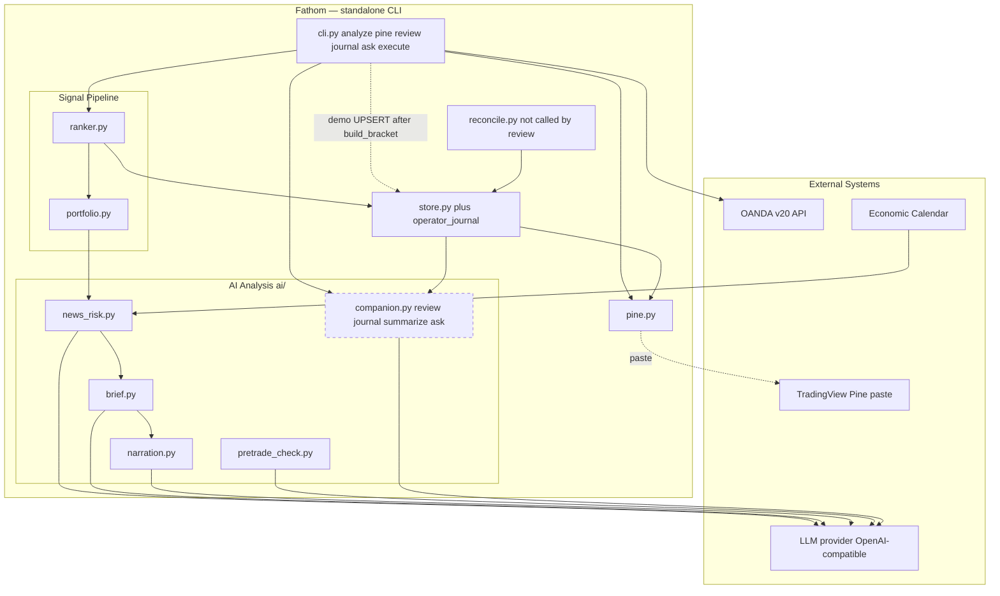

# phase-08 — Trader companion commands: review, journal, ask, deviation explainer

**Status:** not_started
**Commitment level:** Phase N — ships to the operator immediately as CLI commands on the phase-07 platform (not a throwaway PoC).
**Time horizon:** open — after [`phase-07`](../phase-07/phase.md) lands `ai/` + the in-process call pattern
**Depends on:** [`phase-07`](../phase-07/phase.md) (`ai/llm_client.py::OpenAICompatClient`, prompt-template convention, `signals/timeframes.py` for INV-21)
**Unlocks:** nothing hard — [`phase-09`](../phase-09/phase.md) is independent (shares the AI surface; journal's `operator_declined` reason strings are aligned with the ledger spec but the ledger is not a substrate)

## Purpose

Round out the "AI-supported trader" loop with four companion surfaces. Three of them
(`review`, `ask`, `journal show|summarize`) take data Fathom already persists, hand it
to the LLM through one shared call shape, and print advisory text. The fourth is not
a command: the deviation-log explainer is `fathom review --deviations`. Journal also
adds a **demo-only execute-side UPSERT** after `build_bracket` so the operator has a
narrative log of attempts that minted a `client_order_id`.

Nothing here gains order authority. LLM outage degrades every commentary path to
`"analysis unavailable"` (INV-02 does **not** apply — these outputs feed no automated
decision). Live `ENV=live` execute writes **zero** journal rows (INV-09 telemetry skip
until INV-07).

Riskiest assumption tested: **LLM commentary over the store's own data is useful
enough that the operator keeps running these commands** — the cheap test of the
"AI-supported trader" thesis before phase-09/10 invest in heavier machinery.

## In scope

1. **Shared plumbing (`companion-core`)** — `ai/companion.py`: `build_context_pack` +
   `run_companion_call` (stub-client / no-key / parse-failure → caller-supplied
   fallback, never raise) + AST forbidden-import boundary. Load-bearing for the other
   three specs; not a separate epic (see Size check).
2. **`fathom review`** — open positions + last-reconciled `account_state` (`as_of`
   freshness, not a live broker pull) + local calendar (medium/high, next 48h UTC) +
   deviation log → per-item "worth investigating?" findings. **Does not call
   `reconcile()`.** Broker-vs-db `drift_flags` are in-memory on `ReconcileReport` and
   are not a review input.
3. **`fathom review --deviations`** — same command; prints a plain-English diagnosis
   per loaded deviation-log row (phase item 4 folded in, not a fifth CLI).
4. **`fathom journal`** — `operator_journal` UPSERT keyed on `client_order_id`, hooked
   from `cmd_execute` **after** `build_bracket`; `show` / `summarize` (LLM summary uses
   companion-core; the execute hook never calls the LLM). Outcomes: `dry_run`,
   `limits_rejected`, `operator_declined`, `submitted`, `broker_rejected`,
   `submit_failed`. Gate aborts *before* `build_bracket` write **no** row (no natural
   key). Demo-only (INV-09).
5. **`fathom ask "<question>"`** — freeform Q&A over a **fixed** source pack
   (watchlist, latest-run approved-set, open positions, `account_state`, newest 50
   fills). Visible `REFUSED:` when the model marks `live_quote` / `unstored_news` /
   `foreign_account` / `not_in_store`. Stale watchlist rows stay answerable and are
   stamped `stale` (INV-21 disclose, not refuse).

## Out of scope

- Counterfactual veto ledger, tracker, and `fathom veto-report` — [`phase-09`](../phase-09/phase.md). Journal may store `operator_declined` as a **narrative** outcome; it does not write `eval.veto_ledger`.
- AI research loop, trial ledger, deflation gate, DSL, agent — [`phase-10`](../phase-10/phase.md).
- Journal rows feeding sizing, ranking, news-risk, or any automated decision — never; journal is record + `summarize` only.
- Scheduled / digest / cron modes for review/journal/ask — on-demand only ([ADR-004](../../product/architecture.md#adr-004--on-demand-analysis-at-trade-time-no-built-in-scheduler), same operator decision as phase-07).
- Panel views for journal, review, or ask — CLI only this phase; Streamlit stays as merged (later Layer-3 decision).
- New market-data capture or new broker endpoints — review/ask are store-read; journal does not call v20.
- Calling `reconcile()` or reading live OANDA account/trades from review or ask — freshness is `account_state.as_of` from the last operator `fathom reconcile`.
- Live-env journal (or veto-ledger) writes — deferred until INV-07; INV-09 skip stays at the `cmd_execute` call site.
- Watcher server / bar-close scanning / demo autopilot — implementation-plan Workstream 3.
- An LLM router, extra store dumps (`candles`, Parquet, `veto_ledger`, `operator_journal` inside `ask`), or speculative answers — ask's pack is fixed.
- Changing execute-gate *semantics* (pretrade, sizing, limits, submit) — journal is a side-effect hook after `build_bracket`; hook failure logs WARNING and must not change exit codes.
- Pine / analyze / Hermes teardown — [`phase-07`](../phase-07/phase.md).

## Done when

- [ ] `fathom review`, `fathom review --deviations`, `fathom journal show|summarize`,
      and `fathom ask` run against the demo store with a live `LLM_*` key and print
      grounded, non-empty analysis (or the command's honest empty string:
      `"nothing to review"` / `"journal empty"` / `"ask: store has no grounded tables yet"`);
      with `LLM_API_KEY` unset each commentary path prints `"analysis unavailable"` plus
      raw tables where the spec requires them, and exits 0.
- [ ] Demo `fathom execute` that reaches `build_bracket` (dry-run, limits reject after
      minting the id, confirm-abort, broker reject, submit failure, or submitted fill)
      upserts one `operator_journal` row; a repeated execute of the same
      `client_order_id` does not duplicate it. Live (`settings.env == "live"`) execute
      that reaches `build_bracket` writes zero journal rows.
- [ ] `fathom ask` answers ≥3 operator questions correctly from store data and visibly
      `REFUSED:` one out-of-scope question without fabricating.
- [ ] AST boundary tests prove `ai/companion.py`, `ai/review.py`, journal read path,
      and ask import none of `execution.orders`, `execution.models.build_bracket`,
      `execution.reconcile`, `risk.sizing`, `risk.limits`, or `cli`. Reading frozen
      INV-14 models (`Position` / `Fill` / `Order`) returned by `Store` is allowed.
      The execute-side journal recorder is called *from* `cli.py`, not the reverse.
- [ ] CI green; `CLAUDE.md` commands + feature INDEX updated.

## Architecture (this phase)

Monotonic **superset** of the [phase-07](../phase-07/phase.md) diagram (Hermes/Discord
already gone there). Strict subset of the **post-phase-07** Layer-2 target in
[`architecture.md`](../../product/architecture.md) ADRs 001–004, plus the companion
layer (dashed = new this phase). `reconcile.py` is shown only to mark the
non-edge: review reads `account_state` from the store, never calls reconcile.

## Anticipated specs

Four specs, already `ready` in [`docs/features/INDEX.md`](../../features/INDEX.md)
(this Layer-3 pass does not re-open them). Size check below: keep as one phase.

| Feature | Hint |
|---|---|
| companion-core | Context-pack builder + shared call shape + offline fallbacks + AST boundary test |
| review-command | Positions + last `account_state` + store calendar SELECT + deviation log; `--deviations` explainer |
| journal | `operator_journal` UPSERT on `client_order_id`; execute hook after `build_bracket`; `show`/`summarize` |
| ask-command | Fixed source pack; visible `REFUSED:`; INV-21 stale stamp; no LLM router |

## Size check (`/halfcycle:phase-rescope`)

Four anticipated specs (not ~12). Diagnostic:

1. Demo points separated by weeks? **No** — one operator walk covers all four commands.
2. Load-bearing risky epic? **No** — `companion-core` is load-bearing plumbing, not a
   risky thesis; the thesis is "commentary is useful", which needs the commands.
3. Independent subgraphs? **No** — journal's execute hook is a seam but it shares
   companion-core with `summarize`; splitting would serialize the cheap part.
4. Prior design already split? **No** — the spec sprint kept one phase.

0 yes → run the phase whole. Do not split into `phase-08.1` / `phase-08.2`.

## Scoping assumptions

Verified this scoping session (file:line):

- Open positions: `Store.load_open_positions` ([data/store.py:1137](../../../data/store.py)).
- Last-reconciled snapshot: `Store.load_account_state` ([data/store.py:1309](../../../data/store.py));
  table is singleton `id=1` with `as_of` ([data/store.py:268](../../../data/store.py)).
- `ReconcileReport` / `drift_flags` are in-memory only
  ([execution/reconcile.py:161](../../../execution/reconcile.py)); CLI prints them
  ([cli.py:2125](../../../cli.py)) and does not persist a report table (CREATE TABLE
  list in [data/store.py:106-391](../../../data/store.py) has no `reconcile_report`).
- Deviation log columns: `event_id`, `instrument`, `deviation_type`, `detail`,
  `broker_trade_id`, `severity`, `created_at`, `delivered`
  ([data/store.py:316-325](../../../data/store.py)); `load_deviation_log`
  ([data/store.py:1403](../../../data/store.py)).
- `build_bracket` runs before limits/dry-run/confirm/submit
  ([cli.py:1908-2017](../../../cli.py)); returns after that line include limits
  reject (`:1931`), dry-run (`:1964`), confirm abort (`:1996-2001`), `OrderRejected`
  (`:2013`), generic submit (`:2018`), fill print (`:2026`).
- Adapter to reuse: `OpenAICompatClient` in
  [hermes_integration/pretrade_check.py:231](../../../hermes_integration/pretrade_check.py)
  (phase-07 relocates it to `ai/llm_client.py`).
- `FairEconomyCalendar.__init__` runs `CREATE TABLE IF NOT EXISTS` + `commit`
  ([data/calendar.py:273-275](../../../data/calendar.py)) — review must not construct
  it; it needs a read-only SELECT.
- **No** `Store.load_calendar_events` exists today (repo grep empty). Review-command
  spec owns adding that SELECT.
- Fills accessor for ask: `Store.load_fills` ([data/store.py:1627](../../../data/store.py)).

Remaining:

- scoping assumption — verify at implementation time: deviation_log `detail` text plus
  `deviation_type` / `severity` is enough for `--deviations` explanations without new
  capture (review-command spec already treats this as the packed fields).
- scoping assumption — verify at implementation time: `operator_journal` UPSERT on
  `client_order_id` does not collide with `orders.client_order_id` uniqueness beyond
  sharing the INV-15 string (separate table).
