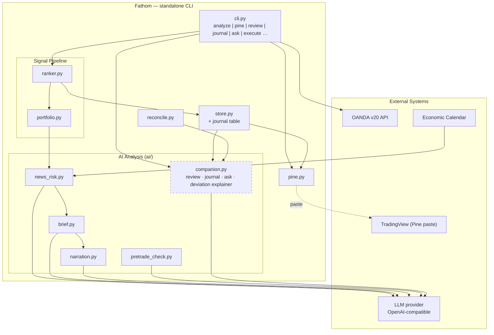

# phase-08 — Trader companion commands: review, journal, ask, deviation explainer

**Status:** not_started
**Commitment level:** Phase N — additive operator tooling on the phase-07 platform.
**Time horizon:** open — after phase-07
**Depends on:** [`phase-07`](../phase-07/phase.md) (`ai/` package + in-process LLM call pattern + prompt-template convention)
**Unlocks:** nothing hard — [`phase-09`](../phase-09/phase.md) is independent but shares the AI surface

## Purpose

Round out the "AI-supported trader" loop with four read-only companion commands. Each one
takes data Fathom already persists (positions, reconcile reports, deviation log, executed
trades, watchlist history), hands it to the LLM with a purpose-built prompt, and prints
advisory text. Nothing here gains order authority: every command is INV-01-safe read-only
analysis; a total LLM outage degrades each command to "no analysis available", never to a
wrong action.

Riskiest assumption tested: **LLM commentary over the store's own data is useful enough
that the operator keeps running these commands** — the cheap test of the whole
"AI-supported trader" thesis before phase-09/10 invest in heavier machinery.

## In scope

1. **`fathom review`** — open positions + latest reconcile report + deviation log → LLM
   flags anomalies (position near a calendar event, unusual stop distance, unexplained
   broker-vs-db deviation) with a "worth investigating?" flag each.
2. **`fathom journal`** — auto-append a journal entry on every `fathom execute` outcome
   (candidate facts, verdicts, operator decision, dry-run/submitted); `fathom journal
   show|summarize` renders entries and LLM-summarizes patterns over time.
3. **`fathom ask "<question>"`** — freeform Q&A grounded strictly in store data
   (watchlist, approved set, backtest metrics, positions); refuses questions needing data
   it does not hold rather than speculating.
4. **Deviation-log explainer** — folded into `fathom review` (or `fathom review
   --deviations`): plain-English diagnosis per deviation entry.
5. **Shared plumbing** — one `ai/companion.py` call-shape (context-pack builder + prompt
   template + bounded response) so all four commands are the same pattern, testable
   offline with injected stub clients.

## Out of scope

- Any write path to broker, risk, or execution modules — these commands import store
  readers only; the AST forbidden-import boundary test pattern extends to them.
- Counterfactual veto tracking — [`phase-09`](../phase-09/phase.md).
- Research loop / strategy proposal — [`phase-10`](../phase-10/phase.md).
- Journal entries feeding sizing, ranking, or any automated decision — journal is a
  record + narrative summary only.
- Scheduled/digest modes for these commands — on-demand only, same operator decision as phase-07.
- Panel views for journal/review — CLI only this phase.
- New data capture (no new market data, no broker endpoints beyond what reconcile already reads).

## Done when

- [ ] All four commands run green against the demo store with a live `LLM_*` key and print
      grounded, non-empty analysis; with `LLM_API_KEY` unset each prints its deterministic
      fallback ("analysis unavailable" + raw data tables) and exits 0.
- [ ] `fathom execute` (both dry-run and demo submit) appends a journal row; a repeated
      execute of the same candidate does not duplicate it (idempotent on client-order-id).
- [ ] `fathom ask` answers ≥3 operator questions correctly from store data and visibly
      declines one out-of-scope question without fabricating.
- [ ] AST boundary test proves none of the companion modules can import order/risk/execution.
- [ ] CI green; CLAUDE.md commands + feature INDEX updated.

## Architecture (this phase)

Superset of the phase-07 diagram — adds the companion layer (dashed = new this phase):

## Anticipated specs

| Feature | Hint |
|---|---|
| companion-core | Context-pack builder + shared call shape + offline fallbacks + AST boundary test |
| review-command | Positions/reconcile/deviation context; anomaly-flag response model; deviation explainer flag |
| journal | Journal table schema, execute-hook append (idempotent), show/summarize subcommands |
| ask-command | Grounding contract (store-data-only), refusal behavior, question → context routing |

## Scoping assumptions

- Verified this scoping session: reconcile reports, positions, and a deviation log are
  persisted and readable (`fathom positions`, `fathom reconcile`; panel Deviation Log view
  per [`CLAUDE.md`](../../../CLAUDE.md)).
- scoping assumption — verify at spec time: the deviation log's stored fields carry enough
  context (expected vs actual, timestamps, instrument) for a per-entry explanation without
  new capture.
- scoping assumption — verify at spec time: `fathom execute` has a single post-gate exit
  point where a journal append hook can attach without touching gate logic.
