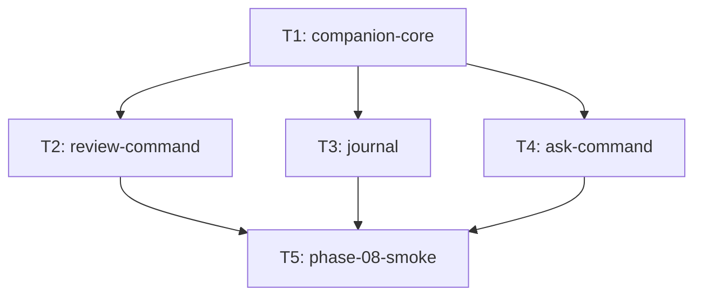

# Taskgraph — phase-08

> **STATUS: awaiting human approval**
> The generating session may not approve this graph. A human edits this banner to `approved by <name>, YYYY-MM-DD` before /halfcycle:orchestrate will run.

## Open decisions

| Decision | Recommendation | Affected tasks | Cost of deciding late | Blocks dispatch? |
|---|---|---|---|---|
| Phase-07 must land before workers run (`ai/llm_client.py`, `signals/timeframes.py`, `ai/` package) | Do not `/halfcycle:orchestrate phase-08` until phase-07 is merged. Graph is valid now; dispatch waits on that merge. | all | Rework import paths if phase-07 adapter signature drifts | **Yes — dispatch** |
| 32KB LLM response cap inside `OpenAICompatClient` (companion-core open Q) | Defer. Cap would retouch the shipped pretrade path; companion-core keeps the existing adapter contract. | T1 | Add a cap later in `llm_client.py` (phase-07 file) | No |
| Review 48h calendar window and 30% RR-deviation as `.env` (review-command open Q) | Keep as module constants in `ai/review.py` this phase. Promote to Settings only if the operator walk wants knobs. | T2 | One Settings field + test later | No |

Dispatch of this graph is blocked on phase-07 merge, not on the two cosmetic questions.

## Summary

5 schedulable tasks (4 auto + 1 manual stack-assembly) across 2 waves; critical path depth 3 (budget `max(3, ceil(5/3)) = 3`), e.g. T1 → T2 → T5. Wave-1 width 1 (`T1`); wave-2 width 3 (`{T2, T3, T4}`).

One task per ready spec. `companion-core` is the only artifact hub (`ContextPack`, `run_companion_call`). Review, journal, and ask consume it in parallel. `cli.py` and `data/store.py` overlap at wave 2 — serialize those merges; do not add file-lock edges (they would make T1→T2→T3→T5 depth 4).

Area names match today's [code-map](../../product/code-map.md): companion/review/ask live under `hermes_integration` (the `ai/` package after phase-07 T3). Journal is `cli` because the execute hook is the load-bearing edit.

## Dependency graph



## Task block (machine-readable — the contract orchestrate executes)

```json
{
  "phase": "phase-08",
  "tasks": [
    {
      "id": "T1",
      "title": "companion-core",
      "area": "hermes_integration",
      "feature_spec": "docs/features/companion-core.md",
      "surface": "backend",
      "depends_on": [],
      "depends_on_why": {},
      "acceptance_criteria": [
        "`build_context_pack` accepts only store-read data structures (dicts/pydantic models already loaded by the caller) — it does not itself open a `Store` or an `OandaClient`, so it cannot acquire write authority by construction.",
        "`run_companion_call` with `client=None` and `LLM_API_KEY` unset returns the given `fallback` unchanged, logs one WARNING, and raises nothing (mirrors `pretrade_check`'s `client is None and no key` branch, `hermes_integration/pretrade_check.py:386-391`).",
        "`run_companion_call` with an injected stub client returning valid JSON for `response_model` returns the parsed, validated instance (offline-testable, no network, no key — same pattern as `pretrade_check`'s stub-client test).",
        "`run_companion_call` with an injected stub client returning malformed/non-conforming JSON returns `fallback`, not a partially-populated model and not an exception.",
        "An AST boundary test (extending the pattern in `tests/test_admin_panel.py:56-110`) asserts `ai/companion.py` contains no import of `execution.orders`, `execution.models.build_bracket`, `execution.reconcile`, `risk.sizing`, or `risk.limits`, and does not import `cli` — proving the module that all four companion commands share cannot reach order authority even transitively. Callers (`ai/review.py`, journal, ask) add their own AST files with at least this set.",
        "`ContextPack.sources` is populated for every call (never empty when the pack has any data) so a downstream refusal (`ask-command`) can name what was actually grounded."
      ],
      "verification": "auto",
      "human_admin": "none",
      "role": "mechanical",
      "role_rationale": "Shared call-shape wrapper over the shipped OpenAICompatClient; no new table and no execute-path edit.",
      "track": "full",
      "files": [
        "ai/companion.py",
        "tests/test_companion.py"
      ],
      "worktree": "yes",
      "new_dependency": false,
      "library_defaults": "n/a",
      "notes": "Import OpenAICompatClient from ai.llm_client (phase-07). Do not add command-specific prompts or models. Do not change OpenAICompatClient (response-size cap deferred). ContextPack is in-memory only."
    },
    {
      "id": "T2",
      "title": "review-command",
      "area": "hermes_integration",
      "feature_spec": "docs/features/review-command.md",
      "surface": "backend",
      "depends_on": ["T1"],
      "depends_on_why": {
        "T1": "consumes build_context_pack, run_companion_call, and ContextPack.sources"
      },
      "acceptance_criteria": [
        "`fathom review` with no open positions **and** an empty deviation log prints \"nothing to review\" and exits 0 without calling the LLM. Deviation-only (zero positions, ≥1 log row, `--deviations`): still calls the LLM (or fallback) and prints deviation findings only. Deviation-only without `--deviations`: \"nothing to review\" (log is loaded for cross-ref but not displayed; no position subjects exist).",
        "With ≥1 open position and an injected stub client returning a valid `ReviewResponse` that includes one `subject=\"position:<id>\"` per open `broker_trade_id`, those findings print. If the parsed list is missing any open-position subject, `run_review` **discards** the whole parsed response and uses `_offline_review` (post-validate; `extra=\"forbid\"` does not catch a short list). The same post-validate applies when `--deviations`: every loaded `event_id` must have `subject=\"deviation:<event_id>\"` or the parse is discarded for `_offline_review`. When `--deviations` is set, `_offline_review` emits one `[rules]` row per loaded `event_id`; it does not emit `deviation:*` findings when the flag is off.",
        "With `LLM_API_KEY` unset (and no client), print raw tables + `[rules]` findings + a line containing `\"analysis unavailable\"`; exit 0; zero network I/O (INV-20). Never crash. Never print an LLM flag.",
        "Display filter: `--deviations` prints one finding per loaded log `event_id` (LLM or `[rules]` explainer note); without the flag, drop all `deviation:*` subjects even if the model emitted them. Raw log rows stay in the context pack either way.",
        "After the in-process medium/high filter, the context pack's `calendar_events` contains only those impacts; a fixture with a low-impact holiday plus a high-impact event in the 48h window (frozen `now`) asserts the pack contains the high `event_name` and not the holiday.",
        "AST test (same forbidden set as `companion-core.md` AC5, plus `execution.reconcile`): `ai/review.py` must not import `execution.orders`, `execution.models.build_bracket`, `execution.reconcile`, `risk.sizing`, `risk.limits`, `cli`, or `data.calendar.FairEconomyCalendar`, and must not construct `OandaClient`. `from execution.models import Position` is allowed (INV-14 frozen read model returned by `Store.load_open_positions`).",
        "`positions` / `account_state` / `deviation_log` **row counts** are unchanged across a run (not SQLite mtime — a `FairEconomyCalendar` construct would bump mtime; this spec forbids that constructor). Calendar reads go through `Store.load_calendar_events`."
      ],
      "verification": "auto",
      "human_admin": "none",
      "role": "mechanical",
      "role_rationale": "Advisory CLI over existing store tables plus a read-only SELECT; no execute-gate change.",
      "track": "full",
      "files": [
        "ai/review.py",
        "data/store.py",
        "cli.py",
        "tests/test_review.py"
      ],
      "worktree": "yes",
      "new_dependency": false,
      "library_defaults": "n/a",
      "notes": "Owns Store.load_calendar_events (SELECT only; missing table → []). Never construct FairEconomyCalendar or call reconcile(). 48h window and 30% RR threshold stay module constants. cli.py: add review subparser only — serialize with T3/T4. data/store.py: calendar accessor only — serialize with T3's operator_journal DDL."
    },
    {
      "id": "T3",
      "title": "journal",
      "area": "cli",
      "feature_spec": "docs/features/journal.md",
      "surface": "backend",
      "depends_on": ["T1"],
      "depends_on_why": {
        "T1": "consumes build_context_pack and run_companion_call for journal summarize"
      },
      "acceptance_criteria": [
        "Demo `fathom execute --dry-run <ref>` that passes limits writes exactly one journal row with `outcome=\"dry_run\"`, the candidate snapshot JSON, pretrade `proceed`, `dry_run=1`. Live (`settings.env == \"live\"`) fixture that reaches `build_bracket` writes zero journal rows.",
        "A second demo execute of the same candidate (same INV-15 `client_order_id`) **upserts** — row count for that id stays 1; `outcome` becomes `submitted` (or `operator_declined`) as appropriate. `--yes` submit after dry-run is the fixture.",
        "Confirm abort writes `outcome=\"operator_declined\"` and does not submit (`cli.py:1999-2001`). `--yes` writes zero declined rows (matches [[veto-ledger]] AC 5).",
        "`record_journal_entry` never raises into `cmd_execute`; a raising Store stub leaves exit code and submit/dry-run behaviour identical (WARNING allowed). Does not mutate `Order` / `Candidate` / `PretradeVerdict` identity.",
        "`fathom journal show` with empty table prints `\"journal empty\"` and does not call the LLM. `summarize` with empty table same, no LLM.",
        "`summarize` with ≥1 row, `LLM_API_KEY` unset, and no client: print a line containing `\"analysis unavailable\"` plus the raw table; exit 0; zero network I/O (INV-20). Empty table is AC 5, not this AC. AST: `ai/journal.py` uses the companion-core forbidden set (plus `execution.reconcile`); `from execution.models import Order, Fill` is allowed (INV-14 read/write models for serialization). Must not import `execution.orders` / `submit_order` / `build_bracket`. `Order`/`Fill` are serialized read-only (`model_dump_json`); the recorder does not mutate them (AC 4). `cmd_journal` only reads (`show`/`summarize`); it never calls `record_journal_entry`.",
        "Round-trip: upsert then `load_journal_entries` returns the same `client_order_id`, `outcome`, `candidate_ref`, UTC `created_at` / `updated_at` (INV-03). `updated_at` changes on upsert; `created_at` is sticky from the first insert."
      ],
      "verification": "auto",
      "human_admin": "none",
      "role": "critical",
      "role_rationale": "Adds operator_journal DDL (UPSERT lifecycle table) and seven isolated hooks on cmd_execute after build_bracket, including the INV-09 live skip.",
      "track": "full",
      "files": [
        "ai/journal.py",
        "ai/prompts/journal_summarize.md",
        "data/store.py",
        "cli.py",
        "tests/test_journal.py",
        "tests/test_execution_cli.py"
      ],
      "worktree": "coordinator-branch",
      "new_dependency": false,
      "library_defaults": "n/a",
      "notes": "Hook only after build_bracket; seven cmd_execute sites covering six outcomes. settings.env skip lives in cli.py, never in ai/journal.py or Store. Do not write eval.veto_ledger. Table name operator_journal. Serialize data/store.py with T2 and cli.py with T2/T4. coordinator-branch: shipped cmd_execute plus store DDL."
    },
    {
      "id": "T4",
      "title": "ask-command",
      "area": "hermes_integration",
      "feature_spec": "docs/features/ask-command.md",
      "surface": "backend",
      "depends_on": ["T1"],
      "depends_on_why": {
        "T1": "consumes build_context_pack, run_companion_call, and ContextPack.sources"
      },
      "acceptance_criteria": [
        "Stub client: a question whose answer is a field in the loaded watchlist (e.g. top `rank` instrument) returns `refused=False` and `answer` containing that instrument string (fixture-controlled JSON).",
        "Stub client returning a valid `AskResponse` with `refused=true` and `reason` exactly `live_quote` (question: “what is EUR_USD mid right now?”) prints `REFUSED: live_quote`. There is **no** keyword post-validate that overrides `refused=false` — grounding is prompt + acceptance stubs. Post-validate on a **valid** parse only: if `refused` and `reason` not in `{live_quote, unstored_news, foreign_account, not_in_store}` → treat as malformed → `_offline_ask(pack)` (does **not** count as this AC’s refusal). Omitting `refused` is malformed JSON → same offline path (AC 5), not REFUSED.",
        "Offline / no key: zero I/O (INV-20); printed text contains `\"analysis unavailable\"` and at least one `sources` token; exit 0. This is not a `REFUSED:` line.",
        "AST: same forbidden set as companion-core AC5 + `execution.reconcile`; `Position`/`Fill` imports allowed. No `OandaClient`, no `FairEconomyCalendar`.",
        "`AskResponse` `extra=\"forbid\"`; malformed JSON → `_offline_ask(pack)` (not a partial answer).",
        "Watchlist-empty + approved-set-empty: still runs (operator may ask about positions). If **all** sources are empty (`watchlist 0`, `approved_set 0`, no positions, `account_state` None, no fills): print `\"ask: store has no grounded tables yet\"`; exit 0; **no LLM**.",
        "Never writes store tables (row counts of the five sources unchanged)."
      ],
      "verification": "auto",
      "human_admin": "none",
      "role": "mechanical",
      "role_rationale": "Read-only Q&A over existing loaders; INV-21 stamp uses signals/timeframes.py from phase-07.",
      "track": "full",
      "files": [
        "ai/ask.py",
        "ai/prompts/ask.md",
        "cli.py",
        "tests/test_ask.py"
      ],
      "worktree": "yes",
      "new_dependency": false,
      "library_defaults": "n/a",
      "notes": "Fixed source pack only (watchlist, latest-run approved_set, positions, account_state, fills). Import TIMEFRAME_BAR_LENGTH from signals/timeframes.py, never cli. Do not load candles, veto_ledger, or operator_journal. cli.py: ask subparser only — serialize with T2/T3."
    },
    {
      "id": "T5",
      "title": "phase-08-smoke",
      "area": "cli",
      "feature_spec": "docs/phases/phase-08/phase.md",
      "surface": "backend",
      "depends_on": ["T2", "T3", "T4"],
      "depends_on_why": {
        "T2": "consumes fathom review and review --deviations for the live-key walk",
        "T3": "consumes fathom journal show|summarize and the execute UPSERT for the demo walk",
        "T4": "consumes fathom ask for grounded answers and a visible REFUSED line"
      },
      "acceptance_criteria": [
        "`fathom review`, `fathom review --deviations`, `fathom journal show|summarize`, and `fathom ask` run against the demo store with a live `LLM_*` key and print grounded, non-empty analysis (or the command's honest empty string: `\"nothing to review\"` / `\"journal empty\"` / `\"ask: store has no grounded tables yet\"`); with `LLM_API_KEY` unset each commentary path prints `\"analysis unavailable\"` plus raw tables where the spec requires them, and exits 0.",
        "Demo `fathom execute` that reaches `build_bracket` (dry-run, limits reject after minting the id, confirm-abort, broker reject, submit failure, or submitted fill) upserts one `operator_journal` row; a repeated execute of the same `client_order_id` does not duplicate it. Live (`settings.env == \"live\"`) execute that reaches `build_bracket` writes zero journal rows.",
        "`fathom ask` answers ≥3 operator questions correctly from store data and visibly `REFUSED:` one out-of-scope question without fabricating.",
        "AST boundary tests prove `ai/companion.py`, `ai/review.py`, journal read path, and ask import none of `execution.orders`, `execution.models.build_bracket`, `execution.reconcile`, `risk.sizing`, `risk.limits`, or `cli`. Reading frozen INV-14 models (`Position` / `Fill` / `Order`) returned by `Store` is allowed. The execute-side journal recorder is called *from* `cli.py`, not the reverse.",
        "CI green; `CLAUDE.md` commands + feature INDEX updated."
      ],
      "verification": "manual",
      "human_admin": "live LLM_API_KEY, demo store with watchlist/positions/deviation_log, three ask questions plus one live-quote refusal",
      "role": "n/a",
      "role_rationale": "Manual stack-assembly / acceptance walk; no worker role.",
      "track": "full",
      "files": [
        "docs/phases/phase-08/results.md",
        "CLAUDE.md",
        "docs/features/INDEX.md"
      ],
      "worktree": "coordinator-branch",
      "new_dependency": false,
      "library_defaults": "n/a",
      "notes": "Stack-assembly for /halfcycle:smoke. Records the walk in results.md. INDEX rows stay ready→shipped at close. Longest human blocker sits here, not on T1."
    }
  ]
}
```

## Tasks (prose detail)

### T1 — companion-core
- **area:** `hermes_integration` (files under `ai/` after phase-07)
- **feature_spec:** [docs/features/companion-core.md](../../features/companion-core.md)
- **surface:** backend
- **depends_on:** none
- **track:** full
- **files:** `ai/companion.py`, `tests/test_companion.py`
- **acceptance_criteria:** spec ACs 1–6, copied in the JSON block
- **verification:** auto
- **human_admin:** none
- **role:** mechanical
- **worktree:** yes
- **notes:** Hub. No CLI.

### T2 — review-command
- **area:** `hermes_integration`
- **feature_spec:** [docs/features/review-command.md](../../features/review-command.md)
- **surface:** backend
- **depends_on:** T1 — `build_context_pack` / `run_companion_call` / `ContextPack.sources`
- **track:** full
- **files:** `ai/review.py`, `data/store.py` (`load_calendar_events` only), `cli.py` (review subparser), `tests/test_review.py`
- **role:** mechanical
- **worktree:** yes

### T3 — journal
- **area:** `cli`
- **feature_spec:** [docs/features/journal.md](../../features/journal.md)
- **surface:** backend
- **depends_on:** T1 — summarize only; the execute hook does not call the LLM
- **track:** full
- **files:** `ai/journal.py`, `ai/prompts/journal_summarize.md`, `data/store.py` (`operator_journal`), `cli.py` (seven hook sites + `journal` subparser), `tests/test_journal.py`, `tests/test_execution_cli.py`
- **role:** critical — DDL + execute isolation + INV-09 skip
- **worktree:** coordinator-branch

### T4 — ask-command
- **area:** `hermes_integration`
- **feature_spec:** [docs/features/ask-command.md](../../features/ask-command.md)
- **surface:** backend
- **depends_on:** T1
- **track:** full
- **files:** `ai/ask.py`, `ai/prompts/ask.md`, `cli.py`, `tests/test_ask.py`
- **role:** mechanical
- **worktree:** yes

### T5 — phase-08-smoke
- **area:** `cli`
- **feature_spec:** [docs/phases/phase-08/phase.md](phase.md)
- **surface:** backend
- **depends_on:** T2, T3, T4
- **track:** full
- **files:** `docs/phases/phase-08/results.md`, `CLAUDE.md`, `docs/features/INDEX.md`
- **verification:** manual
- **human_admin:** live key + demo store + ask questions
- **role:** n/a
- **worktree:** coordinator-branch

## Sanity checks

| Check | Result |
|---|---|
| DAG acyclic | Yes |
| Critical path within budget (<= ceil(n/3), floor 3) | Yes — depth 3, 5 schedulable, budget 3. Longest: T1 → T2\|T3\|T4 → T5 |
| Max parallel width (validator prints it) | 3 (`{T2,T3,T4}`) |
| Every edge has a real artifact in depends_on_why | Yes — ContextPack/run_companion_call; fathom review; journal UPSERT; fathom ask |
| files lists disjoint within each level | Wave 1 yes. Wave 2 no: `cli.py` on T2/T3/T4; `data/store.py` on T2/T3. Mitigated by T3 coordinator-branch and merge serialization — no extra DAG edges |
| Human-gated tasks are shallow, not hubs | T5 is last, not a hub. T1 has no human_admin |
| ACs trace to specs | T1–T4 copy numbered spec ACs; T5 copies phase Done-when |
| Code-map safe-parallel rules respected | Same-file `cli.py` / `store.py` not claimed parallel-safe |
| Platform-package edits flagged coordinator-branch | T3 (cmd_execute + store), T5 (CLAUDE.md / INDEX) |
| library_defaults present on all new-dep tasks | n/a |

Omitted edges: T2→T3 (store.py lock), T2→T4 / T3→T4 (`cli.py` lock). Re-adding them blows the budget.

## Handoff

After phase-07 merge **and** human approval:

```bash
python3 "$CLAUDE_PLUGIN_ROOT/scripts/taskgraph.py" approve docs/phases/phase-08/taskgraph.md --by "<name>"
```

Then `/halfcycle:orchestrate phase-08`.
