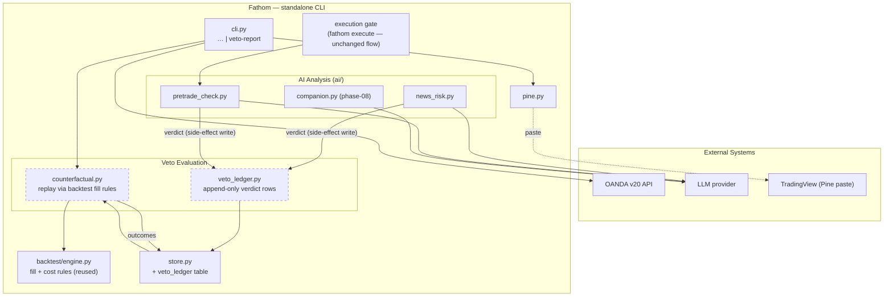

# phase-09 — Counterfactual veto ledger

**Status:** not_started
**Commitment level:** Phase N — evaluation infrastructure; ships to the operator as `fathom veto-report`.
**Time horizon:** open — after phase-07 (phase-08 not required)
**Depends on:** [`phase-07`](../phase-07/phase.md) (`ai/` package; analyze pipeline producing news-risk verdicts worth auditing)
**Unlocks:** [`phase-10`](../phase-10/phase.md) Phase E (shadow-mode evaluation of the veto reuses this ledger — see [`implementation-plan.md`](../../implementation-plan.md) Workstream 4)

## Purpose

Every LLM veto is currently unfalsifiable: when the news-risk gate skips a candidate or the
pre-trade gate blocks an order, nobody learns whether the veto saved money or cost an
opportunity. This phase records every veto verdict (both gates) with the full candidate
snapshot, then tracks the counterfactual — what the bracket-order trade would have done —
from subsequent candle data. `fathom veto-report` aggregates: veto hit-rate, opportunity
cost, and whether the AI gates earn their keep. This is the honest measurement that
phase-10's tiered-autonomy ladder later requires before the LLM gains any authority.

Riskiest assumption tested: **the counterfactual can be computed honestly from candle data
alone** — a would-be trade's outcome (entry fill, stop/target hit ordering within a bar)
must reuse the backtest engine's conservative fill rules, or the report is fiction.

## In scope

1. **Veto ledger table** — append-only: verdict source (`news_risk` | `pretrade` |
   `operator_declined`), full `Candidate` snapshot, verdict JSON, prompt/template
   version, model id, timestamp (UTC). Written on every verdict — proceed and block
   alike (proceeds are the baseline). Operator-declined rows ride along (cheap at the
   existing confirm abort; see phase scoping assumptions).
2. **Counterfactual tracker** — `fathom veto-report --refresh`: for each ledger entry past
   its trade horizon, replay the would-be bracket order over stored candles using the
   backtest engine's fill/cost rules; persist outcome (target/stop/timeout, R-multiple).
3. **`fathom veto-report`** — aggregate view: per-gate block rate, counterfactual win/loss
   of blocked trades, net R saved/cost, broken down by instrument/timeframe/strategy.
4. **Execute-gate + analyze-pipeline recording hooks** — minimal, behind their own spec
   and fresh review (this touches INV-01/INV-02 boundary code; recording must be
   side-effect-only and unable to alter any verdict).

## Out of scope

- Acting on the report — no automatic threshold that re-enables or disables a gate;
  interpretation stays with the operator until phase-10 Phase E's champion-challenger
  machinery.
- Changing either veto's behavior, prompts, or safe defaults — measurement only.
- Counterfactuals for trades the *operator* declined at the confirm prompt — scoping
  assumption below; if cheap, it rides along, else deferred to phase-10 Phase E.
- Live-account anything — demo/dry-run verdicts only until INV-07 clears.
- New market-data capture — the tracker uses candles the store already fetches; if a
  candidate's timeframe candles lapse, the outcome is recorded `unknown`, not fetched ad hoc.
- Panel view for the report — CLI table/JSON only this phase.

## Done when

- [ ] Every `fathom analyze` news-risk verdict and every `fathom execute` pretrade verdict
      (dry-run included) lands one ledger row; rows are append-only (no update path exists)
      and never mutate gate behavior — proven by tests that diff gate outputs with the
      ledger disabled vs enabled.
- [ ] `fathom veto-report --refresh` resolves outcomes for all due entries against stored
      candles, using engine fill rules (stop-before-target within-bar convention identical
      to the backtester); re-running is idempotent.
- [ ] `fathom veto-report` prints the aggregate with ≥10 resolved counterfactuals from demo
      operation, including the explicit `unknown` bucket.
- [ ] Boundary review: fresh reviewer confirms the recording hooks cannot raise into, or
      change control flow of, either gate (a ledger write failure logs WARNING and the
      trade path proceeds as if the ledger did not exist). A hung/slow `INSERT` may
      delay the path this phase (best-effort synchronous write, no timeout).
- [ ] CI green; CLAUDE.md + feature INDEX updated.

## Architecture (this phase)

Superset of the phase-08 diagram — adds the ledger + tracker (dashed = new this phase;
companion layer collapsed for legibility):

## Anticipated specs

| Feature | Hint |
|---|---|
| veto-ledger | Schema, append-only guarantee, recording hooks in both gates, failure-isolation contract |
| counterfactual-tracker | Bracket replay reusing engine fill rules; horizon/timeout policy; idempotent refresh; `unknown` bucket |
| veto-report | Aggregation, breakdowns, output format (table + JSON) |

## Scoping assumptions

- Verified this scoping session: both verdicts are typed pydantic models with a single
  parse boundary each ([news_risk.py:46](../../../hermes_integration/news_risk.py),
  [pretrade_check.py:88](../../../hermes_integration/pretrade_check.py)) — recording can
  wrap the parse-boundary return without touching gate internals.
- scoping assumption — verify at spec time: the backtest engine's fill logic is callable
  on a single synthetic bracket order without dragging in the full walk-forward harness
  (if not, extract a `simulate_bracket()` helper as part of the tracker spec).
- scoping assumption — verify at spec time: candle retention covers each candidate's
  timeframe horizon long enough to resolve most counterfactuals (H1 brackets may need
  days of H1 history after the verdict).
- scoping assumption — verify at spec time: operator-declined trades (gate passed, human
  said no at the confirm prompt) are visible at a single point in `cli.py` where a
  `declined` ledger row could be written cheaply.
