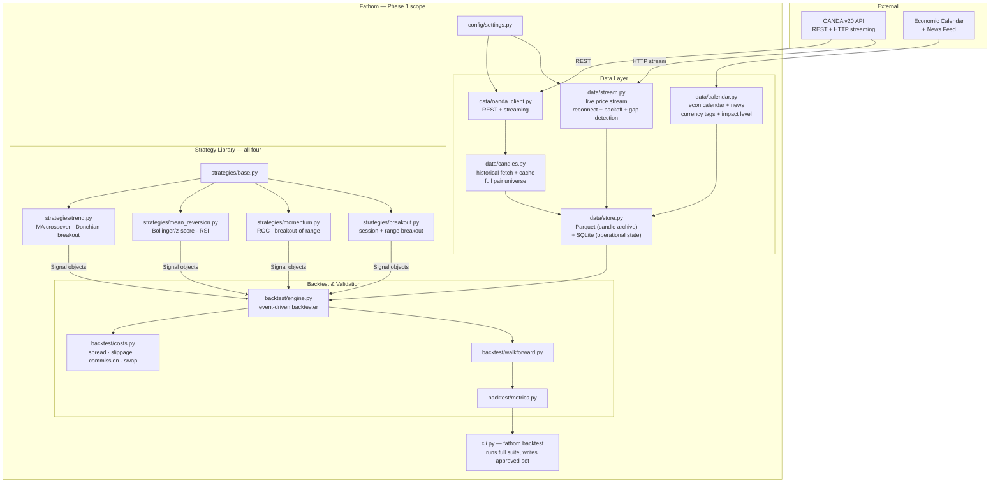

# Fathom — Phase 1: Full Research Engine

**Status:** Stub — not started
**Depends on:** [PoC](poc.md) approved-set table with ≥1 positive entry
**Unlocks:** [Phase 2](phase-2.md)
**Spec layer:** [product-spec.md](../product-spec.md) · [architecture-overview.md](../architecture-overview.md) · [invariants.md](../invariants.md)

---

## Purpose

Complete the research pipeline. Where the PoC validated the thesis with a single strategy on three pairs, Phase 1 hardens and broadens: full data layer including live stream, all four baseline strategies, economic calendar pull, complete pair universe, walk-forward validation across all (strategy, pair, timeframe) combinations, and an honest approved-set table that the signal pipeline in Phase 2 can consume.

At the end of Phase 1, the system knows which strategies have demonstrated edge, on which pairs, at which timeframes — and the answer is locked in for Phase 2.

---

## Done When

- [ ] All four baseline strategies implemented: MA crossover, Donchian breakout, Bollinger/z-score mean-reversion, RSI mean-reversion, ROC momentum, session breakout
- [ ] Live HTTP streaming connection to OANDA (`data/stream.py`) running with reconnect + backoff + gap detection
- [ ] Economic calendar and news headline pull (`data/calendar.py`) with currency tagging and impact level
- [ ] Parquet storage for candle archive; SQLite for operational state
- [ ] Instrument metadata (pip location, min size, margin rate, trading hours, typical spread) fetched and cached for full pair universe
- [ ] Event-driven backtester includes overnight swap cost modelling (INV-06 fully satisfied)
- [ ] Walk-forward approved-set table produced across all `(strategy, pair, timeframe)` combinations in the full pair universe
- [ ] `fathom backtest` CLI command runs the full suite and writes the approved-set table to the database
- [ ] Approved-set table is the gate: the ranker (Phase 2) must refuse to operate if the table is empty

---

## Strict-Subset Architecture Diagram

Adds to PoC: live stream, calendar feed, Parquet storage, remaining three strategies, full pair universe. Still no signal ranker, Hermes, risk module, execution, or panel.

**Not in this diagram (Phase 2+):** signal ranker, portfolio module, `fathom scan|watchlist|chart` CLI commands, Hermes integration, risk module, execution engine, monitor, admin panel.

---

## Components Added vs PoC

| File | What's new |
|---|---|
| `data/stream.py` | Long-lived HTTP streaming connection; heartbeat handling; auto-reconnect with exponential backoff; gap detection |
| `data/calendar.py` | Scheduled pull of upcoming economic calendar events; currency tagging; impact level (high/medium/low) |
| `data/store.py` (extended) | Parquet writer for candle archive (partitioned by instrument + date); SQLite for operational state |
| `strategies/mean_reversion.py` | Bollinger band / z-score reversion and RSI extremes |
| `strategies/momentum.py` | Rate-of-change / breakout-of-range with volatility confirmation |
| `strategies/breakout.py` | Session and range breakout (intraday, session opens) |
| `backtest/costs.py` (extended) | Add overnight swap/financing model for multi-day positions |
| `cli.py` (partial) | `fathom backtest` command only — the full CLI (`scan`, `watchlist`, `chart`) comes in Phase 2 |

---

## Open Questions

- **Vectorised prototyping backtester:** the design doc mentions `backtesting.py` or `vectorbt` as a fast pre-screen before the event-driven engine. Does Phase 1 include this, or do we go straight to the event-driven engine? (Recommendation: skip the vectorised layer — it adds complexity and a "did it pass the fast test but fail the real test" gap. One engine, done right.)
- **Full pair universe scope:** OANDA offers ~70 FX pairs. Walk-forward on all 70 × 6 strategies × 4 timeframes = ~1,680 combinations. This will be slow on first run. Phase 1 should profile this and consider whether a multi-process runner is needed.
- **Swap data source:** OANDA's v20 API provides swap rates per instrument via `GET /v3/accounts/{id}/instruments`. Confirm this is stable and queryable.

---

## Invariants Active in Phase 1

- **INV-03** — all timestamps UTC, RFC 3339
- **INV-06** — all four cost categories modelled (swap added in Phase 1)
- **INV-08** — secrets in `.env`
- **INV-10** — approved-set gate: signal ranker (Phase 2) must not operate without a valid approved-set table

---

## TODO — Detailed Spec

- [ ] Feature spec: `data-layer` (full — stream + calendar + Parquet)
- [ ] Feature spec: `strategy-interface` + all four strategies
- [ ] Feature spec: `backtest-engine` (event-driven, full cost model)
- [ ] Feature spec: `walk-forward-validation`
- [ ] Task graph for Phase 1
