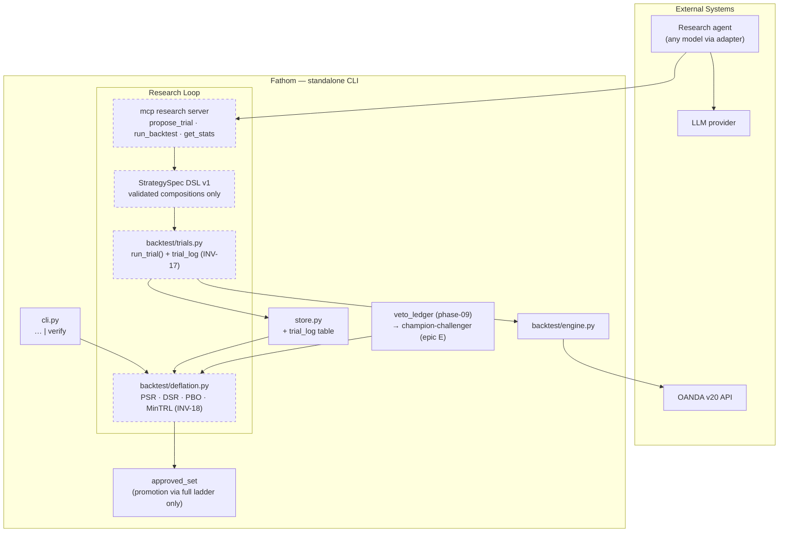

# phase-10 — AI quant research loop (Workstream 4, Phases A–E)

**Status:** not_started
**Commitment level:** Phase N — research infrastructure; each epic ships operator-usable tooling.
**Time horizon:** open — the long game; starts after phase-07 (phase-08/09 desirable first: 09's ledger is Phase E's substrate)
**Depends on:** [`phase-06`](../phase-06/phase.md) (#143 real-data fixture — the verification ladder's rung 1), [`phase-07`](../phase-07/phase.md) (`ai/` adapter), [`phase-09`](../phase-09/phase.md) (veto ledger, for epic E)
**Unlocks:** AI-proposed strategies entering `approved_set` through an honest statistical gate

## Purpose

Let AI expand the strategy set without self-deception. The full design, rationale, and
literature anchors live in [`implementation-plan.md`](../../implementation-plan.md)
Workstream 4 and are not duplicated here: LLM research loops amplify multiple-testing bias
and carry memorized market history, so the load-bearing mechanisms are an **append-only
trial ledger** (honest trial count N — INV-17), a **deflation-gated promotion path**
(Deflated Sharpe / PBO / MinTRL — INV-18, frozen eval config INV-19), and a **constrained
proposal DSL** with post-training-cutoff-only clean evidence.

Riskiest assumption tested: **a deflation-corrected gate still lets *anything* through** —
if honest statistics reject every AI-proposed variant (as the cited 2026 research suggests
they usually should), the loop's value is proving that cheaply rather than trading fiction.

This phase is deliberately registered as one phase with five epics. Per
`/halfcycle:phase-rescope`, each epic gets its own `phase-10.E/phase.md` + strict-subset
diagram at kickoff; the epic split below is the settled seam (it mirrors Workstream 4's
lettered phases, which are sequenced and load-bearing in the implementation plan).

## In scope (as epics)

1. **phase-10.1 — Trial ledger + `run_trial()`** (WS4 Phase A remainder): append-only
   `trial_log` populated inside the single backtest entry point; `backtest/trials.py`.
2. **phase-10.2 — Statistics gate** (Phase B): `backtest/deflation.py` — PSR, DSR, PBO/CSCV,
   MinTRL; `fathom verify <combo>`; promotion to `approved_set` requires the full ladder.
3. **phase-10.3 — Research MCP server** (Phase C): `propose_trial` (StrategySpec DSL v1),
   `run_backtest`, `get_result`, `list_trials`, `get_stats`; hard session budgets.
4. **phase-10.4 — Research agent + contamination controls** (Phase D): pre-register →
   propose → backtest → diagnose loop; post-cutoff clean-evidence rule; date-blind prompting.
5. **phase-10.5 — Tiered autonomy + evaluating the AI** (Phase E): Observe → Advise →
   Act-with-approval → bounded-autonomous-demo ladder; champion-challenger on the pretrade
   veto over the phase-09 ledger.

## Out of scope

- Any relaxation of INV-01: live execution remains operator-only at every autonomy tier;
  "bounded-autonomous" is demo-only.
- LLM-decided entries, exits, sizing, or numeric forecasts; free-form agent-authored
  Python (DSL v1 only) — settled in implementation-plan "Out of scope".
- Raising risk caps or trading AI-proposed strategies live before INV-07 + MinTRL are
  satisfied on the demo track record.
- Multi-agent debate as a signal source.
- Workstream 3 (watcher, exit management, new hand-built sleeves) — parallel track, not
  part of this phase; its sleeves do climb the same phase-10.2 ladder once it exists.
- Treating pre-cutoff OOS windows as clean evidence for agent-proposed strategies.

## Done when

- [ ] Every backtest run in the repo — human- or agent-initiated — lands trial-ledger rows
      by construction (INV-17 test: no code path reaches the engine without logging).
- [ ] `fathom verify` reproduces the pinned real-data fixture's DSR by hand-computed value
      (validated against `pypbo`) and gates `approved_set` promotion (INV-18).
- [ ] The research agent completes a budgeted session end-to-end: N proposals, all ledgered,
      ≥0 survivors of the deflation gate, and a session report stating the honest N.
- [ ] Date-sensitivity diagnostic shows the agent's proposals are not exploiting memorized
      history (four-arm test per the plan).
- [ ] Champion-challenger report on the pretrade veto exists with trial-corrected
      incremental value, before any autonomy-tier promotion.
- [ ] New invariants INV-17/18/19 recorded in [`invariants.md`](../../product/invariants.md).

## Architecture (this phase)

Superset of the phase-09 diagram — adds the research loop (dashed = new; earlier layers
collapsed; the epic docs carry per-epic subsets):

## Anticipated specs

Per-epic; authored at each epic's kickoff, not now (Layer 4 details only the current phase):

| Epic | Spec seeds |
|---|---|
| phase-10.1 | trial-ledger schema + INV-17 by-construction test; run_trial extraction from `cli._run_combo` |
| phase-10.2 | deflation module (validated vs pypbo + hand-computed fixture); `fathom verify`; INV-18/19 |
| phase-10.3 | StrategySpec DSL v1 grammar; MCP tool surface; session budgets |
| phase-10.4 | agent loop harness; clean-evidence rule; date-blind prompting; four-arm diagnostic |
| phase-10.5 | autonomy ladder + promotion gates; champion-challenger over the veto ledger |

## Scoping assumptions

- Verified: Workstream 4's design, sequencing, formulas, and out-of-scope list are already
  settled in [`implementation-plan.md`](../../implementation-plan.md) (Workstream 4 section);
  this doc adds phase ids and gates, not new design.
- scoping assumption — verify at spec time: `cli._run_combo` is still the single backtest
  entry point suitable for promotion into `run_trial()` (the plan asserts it; re-anchor at
  phase-10.1 spec time).
- scoping assumption — verify at spec time: `pypbo` is maintained and installable on the
  pinned Python version; otherwise the validation reference becomes hand-computed fixtures
  only.
- scoping assumption — verify at spec time: phase-06 #143 (real-data fixture) has landed —
  it is rung 1 of the verification ladder and a hard prerequisite for phase-10.2's
  hand-computed DSR check.
