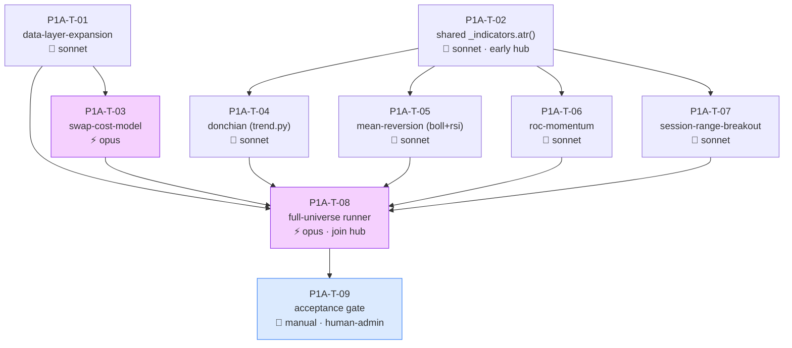

# Fathom Phase 1A — Task Graph (Research Engine → Approved-Set)

> ⚠️ **AWAITING HUMAN APPROVAL**
> Do not dispatch to Agent Teams until this graph is reviewed and signed off.
> The session that generated this graph cannot also approve it.

Generated 2026-05-29 from the 8 `ready` epic-1A specs under `docs/features/`. Epic 1B (live-streaming, economic-calendar) is **out of scope** for this graph (off the critical path; calendar parked on a provider choice).

## Rulings applied (lead, 2026-05-29 — overridable)

- **D-P1-2 — timeframes + window sizing:** H1 (train 12m / test 3m), H4 (18m / 6m), D (24m / 6m). Longer windows for slower timeframes so D isn't starved as it was in the PoC.
- **D-P1-3 — approval gate:** keep the strict **per-window** gate (every OOS window: Sharpe > 0 AND ≥ 5 trades), now viable for D because of the per-timeframe sizing above.
- **D-P1-4 — epic split:** confirmed. This graph is **1A only**.

---

## Summary

| Item | Value |
|---|---|
| Total tasks | 9 (8 code + 1 manual gate) |
| Auto-verified | 8 |
| Manual | 1 (T-09 acceptance, human-admin — uses populated `.env`) |
| Opus tasks | 2 (T-03 swap-cost-model, T-08 runner) |
| Sonnet tasks | 6 |
| Independent parallel slots | t=0 {T-01, T-02}; strategy wave {T-04, T-05, T-06, T-07} (4-wide) |
| Critical path | 4 hops: T-01 → T-03 → T-08 → T-09 (and T-02 → strategy-wave → T-08 → T-09) |
| Dependency hubs | T-02 `_indicators` (5 downstream strategies); T-08 runner (6 upstream deps — the join) |
| Coordinator-branch edits | `pyproject.toml` (pyarrow dep) + `CLAUDE.md` stack — via coordinator, not feature workers |
| Phase-rescope signal | None — 9 tasks, clean structure |

---

## Dependency graph

**Waves:** t=0 dispatch **T-01 ∥ T-02** (data vs strategies — distinct areas). When T-01 lands → **T-03** (opus, swap). When T-02 lands → **T-04, T-05, T-06, T-07** (4 strategies in parallel — distinct files). When T-01 + T-03 + all four strategies land → **T-08** (opus, runner). Then **T-09** (manual).

---

## Open decisions to resolve before dispatch

The three D-P1 rulings above are applied. Remaining, non-blocking (resolved at each worker's Plan step):

- **D-P1-5 — ProcessPoolExecutor worker count** (T-08): tune to cores; write-serialization already settled (INV-12, parent-only).
- **Bollinger band centre** SMA vs EMA (T-05): lean SMA.
- **session-range primary variant** (T-07): lean rolling N-bar range for Phase 1; session-window variant deferred.

None block dispatch.

---

## Tasks

### P1A-T-01 — data-layer-expansion
| Field | Value |
|---|---|
| **area** | data | **surface** | backend | **model** | sonnet — mechanical fetch + storage, well-specified |
| **feature_spec** | `docs/features/data-layer-expansion.md` |
| **depends_on** | _(none — root)_ |
| **worktree** | `../fathom-p1a-T-01-data-layer` |
| **verification** | auto — unit tests: `list_instruments()` returns validated `InstrumentMeta` (mocked OANDA); pip_location correct for JPY (−2) vs majors (−4); Parquet round-trip preserves `datetime64[ns, UTC]` + float64/int64; gap-aware multi-pair fetch makes no redundant HTTP |

**AC:** see spec. Key: `InstrumentMeta` owns `long_rate`/`short_rate`/`financing_days_of_week` (canonical names); Parquet archive partitioned by instrument+date; SQLite stays source of truth for gap detection; dtype contract identical to shipped `load_candles`.
**library_defaults:** `pyarrow` (NEW dep — coordinator applies `pyproject.toml` + `CLAUDE.md` stack edit). Verify pyarrow Parquet preserves UTC tz on round-trip (it stores tz in column metadata — confirm, don't assume).
**notes:** one cohesive task — do NOT split (oanda_client + candles + store all change together; splitting collides on store.py per code-map).

### P1A-T-02 — shared `_indicators.atr()`
| Field | Value |
|---|---|
| **area** | strategies | **surface** | backend | **model** | sonnet — small refactor, tight spec |
| **feature_spec** | INV-11 + `docs/code-map.md` (shared-prerequisite row) |
| **depends_on** | _(none — root)_ |
| **worktree** | `../fathom-p1a-T-02-indicators` |
| **verification** | auto — `atr()` reproduces the shipped `trend.py` ATR values exactly (`ewm(com=period-1, adjust=False)`); existing `MACrossover` tests still pass after the refactor |

**AC:** create `strategies/_indicators.py` with `atr(df, period=14) -> pd.Series` extracted from the existing `trend.py` `_compute_atr` (`ewm(com=period-1, adjust=False)`, Wilder); refactor `trend.py`/`MACrossover` to import it; no behavioural change to MACrossover.
**library_defaults:** none.
**notes:** **early hub — 5 strategy tasks import this.** Touches `trend.py` (extracts ATR) → T-04 (donchian, also `trend.py`) depends on this and serializes after it. Ship first.

### P1A-T-03 — swap-cost-model
| Field | Value |
|---|---|
| **area** | backtest | **surface** | backend | **model** | **opus** — INV-06-critical; a wrong holding-days calc, a half-removed D-03 guard, or a mislabelled `swap_modelled` silently corrupts every Phase 1 approved-set result |
| **feature_spec** | `docs/features/swap-cost-model.md` |
| **depends_on** | P1A-T-01 (InstrumentMeta financing fields) |
| **worktree** | `../fathom-p1a-T-03-swap-costs` |
| **verification** | auto — property tests: same-bar close → 0 swap; financing = rate×days on correct side; `total_cost_pips>0` and gross≥net preserved (INV-06); regression test proves PoC spread+slippage numbers unchanged at swap=0,commission=0; both D-03 guard sites removed (no `ValueError` on financing) |

**AC:** see spec — committed `apply_costs` signature; remove `swap_pips` field + pydantic validator + inline guard at `costs.py:159`; add `swap_long_rate`/`swap_short_rate`/`commission_pips`/`holding_days`; engine computes `holding_days` from UTC bar dates; map `InstrumentMeta.long_rate`→`CostParams.swap_long_rate`.
**library_defaults:** none new.
**notes:** Opus invariant-defence: state explicitly that both guard sites are gone and `swap_modelled` flips to True only when financing is applied. Touches `costs.py` + `engine.py`.

### P1A-T-04 — donchian-breakout
| Field | Value |
|---|---|
| **area** | strategies | **surface** | backend | **model** | sonnet |
| **feature_spec** | `docs/features/donchian-breakout.md` |
| **depends_on** | P1A-T-02 (`_indicators.atr()`; also serializes on `trend.py`) |
| **worktree** | `../fathom-p1a-T-04-donchian` |
| **verification** | auto — LONG on close above prior N-bar channel high, SHORT below low, no signal inside; ATR stop via shared helper; tested N∈{20,55} |

**notes:** extends `trend.py`; must run after T-02 (no parallel `trend.py` edit). INV-11 stop/target.

### P1A-T-05 — mean-reversion-strategies (Bollinger + RSI)
| Field | Value |
|---|---|
| **area** | strategies | **surface** | backend | **model** | sonnet |
| **feature_spec** | `docs/features/bollinger-zscore-reversion.md` + `docs/features/rsi-reversion.md` |
| **depends_on** | P1A-T-02 (`_indicators.atr()`) |
| **worktree** | `../fathom-p1a-T-05-mean-reversion` |
| **verification** | auto — Bollinger LONG/SHORT on ±z-score breach; RSI cross-out of oversold/overbought; no signal mid-range; fixed RR target (INV-11, no midline); tested param sets per specs |

**notes:** **Bollinger + RSI MERGED into one task** — both target `strategies/mean_reversion.py` (code-map: never parallel). Shared `_atr` is the package-level `_indicators.atr()`.

### P1A-T-06 — roc-momentum
| Field | Value |
|---|---|
| **area** | strategies | **surface** | backend | **model** | sonnet |
| **feature_spec** | `docs/features/roc-momentum.md` |
| **depends_on** | P1A-T-02 |
| **worktree** | `../fathom-p1a-T-06-roc` |
| **verification** | auto — ROC ±threshold triggers; volatility-confirmation gate provably changes behaviour (test on/off); ATR stop via shared helper |

**notes:** new `momentum.py`. Volatility gate uses shared `_indicators.atr()`.

### P1A-T-07 — session-range-breakout
| Field | Value |
|---|---|
| **area** | strategies | **surface** | backend | **model** | sonnet |
| **feature_spec** | `docs/features/session-range-breakout.md` |
| **depends_on** | P1A-T-02 |
| **worktree** | `../fathom-p1a-T-07-breakout` |
| **verification** | auto — breakout above/below reference range (+buffer); once-per-session-per-direction latch; UTC session boundaries (INV-03); ATR stop |

**notes:** new `breakout.py`. Lean rolling N-bar range variant for Phase 1.

### P1A-T-08 — full-universe-backtest-runner
| Field | Value |
|---|---|
| **area** | cli | **surface** | backend | **model** | **opus** — owns INV-10 (the persisted approved-set gate) + INV-12 (single-writer); per-timeframe window sizing and a silent partial write would corrupt the gate everything downstream trusts |
| **feature_spec** | `docs/features/full-universe-backtest-runner.md` |
| **depends_on** | P1A-T-01, T-03, T-04, T-05, T-06, T-07 (the join) |
| **worktree** | `../fathom-p1a-T-08-runner` |
| **verification** | auto — integration test (cached fixtures, no live HTTP): builds combo list across H1/H4/D; per-timeframe windows applied; approved-set persisted with `granularity` (not "timeframe") + DB-only `run_timestamp`; parent-serialized single-transaction write (INV-12); empty approved-set exits 0; deterministic across worker counts |

**AC:** see spec — `fathom backtest` CLI, `ProcessPoolExecutor`, persisted `approved_set` table mirroring `ApprovedSetEntry` + `run_timestamp`, INV-10/INV-12 semantics.
**library_defaults:** `concurrent.futures`, `argparse` — stdlib, no new dep.
**notes:** the capstone/join. Hold the queue here until its tests pass before T-09.

### P1A-T-09 — acceptance gate (manual)
| Field | Value |
|---|---|
| **area** | cli | **surface** | backend | **model** | n/a — human execution + review |
| **feature_spec** | `docs/phases/phase-1.md` "Done When" |
| **depends_on** | P1A-T-08 |
| **verification** | manual · **human_admin: true** (uses populated `.env` demo creds) |

**Checklist:** run `fathom backtest` over the full universe on demo; confirm per-timeframe windows; review the persisted approved-set table; UTC timestamps; `swap_modelled=True` where financing applies; no creds in output; **does any (strategy, pair, timeframe) now show robust OOS edge?** Empty is still a valid result. Save the table to `docs/phases/phase-1a-results.md`.

---

## Sanity checks

| Check | Result |
|---|---|
| DAG — no cycles | ✓ acyclic (T-01,T-02 roots → … → T-08 → T-09) |
| Critical path | ✓ 4 hops |
| Parallel slots | ✓ t=0 {T-01,T-02}; strategy wave {T-04,T-05,T-06,T-07} 4-wide; T-03 parallel to strategy wave |
| Dependency hubs flagged | ✓ T-02 (5 downstream), T-08 (6 upstream join) — ship T-02 early, hold T-08 until deps pass |
| Invariant compliance | ✓ INV-03/06/08/09/10/11/12 mapped across tasks; no task violates one |
| Code-map collisions respected | ✓ data-layer one task; bollinger+rsi merged (T-05); donchian after `_indicators` (trend.py serialized); dep edits via coordinator |
| Coordinator-branch edits flagged | ✓ `pyproject.toml` (pyarrow) + `CLAUDE.md` stack — coordinator applies, workers rebase |
| Stack-assembly / acceptance task | ✓ T-09 manual gate |
| Reviewable in one sitting | ✓ 9 tasks |
| Model split w/ rationale | ✓ 6 sonnet, 2 opus (T-03, T-08), 1 n/a |

---

## Post-approval handoff

On sign-off: resolve nothing further (the three D-P1 rulings are applied; remaining open items are worker-Plan-level). Then run `runbook-orchestration-kickoff`:
1. Coordinator applies the `pyproject.toml` (pyarrow) + `CLAUDE.md` edit on a coordinator branch first.
2. Open 9 issues (T-01…T-09) with `area:*` / `phase:p1a` / `role:{sonnet,opus}` labels; T-09 gets `blocked-on-human`, no role label.
3. Dispatch t=0 {T-01, T-02}; then the waves above. Hold T-08 until all six deps merge.
4. Each PR → fresh read-only reviewer → `gh pr merge --squash --delete-branch`.
5. T-09 is human-run.

Epic 1B (live-streaming, economic-calendar) gets its own graph later — after the economic-calendar provider is chosen.
