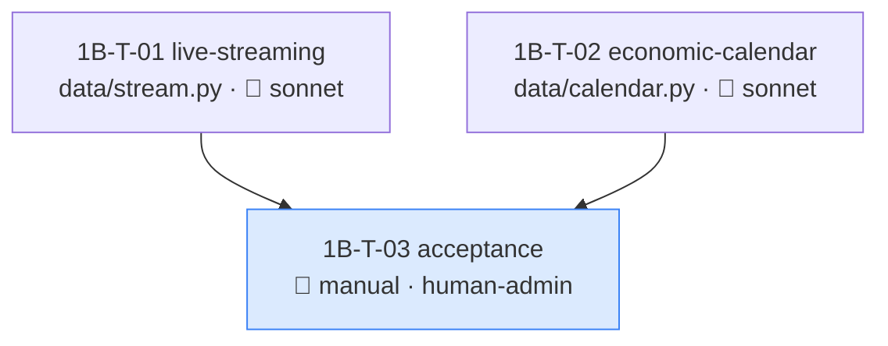

# Fathom Phase 1B — Task Graph (Live-Data Groundwork)

> ✅ **APPROVED — proceeding** (user greenlit "finish Phase 1"; calendar provider decided 2026-05-29).

Completes Phase 1: the live-data groundwork 1A deferred (off the approved-set critical path; groundwork for Phase 2's live signals + news-risk). Both 1B specs are `ready`.

## Decision applied

- **Calendar provider:** free FairEconomy/ForexFactory weekly XML feed (no auth), behind the pluggable `EconomicCalendar` interface. (See economic-calendar.md.)

## Summary

| Item | Value |
|---|---|
| Tasks | 3 (2 code + 1 manual acceptance) |
| Model split | 2 sonnet, 1 manual |
| Parallel | 1B-T-01 ∥ 1B-T-02 at t=0 (distinct new files: `data/stream.py` vs `data/calendar.py`) |
| Critical path | 2 hops: {T-01, T-02} → T-03 |
| New deps | none for stream (oandapyV20 present); `httpx` for calendar IF not already present — coordinator-branch edit if so |
| Invariants | INV-03 (UTC — sharp for both), INV-08 (no token/key logged), INV-09 (env-scoped) |

## Dependency graph

Both code tasks depend only on the existing data layer / config / store (all on `main`) — fully parallel, distinct files. No `strategies/__init__.py`-style shared-file contention this time.

## Tasks

### 1B-T-01 — live-streaming
| Field | Value |
|---|---|
| area | data · surface backend · **model** sonnet (read-only price stream; a bug means missed ticks, not bad trades — INV-01 unaffected) |
| feature_spec | `docs/features/live-streaming.md` |
| depends_on | _(none — existing data layer on main)_ |
| worktree | `../fathom-p1b-T-01-stream` |
| verification | auto — mocked `PricingStream`: yields UTC-aware `PriceTick`s; heartbeat resets liveness timer; heartbeat-timeout → reconnect; reconnect uses capped exp backoff + jitter; `gap_detected` raised on reconnect; clean shutdown (no orphaned thread); typed errors not raw |

`data/stream.py`: `PriceStream(settings, instruments)` over `oandapyV20.endpoints.pricing.PricingStream`, background thread + thread-safe queue (spec lean). INV-03 (UTC ticks), INV-08 (no token logged), INV-09 (env from settings). **No live HTTP in tests** — mock the stream generator.

### 1B-T-02 — economic-calendar
| Field | Value |
|---|---|
| area | data · surface backend · **model** sonnet |
| feature_spec | `docs/features/economic-calendar.md` |
| depends_on | _(none — existing config/store on main)_ |
| worktree | `../fathom-p1b-T-02-calendar` |
| verification | auto — parse a **fixture FF XML** (no live HTTP): `CalendarEvent`s with UTC-aware times (feed-TZ→UTC conversion correct), impact normalised, currency tagged; idempotent upsert; provider behind the `EconomicCalendar` ABC |

`data/calendar.py`: `EconomicCalendar` ABC + `FairEconomyCalendar` provider (fetch weekly XML via `httpx`, parse stdlib XML). **INV-03 sharp edge:** convert the feed's display-TZ times to UTC — a fixture test must assert a known event lands at the right UTC instant. INV-08: no key needed (free feed); if a configurable URL/key is ever added it lives in `.env`.
**library_defaults:** `httpx` — confirm whether it's already a dep (oandapyV20 may pull `requests`, not httpx); if NEW, the coordinator adds it to `pyproject.toml` + CLAUDE.md Stack. `httpx` defaults: 5s timeout is None by default — set an explicit timeout; raises on `.raise_for_status()` only when called.

### 1B-T-03 — acceptance (manual)
| Field | Value |
|---|---|
| area | data · **model** n/a — human/lead-run · **human_admin** true (live demo token for the stream) |
| depends_on | 1B-T-01, 1B-T-02 |
| verification | manual |

Checklist: `PriceStream` connects to the live **practice** endpoint and yields real ticks (UTC-aware) for a few seconds, reconnects cleanly on a forced drop; `FairEconomyCalendar` fetches the live weekly XML, stores events with correct UTC times + impact + currency. No token/key in logs. Save a short note to `docs/phases/phase-1-results.md` (or append to 1a-results) confirming both work; then Phase 1 (1A+1B) is complete.

## Sanity checks

| Check | Result |
|---|---|
| DAG acyclic | ✓ {T-01,T-02} → T-03 |
| Parallel slot | ✓ T-01 ∥ T-02 (distinct new files, no shared edits) |
| Invariants mapped | ✓ INV-03/08/09 on both; INV-01 explicitly unaffected (read-only stream) |
| Shared-file contention | ✓ none (new files; only `pyproject.toml`/CLAUDE.md if httpx is new → coordinator) |
| No-live-HTTP in tests | ✓ both verified with mocks/fixtures |
| Acceptance task present | ✓ T-03 (live demo) |

## Post-approval handoff

Open 3 issues (`area:data`/`phase:p1b`/`role:sonnet`; T-03 `blocked-on-human`, no role). Dispatch T-01 ∥ T-02; fresh read-only reviewer per PR → `gh pr merge --squash --delete-branch`; if `httpx` is new, coordinator applies the dep edit first. T-03 is lead/human-run against the live demo. On pass, Phase 1 is complete → Phase 2 (watchlist → Discord) consumes the 1A approved-set.
