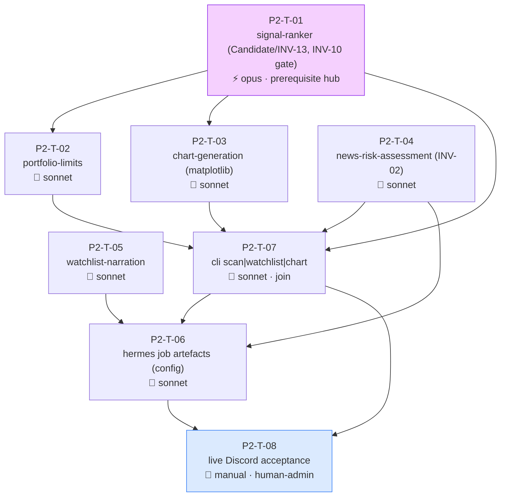

# Fathom Phase 2 — Task Graph (Watchlist → Discord)

> ⚠️ **AWAITING HUMAN APPROVAL**
> Do not dispatch to Agent Teams until this graph is reviewed and signed off.
> The session that generated this graph cannot also approve it.

Generated 2026-05-29 from the 7 `ready` Phase 2 specs. Cross-spec audit passed (`phase-2-spec-audit-2026-05-29.md`); INV-13 (`Candidate` wire contract) promoted.

## Rulings applied (lead, overridable)

- **D-P2-1 conflict:** suppress both on same-(instrument, timeframe) opposite directions.
- **News:** deterministic gate drops high-impact-in-window, flags medium; Claude news-risk is the finer veto on survivors.
- **Ranking:** `oos_sharpe_mean` primary, `quality_score` tie-break only (no composite).
- **D-P2-2** matplotlib · **D-P2-3** Claude Hermes-side (no `anthropic` dep) · **D-P2-4** Discord via Hermes gateway · **D-P2-5** the live Discord run is a human-operational gate.

---

## Summary

| Item | Value |
|---|---|
| Total tasks | 8 (6 auto code + 1 config + 1 manual gate) |
| Auto-verified | 6 (T-01…T-05, T-07) |
| Config (auto-lintable) | 1 (T-06 Hermes job artefacts) |
| Manual / human-admin | 1 (T-08 live Discord acceptance — needs configured Hermes + Discord + Anthropic key) |
| Opus tasks | 1 (T-01 signal-ranker — defines the INV-13 contract + INV-10 gate) |
| Sonnet tasks | 5 |
| Parallel slot | after T-01 locks `Candidate`: {T-02, T-03, T-04, T-05} 4-wide (distinct files) |
| Critical path | 4 hops: T-01 → {T-02/T-03/T-04/T-05} → T-07 (cli join) → T-08 (acceptance) |
| Dependency hubs | T-01 `signal-ranker` (Candidate prerequisite — 5 downstream); T-07 `cli-commands` (join) |
| Coordinator-branch edits | `pyproject.toml` (matplotlib) + `CLAUDE.md` Stack; INV-13 already on main |
| Phase-rescope signal | None — 8 tasks, clean structure |

---

## Dependency graph

**Waves:** **T-01 fires alone at t=0** (sole prerequisite — locks the `Candidate` contract). When it merges → **T-02, T-03, T-04, T-05** dispatch in parallel (distinct files: `portfolio.py` / `charts.py` / `hermes_integration/news_risk.py` / `hermes_integration/narration.py`). **T-07** (`cli.py`, the join) needs T-01+T-02+T-03+T-04. **T-06** (Hermes job config) needs T-04, T-05, T-07. **T-08** (manual acceptance) last.

---

## Open decisions to resolve before dispatch

The five D-P2 rulings above are applied. Remaining, non-blocking (worker-Plan level):

- News-window lengths (high-impact 4h / medium 1h — confirm), spread-threshold source (`InstrumentMeta` typical_spread × k).
- Correlation source for portfolio (rolling daily-return ρ, |ρ|>0.7 — confirm) + default caps (`max_concurrent=5`, `max_per_currency=2`).
- `scan` `--dry-run` (cache-only) — mirror `backtest` (yes).

None block dispatch.

---

## Tasks

### P2-T-01 — signal-ranker
| Field | Value |
|---|---|
| area | signals · surface backend · **model** opus — defines the INV-13 `Candidate` contract every downstream task consumes AND enforces the INV-10 gate join; a wrong contract or a silent gate-join bug ripples across the whole phase |
| feature_spec | `docs/features/signal-ranker.md` |
| depends_on | _(none — prerequisite root)_ |
| worktree | `../fathom-p2-T-01-ranker` |
| verification | auto — empty approved-set → `rank()` returns `[]` (INV-10); only approved combos emit; gate join `signal.timeframe == row['granularity']`; high-impact-news drop / medium flag; same-(instrument,tf) opposite-direction suppression; rank by `oos_sharpe_mean` then `quality_score`; **`Candidate` serialisation round-trip pins the INV-13 field shape** |

`signals/ranker.py` + the pinned `Candidate` model. Mock approved-set/candles/calendar in tests — no live HTTP. INV-10/INV-11/INV-13/INV-03/INV-01.
**notes:** **prerequisite hub** — lock `Candidate` first; T-02/03/05/07 all build against it. Reuse the runner's strategy-name→instance construction.

### P2-T-02 — portfolio-limits
| Field | Value |
|---|---|
| area | signals · backend · **model** sonnet |
| feature_spec | `docs/features/portfolio-limits.md` |
| depends_on | P2-T-01 (consumes `Candidate`) |
| worktree | `../fathom-p2-T-02-portfolio` |
| verification | auto — correlated pair not double-admitted (higher score wins); `max_per_currency` + `max_concurrent` enforced; greedy admission deterministic; empty→empty; INV-01 (no sizing/orders) |

`signals/portfolio.py`. Correlation from rolling daily-return ρ via `load_candles`. Distinct file from ranker → parallel-safe once `Candidate` locked.

### P2-T-03 — chart-generation
| Field | Value |
|---|---|
| area | signals · backend · **model** sonnet |
| feature_spec | `docs/features/chart-generation.md` |
| depends_on | P2-T-01 (`Candidate` levels) |
| worktree | `../fathom-p2-T-03-charts` |
| verification | auto — PNG produced + non-empty; entry/stop/target lines correctly placed per `direction`; signal marker at `generated_at`; UTC x-axis (INV-03); headless `Agg`; deterministic path |

`signals/charts.py`, matplotlib `Agg`. **`matplotlib` is a NEW dep — coordinator** adds to `pyproject.toml` + CLAUDE.md (only this task needs it; serialize the dep edit). Reads flat `Candidate` fields (no `.signal.` nesting).

### P2-T-04 — news-risk-assessment
| Field | Value |
|---|---|
| area | hermes_integration · backend · **model** sonnet |
| feature_spec | `docs/features/news-risk-assessment.md` |
| depends_on | _(none — `calendar` on main)_ |
| worktree | `../fathom-p2-T-04-news-risk` |
| verification | auto — `NewsRiskVerdict` strict enums; `parse_news_risk` returns valid verdict for good JSON; **malformed/missing-field/bad-enum/empty → safe default `suggest_action="skip"`, never an exception, never "proceed" (INV-02)** |

`hermes_integration/news_risk.py` (`NewsRiskVerdict` + `parse_news_risk`) + `prompts/news_risk.md`. **No `anthropic` dep** (Hermes-side call). The canonical INV-02 feature.
**notes:** independent of T-01 — can start at t=0 alongside it if desired.

### P2-T-05 — watchlist-narration
| Field | Value |
|---|---|
| area | hermes_integration · backend · **model** sonnet |
| feature_spec | `docs/features/watchlist-narration.md` |
| depends_on | P2-T-01 (`Candidate` facts) |
| worktree | `../fathom-p2-T-05-narration` |
| verification | auto — `fallback_narration` produces a one-liner for any candidate (LONG/SHORT, each strategy); empty/over-long Claude response → fallback (cosmetic, candidate kept — **NOT** an INV-02 veto) |

`hermes_integration/narration.py` + `prompts/narration.md`. Distinct file from news_risk → parallel-safe. Explicitly NOT INV-02-governed.

### P2-T-06 — hermes job artefacts
| Field | Value |
|---|---|
| area | hermes_integration · config · **model** sonnet |
| feature_spec | `docs/features/hermes-job-definitions.md` |
| depends_on | P2-T-04, P2-T-05, P2-T-07 |
| worktree | `../fathom-p2-T-06-hermes-job` |
| verification | auto (artefact lint) — `jobs/daily.md` exists with the ordered steps; references only `scan\|watchlist\|chart` (INV-01 — no execute/order tool); maps `skip→veto / reduce_size→flag / proceed→keep`; specifies empty-watchlist + malformed-Claude safe paths. Plus the **operator runbook** section |

Configuration artefact (Hermes is configured, not coded). No service code. The live behaviour is verified by T-08.

### P2-T-07 — cli-commands (join)
| Field | Value |
|---|---|
| area | cli · backend · **model** sonnet |
| feature_spec | `docs/features/cli-commands.md` |
| depends_on | P2-T-01, P2-T-02, P2-T-03 |
| worktree | `../fathom-p2-T-07-cli` |
| verification | auto — `scan` runs ranker→portfolio, persists to a `watchlist` table + prints `Candidate[]` JSON; empty approved-set → empty watchlist, exit 0 (INV-10); `watchlist` re-reads persisted JSON (INV-13 shape); `chart <instrument>` writes PNG; existing `backtest` unbroken; no live HTTP (mocked + cached fixtures); no order path (INV-01) |

Extends `cli.py` — **the ONLY Phase 2 task that edits `cli.py`** (the join point). Reuses Phase 1 runner scaffolding (`--dry-run`, UTC logging).

### P2-T-08 — live Discord acceptance (manual)
| Field | Value |
|---|---|
| area | hermes_integration · **model** n/a — human/operator-run · **human_admin** true (configured Hermes + Discord channel + Anthropic key) |
| depends_on | P2-T-06, P2-T-07 |
| verification | manual |

**Checklist:** register the `daily.md` job in Hermes; point it at the `fathom` CLI as a tool (scan/watchlist/chart ONLY — INV-01); connect the Discord gateway + Anthropic key. Confirm a coherent, actionable ranked watchlist (charts + Claude rationale + news flags) lands in Discord over **≥5 consecutive daily runs**; empty days post "no candidates"; a `skip` verdict vetoes; no token in output. Save a note to `docs/phases/phase-2-results.md`. Phase 2 complete.

---

## Sanity checks

| Check | Result |
|---|---|
| DAG acyclic | ✓ T-01 root → fan-out → T-07 join → T-06 → T-08 |
| Critical path | ✓ 4 hops (T-01 → fan-out → T-07 → T-08) |
| Parallel slot | ✓ {T-02, T-03, T-04, T-05} 4-wide after T-01 (distinct files; T-04 independent of T-01 entirely) |
| Dependency hubs | ✓ T-01 (Candidate/INV-13 prerequisite — hold the queue until its contract test passes); T-07 (cli join) |
| Invariant compliance | ✓ INV-01 (cli+hermes no order path), INV-02 (T-04 safe-default; T-05 explicitly NOT), INV-10 (empty→empty across T-01/T-07/T-06), INV-11/INV-13 (Candidate contract), INV-03/08 |
| Code-map collisions | ✓ `cli.py` single-writer (T-07 only); `signals/` files distinct; `hermes_integration/` news_risk vs narration distinct; matplotlib dep via coordinator |
| Coordinator-branch edits | ✓ matplotlib (`pyproject.toml`+CLAUDE.md) before T-03; no `anthropic` dep |
| Manual/operational gate | ✓ T-08 (live Discord, human-admin) — the D-P2-5 operational acceptance |
| Reviewable in one sitting | ✓ 8 tasks |
| Model split w/ rationale | ✓ 1 opus (T-01 contract+gate), 5 sonnet, 1 config, 1 manual |
| Deep-chain risk | ⚠️ T-01 is the prerequisite hub — if its `Candidate` contract is reworked, T-02/03/05/07 rebase. Mitigate: lock + contract-test T-01 first; do not fan out until its INV-13 round-trip test passes |

---

## Post-approval handoff

On sign-off → `runbook-orchestration-kickoff`:
1. Coordinator applies the `matplotlib` dep edit (`pyproject.toml` + CLAUDE.md) on a coordinator branch before T-03.
2. Open 8 issues (`area:{signals,hermes_integration,cli}` / `phase:p2` / `role:{opus,sonnet}`; T-08 `blocked-on-human`, no role).
3. Dispatch **T-01 alone** (and optionally T-04, which is independent); hold the fan-out until T-01's `Candidate` contract test passes. Then {T-02, T-03, T-05} ∥; then T-07 (join); then T-06; then T-08.
4. Each PR → fresh read-only reviewer → `gh pr merge --squash --delete-branch`. Watch `hermes_integration/` context-log + the `Candidate` shape across consumers.
5. **T-08 is operator-run** (configured Hermes + Discord) — schedule it as the phase gate, not an automated step.

Phase 3 (risk + execution) does not begin until Phase 2's `Done when` is met and `docs/phases/phase-2-results.md` exists.
