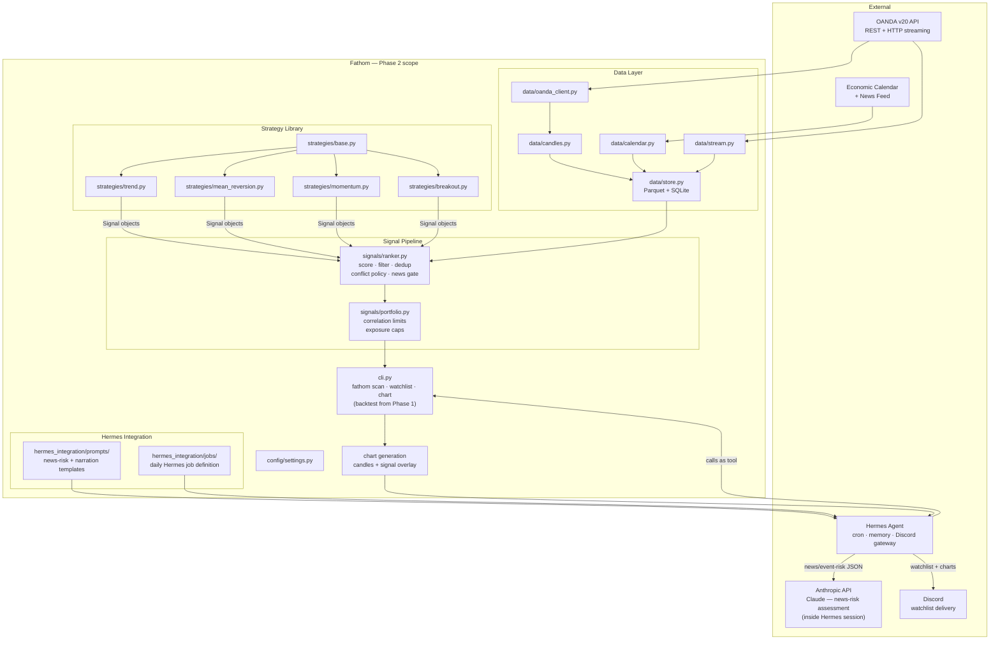

# Fathom — Phase 2: Daily Watchlist to Discord

**Status:** Stub — not started
**Depends on:** [Phase 1](phase-1.md) approved-set table populated and stable
**Unlocks:** Phase 3 (Risk + Execution — stub TBD)
**Spec layer:** [product-spec.md](../product-spec.md) · [architecture-overview.md](../architecture-overview.md) · [invariants.md](../invariants.md)

---

## Purpose

Turn the approved-set table into a daily actionable watchlist delivered to Discord. This is the first time the system produces human-readable output — a ranked list of candidate trades with charts and Claude-written rationale, delivered on a schedule without manual intervention.

At the end of Phase 2, the trader receives a daily Discord message that is genuinely useful: ranked pair candidates, a one-line reason per candidate, a chart showing the proposed entry/stop/target, and an event-risk flag if high-impact news is imminent.

This phase does not place trades. Hermes's authority ends at the watchlist.

---

## Done When

- [ ] `fathom scan` runs end-to-end: refreshes data, evaluates all approved (strategy, pair, timeframe) combos, ranks candidates, returns filtered list
- [ ] `fathom chart <pair>` renders a candle chart with signal overlay and saves to disk
- [ ] `fathom watchlist` outputs the ranked candidate list as structured JSON
- [ ] Hermes cron job calls `fathom scan` → `fathom chart` → delivers ranked watchlist + charts to Discord channel on schedule (daily, after major session close)
- [ ] Claude (inside Hermes session) assesses news/event risk per candidate and produces structured `{event_risk, reason, suggest_action}` — malformed response defaults to `skip` (INV-02)
- [ ] Watchlist narration: one human-readable line per candidate explaining the setup
- [ ] High-impact news events cause the affected pair to be down-ranked or vetoed
- [ ] Portfolio correlation limits suppress highly correlated concurrent candidates
- [ ] Trader receives a Discord message that is coherent and actionable — manual review confirms quality over ≥5 consecutive daily runs

---

## Strict-Subset Architecture Diagram

Adds to Phase 1: signal ranker, portfolio module, CLI commands, Hermes integration, chart generation, Discord delivery, Claude news-risk assessment.

**Not in this diagram (Phase 3+):** `hermes_integration/pretrade_check.py`, `risk/`, `execution/`, `monitoring/`, `panel/`.

---

## Components Added vs Phase 1

| File | What's new |
|---|---|
| `signals/ranker.py` | Score by backtested expectancy × quality; filter by spread, session, imminent news; de-duplicate; conflict policy (trend wins on higher TF, or suppress) |
| `signals/portfolio.py` | Correlation-aware limit: correlated pairs count as shared exposure; max concurrent candidates; position limit per currency |
| `cli.py` (full) | `fathom scan`, `fathom watchlist`, `fathom chart <pair>` added to Phase 1's `fathom backtest` |
| Chart generation | Candle + indicator overlays using matplotlib or plotly; saves PNG per pair; entry/stop/target markers |
| `hermes_integration/prompts/news_risk.md` | Prompt template for per-pair event-risk assessment; output schema: `{event_risk: high\|medium\|low, reason: str, suggest_action: proceed\|reduce_size\|skip}` |
| `hermes_integration/prompts/narration.md` | Prompt template for watchlist rationale: one-line human-readable reason per candidate |
| `hermes_integration/jobs/daily.md` | Plain-English Hermes job definition: trigger, tool calls, delivery target |

---

## The Hermes Boundary (critical)

Hermes calls `fathom scan` and `fathom chart` as tools. It uses Claude to assess news risk and write narration. It delivers the result to Discord.

**Hermes must not be given access to** `fathom execute`, order-placement functions, or any risk module entrypoint. The watchlist is the boundary. See INV-01.

---

## Open Questions

- **Chart generation library:** matplotlib is the simplest dependency; plotly produces better interactive output but PNG export requires kaleido. For Discord delivery (PNG attachments) matplotlib is sufficient.
- **Hermes news-risk assessment:** this is the first live Claude API call in the production path. The structured output contract (`{event_risk, reason, suggest_action}`) and the malformed-response default (→ `skip`) must be implemented and tested before Phase 2 is complete.
- **Intraday cadence:** the confirmed decision (Decision #6) is to start with daily/swing and add an intraday Hermes job once a strategy earns it. Phase 2 only defines the daily job. The intraday job config is identical in structure — a separate Hermes job definition on a faster schedule, calling the same `fathom scan` with intraday-only approved strategies.
- **Conflict policy:** when trend says long EUR/USD and mean-reversion says short on the same timeframe, the policy must be defined before `ranker.py` is specced. Options: (a) trend wins on higher TF; (b) suppress both; (c) rank independently and let the quality score decide. This is a feature spec decision.

---

## Invariants Active in Phase 2

- **INV-01** — Hermes must not place orders; its authority ends at the watchlist
- **INV-02** — Claude news-risk output is structured JSON; malformed → `skip`
- **INV-03** — all timestamps UTC, RFC 3339
- **INV-08** — secrets in `.env`
- **INV-10** — ranker refuses to operate without a valid approved-set table

---

## TODO — Detailed Spec

- [ ] Feature spec: `signal-ranker` (scoring formula, filter rules, conflict policy)
- [ ] Feature spec: `news-risk-assessment` (prompt contract, pydantic response model, safe defaults)
- [ ] Feature spec: `watchlist-narration`
- [ ] Feature spec: `chart-generation`
- [ ] Feature spec: `cli-commands`
- [ ] Feature spec: `hermes-job-definitions`
- [ ] Task graph for Phase 2
