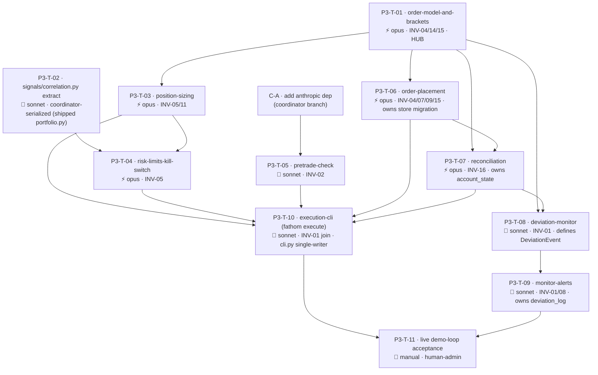

# Fathom — Phase 3 Task Graph (Risk · Execution · Monitoring, demo only)

> **Status: awaiting human approval. Do NOT dispatch to workers until this graph is reviewed and signed off.** (Generated per `runbook-taskgraph-generation`; the session that generated it is not the gate.)

Maps to product-spec Phase 4. Source specs: the 9 `ready` Phase 3 specs (cross-spec audit passed 2026-05-29, INV-14/15/16 promoted). See [phase-3.md](phase-3.md), [phase-3-spec-audit-2026-05-29.md](phase-3-spec-audit-2026-05-29.md), [code-map.md](../code-map.md) (Phase 3 dispatch section).

## Confirmed kickoff decisions (already locked)

- **D-P3-1** full bundle (risk + execution + monitor + alerts). **D-P3-2** pretrade-check boundary now, live `anthropic` key at acceptance. **D-P3-3** approval = operator-run `fathom execute`, never a Hermes tool (INV-01).

## Coordinator pre-steps (before any fan-out — `main` coordinator branch, not a worktree)

- **C-A — add `anthropic` dependency** to `pyproject.toml` + `CLAUDE.md` (mirrors Phase 2's matplotlib edit). Blocks P3-T-05 only. *(Pure coordinator edit, no worker.)*
- **C-B — `signals/correlation.py` extraction** is task **P3-T-02** below (it's substantive code touching a shipped, tested file → coordinator-serialized, runs before P3-T-04).

## Summary

| | |
|---|---|
| Total tasks | 11 (10 auto/code + 1 manual gate) + 1 coordinator dep-edit (C-A) |
| Auto-verified | 9 (T-01…T-10 except the manual gate) |
| Manual / human-admin | 1 (P3-T-11 live demo-loop acceptance — needs `ANTHROPIC_API_KEY` + `DISCORD_WEBHOOK_URL` + live practice account + sustained demo) |
| Opus tasks | 5 (T-01 contract/brackets, T-03 sizing-cap, T-04 limits/kill-switch, T-06 order-placement, T-07 reconciliation — all invariant-heavy / money-mechanics) |
| Sonnet tasks | 5 (T-02 refactor, T-05 pretrade parser, T-08 monitor, T-09 alerts, T-10 cli join) |
| Prerequisite hub | **P3-T-01** `order-model-and-brackets` (locks the INV-14 `Order`/`Fill`/`Position` contract — 6 downstream) |
| Critical path | 6 hops: T-01 → T-06 → T-07 → T-08 → T-09 → T-11 |
| Parallel slot (t=0) | {T-01, T-02, T-05} 3-wide (distinct areas; T-05 after C-A) |
| Serialized (shipped files) | `data/store.py` + `data/oanda_client.py` edits chained T-06 → T-07; `signals/portfolio.py` via T-02; `cli.py` single-writer T-10 |

## Dependency graph

**Waves.** C-A (dep edit) lands first. **t=0:** T-01 (hub), T-02 (correlation extract), T-05 (pretrade — after C-A) dispatch in parallel. When T-01 merges → T-03 + T-06 in parallel. T-04 needs T-02 + T-03. T-07 needs T-01 + T-06 (serializes `store.py`/`oanda_client.py` after T-06). T-08 needs T-01 + T-07. T-09 needs T-08. **T-10** (cli join) needs T-03 + T-04 + T-05 + T-06 + T-07. **T-11** (manual acceptance) needs T-10 + T-09, runs last.

## Tasks

### P3-T-01 — order-model-and-brackets
| Field | Value |
|---|---|
| area | `execution` · surface backend · **model opus** — defines the INV-14 frozen `Order`/`Fill`/`Position` contract + INV-04 bracket maths + INV-15 `client_order_id`; a wrong contract ripples across 6 downstream tasks |
| feature_spec | `docs/features/order-model-and-brackets.md` |
| depends_on | — |
| worktree | `../fathom-p3-T-01-ordermodel` |
| verification | auto — `build_bracket` yields SL+TP for both directions (INV-04); precision = `display_precision` rounding (5dp + 3dp fixtures); signed units; UTC validators; `client_order_id` formula; **JSON round-trip pins the INV-14 shape** (hypothesis: stop/target straddle entry) |
| human_admin | false · library_defaults | n/a |

**notes:** prerequisite hub — lock + round-trip test first; do not fan out until it passes.

### P3-T-02 — signals/correlation.py extraction
| Field | Value |
|---|---|
| area | `signals` · surface backend · **model sonnet** — behaviour-preserving refactor; mechanical but touches a shipped, tested file |
| feature_spec | `docs/features/risk-limits-kill-switch.md` (Component design, DRIFT-09 resolution) |
| depends_on | — |
| worktree | **coordinator-serialized** — edits shipped `signals/portfolio.py`; no parallel `signals/` worker |
| verification | auto — extract `_pearson_corr` + `_mid_returns`/`_load_returns`/`_split_currencies` into `signals/correlation.py`; `portfolio.py` imports them back; **all existing Phase 2 `portfolio` tests stay green** (behaviour-preserving) |
| human_admin | false · library_defaults | n/a |

**notes:** the only Phase 3 task that edits shipped Phase 2 code. Pure move + re-import; add no new behaviour.

### P3-T-03 — position-sizing
| Field | Value |
|---|---|
| area | `risk` · surface backend · **model opus** — owns the INV-05 0.25% cap; the single most safety-critical line |
| feature_spec | `docs/features/position-sizing.md` |
| depends_on | P3-T-01 |
| worktree | `../fathom-p3-T-03-sizing` |
| verification | auto — per-unit risk = `stop_distance × quote_to_account_rate` (no `pip_value` field); realized risk ≤ `equity × 0.0025` (hypothesis property); `stop_distance ≤ 0` → reject; budget < `min_trade_size` → reject; JPY-quote conversion fixture |
| human_admin | false · library_defaults | n/a |

### P3-T-04 — risk-limits-kill-switch
| Field | Value |
|---|---|
| area | `risk` · surface backend · **model opus** — daily-loss kill switch + book caps; a silent miss removes the backstop |
| feature_spec | `docs/features/risk-limits-kill-switch.md` |
| depends_on | P3-T-02, P3-T-03 |
| worktree | `../fathom-p3-T-04-limits` |
| verification | auto — daily-loss ≥ cap → kill switch active until 00:00 UTC reset; `max_concurrent`/`max_book_risk` rejects; correlation-bucket shared exposure (on the T-02 primitive); pure (injected `now`/`day_pl`/`equity`); reads `account_state` shape |
| human_admin | false · library_defaults | n/a |

**notes:** unit-tests with injected state (no DB) → does not hard-block on T-07; at runtime reads the `account_state` row T-07 owns.

### P3-T-05 — pretrade-check
| Field | Value |
|---|---|
| area | `hermes_integration` · surface backend · **model sonnet** — mirrors the shipped `news_risk.py` parser pattern |
| feature_spec | `docs/features/pretrade-check.md` |
| depends_on | C-A (anthropic dep) |
| worktree | `../fathom-p3-T-05-pretrade` |
| verification | auto — `parse_pretrade_verdict` → `block` on all malformed inputs, never raises, never `proceed` on failure (INV-02); valid proceed/block parse; stub-client path offline; no-key → safe-default block; no order/risk fn importable |
| human_admin | false |
| library_defaults | **`anthropic` SDK** — pin an explicit model (do NOT rely on a default model); set an explicit request timeout; route every response through `parse_pretrade_verdict` (never trust raw text); the SDK reads `ANTHROPIC_API_KEY` from env — keep it out of args/logs (INV-08). Reviewer verifies each. |

### P3-T-06 — order-placement
| Field | Value |
|---|---|
| area | `execution` · surface backend · **model opus** — atomic bracket + idempotency; the double-fill / naked-position risk |
| feature_spec | `docs/features/order-placement.md` |
| depends_on | P3-T-01 |
| worktree | `../fathom-p3-T-06-orders` · **serializes `data/store.py` + `data/oanda_client.py`** (owns orders/fills/positions migration + v20 order endpoints) |
| verification | auto (mocked v20 via `responses`) — SL+TP in one request (INV-04); duplicate `client_order_id` → no second order (INV-15); transient-error retry → exactly one fill; slippage capture; rejection/partial recorded; practice endpoint only (INV-07/09); no secrets logged (INV-08) |
| human_admin | false · library_defaults | n/a (oandapyV20 shipped) |

### P3-T-07 — reconciliation
| Field | Value |
|---|---|
| area | `execution` · surface backend · **model opus** — broker-is-truth (INV-16); corrupting this corrupts the kill switch's inputs |
| feature_spec | `docs/features/reconciliation.md` |
| depends_on | P3-T-01, P3-T-06 |
| worktree | `../fathom-p3-T-07-reconcile` · **serialized after T-06** on `data/store.py` (adds `account_state`) + `data/oanda_client.py` (open-trades + account-summary endpoints) |
| verification | auto (mocked v20) — broker-only adopted; store-only closed + `realized_pl` written; matched refreshed; `account_state` snapshot once per UTC day, stable across restart; drift logged; idempotent re-run |
| human_admin | false · library_defaults | n/a |

### P3-T-08 — deviation-monitor
| Field | Value |
|---|---|
| area | `monitoring` · surface backend · **model sonnet** — rules are pure predicates; the risky feed-handling is inherited from shipped Phase 1B `stream.py` |
| feature_spec | `docs/features/deviation-monitor.md` |
| depends_on | P3-T-01, P3-T-07 |
| worktree | `../fathom-p3-T-08-monitor` |
| verification | auto — adverse/slippage/vol/feed-health rules fire one debounced `DeviationEvent` each on synthetic series; default `alert_only` (no flatten unless flag on); resilient to stream drop; UTC events; defines the `DeviationEvent` model; never opens an order (INV-01) |
| human_admin | false · library_defaults | n/a |

### P3-T-09 — monitor-alerts
| Field | Value |
|---|---|
| area | `monitoring` · surface backend · **model sonnet** |
| feature_spec | `docs/features/monitor-alerts.md` |
| depends_on | P3-T-08 |
| worktree | `../fathom-p3-T-09-alerts` · adds `deviation_log` table (distinct from T-06/T-07 tables; chained after them via the dep path) |
| verification | auto (stub webhook client, no live HTTP) — event persisted to `deviation_log` **before** delivery; one-line UTC alert format; delivery failure retried, never crashes the loop; outbound-only (INV-01); no secret (INV-08); idempotent on `event_id` |
| human_admin | false · library_defaults | n/a (httpx shipped) |

### P3-T-10 — execution-cli (`fathom execute`)
| Field | Value |
|---|---|
| area | `cli` · surface backend · **model sonnet** — pure orchestration; the INV-01 enforcement point |
| feature_spec | `docs/features/execution-cli.md` |
| depends_on | P3-T-03, P3-T-04, P3-T-05, P3-T-06, P3-T-07 |
| worktree | `../fathom-p3-T-10-cli` · **ONLY Phase 3 task that edits `cli.py`** (the join) |
| verification | auto — gate order pretrade→size→limits→submit, any reject aborts non-zero with reason; `--dry-run` runs 1–5 with no v20 submit; fresh reconcile before limits; idempotent re-run; kill-switch refusal; **a test asserts no execution command appears in `hermes_integration/`** (INV-01); existing scan/watchlist/chart/backtest unbroken |
| human_admin | false · library_defaults | n/a |

### P3-T-11 — live demo-loop acceptance (manual)
| Field | Value |
|---|---|
| area | `execution` + `monitoring` · **model n/a** — human/operator-run · **human_admin true** |
| feature_spec | `docs/phases/phase-3.md` (Done When) |
| depends_on | P3-T-10, P3-T-09 |
| verification | manual |

**Checklist:** with `ANTHROPIC_API_KEY` + `DISCORD_WEBHOOK_URL` configured against a live practice account: `fathom execute` an approved candidate → confirm a **bracketed** (SL+TP) demo order places through the gate → fill recorded → `run_monitor.py` tracks it → a deviation alert lands in Discord → reconciliation matches broker state after a restart. Confirm over a **sustained demo period**; no live endpoint touched (INV-07); no secret in output (INV-08). Record results in `docs/phases/phase-3-results.md`. **This is the stack-assembly verification gate** (runnable-stack phase) — the boundary between auto-test-green and shippable.

## Sanity checks

| Check | Result |
|---|---|
| DAG acyclic | ✓ T-01 hub → risk/execution fan-out → T-10 join → T-11 |
| Critical path | ✓ 6 hops (T-01 → T-06 → T-07 → T-08 → T-09 → T-11) |
| Parallel slots | ✓ {T-01, T-02, T-05} at t=0; {T-03, T-06} after T-01 |
| Dependency hubs | ✓ T-01 (6 downstream — lock first); T-07 (feeds T-08 + T-10 + T-04's account_state) |
| Invariant compliance | ✓ INV-01 (T-08/T-10 not Hermes tools; monitor never opens), INV-02 (T-05 safe-default block), INV-04 (T-01/T-06 brackets), INV-05 (T-03/T-04), INV-07/09 (practice-only, single path), INV-13 (consumes Candidate), INV-14/15/16 (T-01/T-06/T-07) |
| Code-map / shipped-file edits | ✓ `cli.py` single-writer (T-10); `signals/portfolio.py` via T-02 (coordinator-serialized); `data/store.py` + `data/oanda_client.py` chained T-06→T-07 (no parallel edit); `deviation_log` (T-09) distinct table, chained |
| Coordinator-branch edits | ✓ C-A `anthropic` dep (pyproject + CLAUDE.md) before T-05; T-02 correlation extract before T-04 |
| Manual/stack-assembly gate | ✓ T-11 (live demo loop, human-admin) — the runnable-stack acceptance |
| Reviewable in one sitting | ✓ 11 tasks with clear hub→risk→execution→monitor→join→accept structure (largest phase; no rescope needed) |
| Model split w/ rationale | ✓ 5 opus (contract + money-mechanics), 5 sonnet (parser/refactor/monitor/cli), 1 manual |
| Deep-chain risk | ⚠️ T-01 is the prerequisite hub — if its INV-14 contract is reworked, T-03/06/07/08 rebase. Mitigate: lock + round-trip-test T-01 first; do not fan out until it passes (same playbook as Phase 2's `Candidate`). |
| New-dep audit | ✓ only T-05 adds `anthropic` (library_defaults specified); T-09 uses shipped `httpx`; T-06/T-07 use shipped `oandapyV20` |

## Open decisions to resolve before dispatch

All have proposed defaults baked into the specs (overridable at review). **None blocks code dispatch** — the manual gate (T-11) is the only true blocked-on-human, and only at acceptance time.

| ID | Decision | Recommendation | Tasks | Cost of late-deciding |
|---|---|---|---|---|
| D-P3-A | Daily-loss cap value | **1.0% of start-of-day equity** (≈4 max-loss trades) | T-04, T-11 | low — a config constant |
| D-P3-B | Book caps: `max_concurrent` / `max_book_risk` / `max_per_correlation_group` / correlation `threshold` | **5 / 1.0% / 2 / 0.7** | T-04 | low — config constants |
| D-P3-C | Monitor severe-response on demo | **alert-only**; `auto_flatten`/`tighten_stop` behind a default-off flag | T-08, T-11 | low — flag default |
| D-P3-D | Account currency for sizing | **USD** (demo), config-driven | T-03 | low |
| D-P3-E | `anthropic` model for pretrade-check | a **small/fast Claude** (e.g. Haiku); text-only prompt | T-05, T-11 | low — one constant |
| D-P3-F | Reconcile cadence | **startup + every 5 min**, operator-configurable | T-07, T-08 | low |
| D-P3-G | T-11 credentials | operator provides `ANTHROPIC_API_KEY` + `DISCORD_WEBHOOK_URL` + live practice account | T-11 | **gates acceptance only**, not code |

## Post-approval handoff

On sign-off → `runbook-orchestration-kickoff`:
1. Coordinator applies **C-A** (`anthropic` dep) + dispatches **P3-T-02** (correlation extract) on the coordinator branch / serialized — both before the fan-out.
2. Open 11 issues (`area:{execution,risk,hermes_integration,monitoring,signals,cli}` / `phase:p3` / `role:{opus,sonnet}`; T-11 `blocked-on-human`, no role).
3. Dispatch **T-01 alone** (hub); hold the fan-out until its INV-14 round-trip test passes. Then {T-03, T-06} ∥; T-04 (after T-02+T-03); T-07 (after T-06, serialized store/client); T-08 (after T-07); T-09; T-10 (join); T-11 (manual).
4. Each PR → fresh read-only `reviewer` → `gh pr merge --squash --delete-branch`. Watch the `Order`/`Fill`/`Position` shape across consumers and the serialized `data/store.py` edits.
5. **T-11 is operator-run** (live demo loop) — schedule it as the phase gate, not an automated step. Phase 4 (admin panel) does not begin until `docs/phases/phase-3-results.md` exists.
