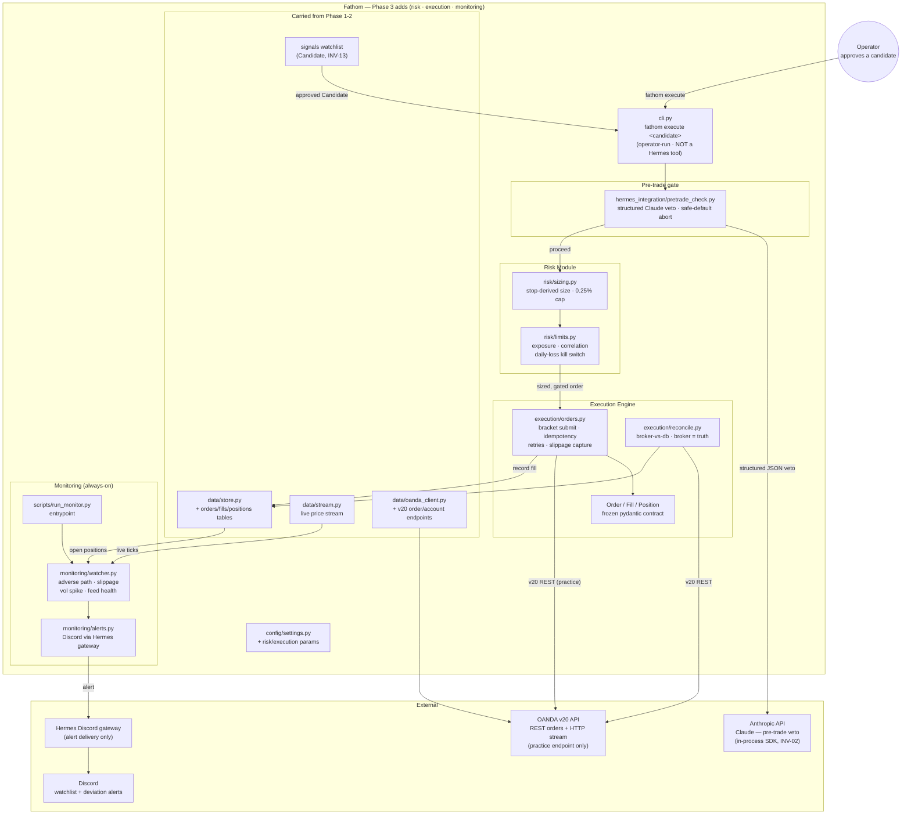

# Fathom — Phase 3: Risk, Execution & Monitoring (demo only)

**Status:** Carved — planning. No code yet.
**Depends on:** [Phase 2](phase-2.md) — the `Candidate` watchlist contract (INV-13) shipped and stable.
**Unlocks:** Phase 4 (Admin Panel & Hardening — `panel/`, equity curve, blotter, deviation log).
**Spec layer:** [product-spec.md](../product-spec.md) (its "Phase 4 — Risk, Execution & Monitoring") · [architecture-overview.md](../architecture-overview.md) ("Trade Execution" data flow + Risk Gate boundary) · [invariants.md](../invariants.md)
**Maps to:** product-spec **Phase 4**. (The implemented track compressed spec-Phases 1+2 → impl-Phase 1 and spec-Phase 3 → impl-Phase 2; this is the next slice.)

> **Numbering note.** "Phase 3" here = the product spec's *Phase 4 — Risk, Execution & Monitoring*. The admin panel (spec Phase 5) becomes impl-Phase 4; go-live (spec Phase 6) becomes impl-Phase 5.

---

## Purpose

Turn an **operator-approved** watchlist candidate into a risk-sized, bracketed,
idempotent **demo** order on OANDA — through a deterministic Python gate that
Hermes can never invoke — and watch the resulting position with an always-on
monitor that alerts on deviation.

This is the first phase where Fathom holds **order authority**. That authority
lives entirely on the deterministic side of the [INV-01](../invariants.md#inv-01--hermes-must-not-place-orders)
boundary: a human approves a candidate, a deterministic command sizes and
risk-checks it, and only then is a bracketed order submitted. Hermes produces
suggestions; it never pulls the trigger.

**Demo only.** No live (non-practice) endpoint is touched in this phase — that is
[INV-07](../invariants.md#inv-07--demo-first--no-live-trading-without-a-track-record),
deferred to impl-Phase 5.

---

## Confirmed scope decisions (this kickoff)

| # | Decision | Choice |
|---|---|---|
| D-P3-1 | Phase boundary | **Full product-spec Phase 4 bundle** — risk + execution + always-on deviation monitor + alerts in one phase. |
| D-P3-2 | Pre-trade Claude check | **Build the deterministic INV-02 boundary now** (pydantic verdict + parser + safe-default veto), live `anthropic` SDK call behind a stubbable adapter; real `ANTHROPIC_API_KEY` wired at the acceptance gate. Adds the `anthropic` dependency (D-P3-3 equivalent of Phase 2's matplotlib coordinator edit). |
| D-P3-3 | Approval → execution trigger | **Operator-run CLI command** `fathom execute <candidate>` — deterministic, **never registered as a Hermes tool** (INV-01). |

---

## Done When

- [ ] `risk/sizing.py` derives position size from `Candidate.stop_distance` and a 0.25%-of-equity budget; never a fixed lot; rejects (does not size naked) when a valid stop cannot be computed (INV-05, INV-11).
- [ ] `risk/limits.py` enforces exposure caps (max concurrent trades, max total book risk), correlation-aware shared exposure, and a **daily-loss kill switch** that halts new entries and alerts when the day's cumulative loss crosses the threshold.
- [ ] `execution/orders.py` submits a **bracket** (entry + stop-loss + take-profit) atomically to OANDA v20 practice; **idempotent** via client-supplied order ID (a retry never double-fills); captures actual fill price + slippage vs intended entry; records the fill to the store (INV-04).
- [ ] `execution/reconcile.py` fetches the broker's open trades on startup and periodically, reconciles against the DB, and treats **the broker as the source of truth**.
- [ ] `hermes_integration/pretrade_check.py` makes a final structured Claude veto immediately before submission; malformed/unavailable → **safe default = abort** (INV-02). Offline-testable; live key wired at acceptance.
- [ ] `monitoring/watcher.py` runs always-on against the live stream: detects adverse path, slippage, volatility spikes, and feed-health loss on open positions; severe-response policy is configurable (default alert-only on demo).
- [ ] `monitoring/alerts.py` delivers deviation alerts to the **same Discord channel** as the watchlist, via Hermes' Discord gateway.
- [ ] `scripts/run_monitor.py` is the always-on monitor entrypoint.
- [ ] `fathom execute <candidate>` runs the full deterministic gate (pretrade-check → sizing → limits → order) for an operator-approved candidate; it is **not** a Hermes tool.
- [ ] The full demo loop runs end-to-end: approve → sized bracketed demo order placed through the gate → fill recorded → monitor tracks it → deviation alerts fire — over a sustained demo period.
- [ ] Demo/live share one code path; only `oanda_client.py` reads the `env` switch (INV-09). No live token referenced anywhere (INV-07).

---

## Strict-Subset Architecture Diagram

Adds to Phase 2: `hermes_integration/pretrade_check.py`, the `risk/` module, the
`execution/` engine, the `monitoring/` service, the monitor entrypoint, and the
`fathom execute` operator command.

**Not in this diagram (impl-Phase 4+):** `panel/app.py` (Streamlit dashboard), the
equity-curve / blotter / deviation-log UI, and any live-endpoint wiring (INV-07).

---

## Components Added vs Phase 2

| File | What's new |
|---|---|
| `execution/orders.py` | The `Order` / `Fill` / `Position` pydantic models + bracket construction + atomic submission to OANDA v20 practice; client-order-ID idempotency; network retries; partial-fill + slippage capture; fill persisted to store (INV-04). |
| `execution/reconcile.py` | Broker-vs-DB reconciliation on startup + periodically; broker is source of truth; flags drift. |
| `risk/sizing.py` | Position size derived from `Candidate.stop_distance` + 0.25% equity budget; pip/precision per `InstrumentMeta`; rejects when no valid stop (INV-05, INV-11). |
| `risk/limits.py` | Exposure caps (max concurrent, max book risk), correlation-aware shared exposure, daily-loss kill switch (halt + alert). |
| `hermes_integration/pretrade_check.py` | Final pre-submission Claude veto; pydantic verdict + parser; INV-02 safe-default = **abort**; live `anthropic` call behind a stubbable adapter. |
| `monitoring/watcher.py` | Always-on deviation detection on open positions: adverse path, slippage, vol spike, feed-health loss; configurable severe-response (default alert-only). |
| `monitoring/alerts.py` | Deviation-alert delivery to Discord via Hermes' gateway (same channel as the watchlist). |
| `scripts/run_monitor.py` | Entrypoint for the always-on monitor process. |
| `cli.py` (extend) | `fathom execute <candidate>` operator command (the deterministic gate join); optionally `fathom positions` / `fathom reconcile` read-only operator helpers. **Single-writer task** (only one Phase 3 task edits `cli.py`). |
| `data/store.py` (extend) | `orders`, `fills`, `positions` tables (state for execution + reconciliation + monitoring). |
| `data/oanda_client.py` (extend) | v20 **order** + **account-summary** endpoints (equity for sizing); still the only reader of the `env` switch (INV-09). |
| `config/settings.py` (extend) | Risk + execution params (daily-loss cap, max-concurrent, RR already present, reconcile cadence, monitor thresholds). |
| `pyproject.toml` + `CLAUDE.md` | Add `anthropic` dependency (coordinator-branch edit, before pretrade-check). |

---

## The Execution Boundary (critical — INV-01)

Order authority is born in this phase and it must stay on the deterministic side
of the wall:

- **Hermes never gains an execution tool.** `fathom execute`, the `risk/` module,
  and `execution/orders.py` are **not** registered as Hermes tools — the Phase 2
  `daily.md` allow-list (`scan`/`watchlist`/`chart`) is unchanged. A reviewer
  checks no Hermes job references an execution entrypoint.
- **Approval is a human, deterministic act.** The operator runs `fathom execute`;
  the candidate must already be on the persisted watchlist (INV-13). No autonomous
  agent triggers a trade.
- **The pre-trade Claude check can only *subtract*.** It can veto (abort) a trade;
  it can never cause one. Malformed/unavailable → abort (INV-02). It is the finer
  veto on top of the deterministic gate, not a green light.
- **Alerts go *out* through Hermes' gateway** — that is delivery, not order
  authority, and is allowed.

---

## Open Questions (resolve during spec drafting — not blocking the carve)

- **Daily-loss cap value.** Product-spec Decision #5 confirms a daily loss cap but
  not a number. Propose **1.0% of start-of-day equity** (≈4 max-loss trades) or
  `N × per-trade-risk`; confirm in `risk-limits` spec.
- **Kill-switch reset semantics.** UTC-midnight reset vs rolling 24h vs
  broker-day. Propose UTC-midnight (consistent with INV-03).
- **Idempotency key scheme.** Deterministic client order ID from
  `(candidate instrument, strategy, timeframe, generated_at)` + an execution date,
  so a retry of the same approval dedups. Pin in `order-placement` spec.
- **Reconciliation cadence.** Startup + every N minutes; propose startup + 5 min.
- **Monitor severe-response policy.** Alert-only vs auto-flatten / tighten-stop on
  the most severe triggers. Propose **alert-only on demo**, the auto-response
  behind a default-off config flag.
- **Equity source.** OANDA v20 account-summary endpoint for current equity (sizing
  input); cache TTL?
- **Multiple concurrent candidates.** Does one `fathom execute` take one candidate,
  or a batch? Propose one-candidate-per-invocation; limits enforce the book cap.
- **Stop/target → OANDA bracket units.** `Candidate.stop_distance` is in price
  units; convert to v20 bracket price/distance with per-instrument precision from
  `InstrumentMeta`. Pin the conversion in `order-placement`.

---

## Invariants Active in Phase 3

- **INV-01** — Hermes never places orders; execution lives behind an operator CLI, never a Hermes tool. **(This phase is the enforcement test.)**
- **INV-02** — the pre-trade Claude veto is structured JSON; malformed → abort.
- **INV-03** — all timestamps UTC RFC 3339 (orders, fills, alerts, kill-switch day boundary).
- **INV-04** — every order is a bracket (SL + TP); no naked positions.
- **INV-05** — per-trade risk ≤ 0.25% equity; size derived from stop distance.
- **INV-07** — demo only; no live endpoint this phase.
- **INV-08** — secrets (`OANDA`, `ANTHROPIC_API_KEY`) in `.env`, never committed/logged.
- **INV-09** — demo and live share one code path; only `oanda_client.py` reads `env`.
- **INV-11** — sizing consumes the ATR-derived stop; symmetric across strategies.
- **INV-13** — execution consumes the frozen `Candidate` contract unchanged.

**Invariant-promotion candidates (decide at cross-spec audit):** the
`Order`/`Fill`/`Position` model as a frozen contract (à la INV-13 for `Candidate`);
client-order-ID idempotency as a promoted rule; "broker is source of truth" for
reconciliation.

---

## TODO — Detailed Spec (drafted after this kickoff is approved)

- [ ] Feature spec: `order-model-and-brackets` (the `Order`/`Fill`/`Position` contract — prerequisite hub)
- [ ] Feature spec: `position-sizing` (stop-derived size, 0.25% cap)
- [ ] Feature spec: `risk-limits-kill-switch` (exposure, correlation, daily-loss)
- [ ] Feature spec: `pretrade-check` (Claude veto, INV-02 safe-default, stubbable adapter)
- [ ] Feature spec: `order-placement` (bracket submit, idempotency, retries, slippage capture)
- [ ] Feature spec: `reconciliation` (broker-vs-db, broker = truth)
- [ ] Feature spec: `deviation-monitor` (watcher + run_monitor entrypoint)
- [ ] Feature spec: `monitor-alerts` (Discord via Hermes gateway)
- [ ] Feature spec: `execution-cli` (`fathom execute`, the operator join)
- [ ] Task graph for Phase 3
