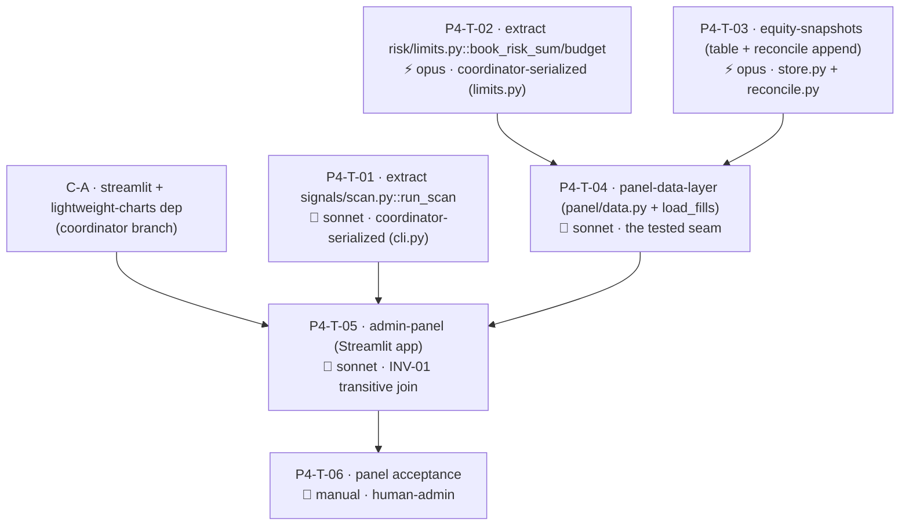

# Fathom — Phase 4 Task Graph (Admin Panel & Hardening, demo)

> **Status: awaiting human approval. Do NOT dispatch to workers until this graph is reviewed and signed off.** (Generated per `runbook-taskgraph-generation`; the session that generated it is not the gate.)

Maps to product-spec Phase 5. Source specs: the 3 `ready` Phase 4 specs (cross-spec audit passed 2026-05-29). See [phase-4.md](phase-4.md), [phase-4-spec-audit-2026-05-29.md](phase-4-spec-audit-2026-05-29.md), [code-map.md](../code-map.md) (Phase 4 dispatch section).

## Confirmed kickoff decisions (already locked)

- **D-P4-1** read-only dashboard + a scan-refresh button (no order/execute action — INV-01). **D-P4-2** add an `equity_snapshots` table; reconcile appends. **D-P4-3** TradingView Lightweight Charts via a Streamlit component.

## Coordinator pre-steps (before any fan-out — `main` coordinator branch / serialized)

Surfaced by the cross-spec audit. Two are behaviour-preserving extractions from shipped files (à la Phase 3's T-02); one is a dep edit.

- **C-A — `streamlit` + Lightweight Charts component** → `pyproject.toml` + `CLAUDE.md`. Blocks P4-T-05 only. *(Pure coordinator dep edit, no worker.)*
- **C-B — extract `signals/scan.py::run_scan`** is task **P4-T-01** (order-free scan; touches shipped `cli.py` → coordinator-serialized).
- **C-C — extract `risk/limits.py::book_risk_sum`/`book_risk_budget`** is task **P4-T-02** (touches shipped `risk/limits.py` → coordinator-serialized).

## Summary

| | |
|---|---|
| Total tasks | 6 (5 auto/code + 1 manual gate) + 1 coordinator dep-edit (C-A) |
| Auto-verified | 5 (T-01…T-05) |
| Manual / human-admin | 1 (P4-T-06 panel acceptance — operator runs the panel against the demo store + sustained track record) |
| Opus tasks | 2 (T-03 equity-snapshots — touches the reconcile/kill-switch path; T-02 book-risk extraction — feeds the kill switch's numbers) |
| Sonnet tasks | 3 (T-01 run_scan extraction, T-04 panel-data-layer, T-05 admin-panel) |
| Prerequisite extractions | T-01 (`run_scan`) + T-02 (`book_risk_sum`) — coordinator-serialized shipped-file edits, before the panel fan-out |
| Critical path | 4 hops: T-03 → T-04 → T-05 → T-06 |
| Serialized (shipped files) | `data/store.py` edits chained T-03 → T-04; `cli.py` (T-01), `risk/limits.py` (T-02), `execution/reconcile.py` (T-03) each single-task |
| Parallel slot | {T-01, T-02, T-03} at t=0 (distinct shipped files: `cli.py` / `risk/limits.py` / `reconcile.py`+`store.py`) |

## Dependency graph

**Waves.** C-A (dep) lands whenever. **t=0:** T-01 (`cli.py`), T-02 (`limits.py`), T-03 (`reconcile.py`+`store.py`) dispatch in parallel — distinct shipped files. When T-02 + T-03 merge → **T-04** (panel-data-layer; its `load_fills` store edit is serialized *after* T-03's `store.py` edit). When T-01 + T-04 + C-A are in → **T-05** (the Streamlit join). **T-06** (manual acceptance) last.

## Tasks

### P4-T-01 — extract signals/scan.py::run_scan
| Field | Value |
|---|---|
| area | `signals` + `cli` · surface backend · **model sonnet** — mechanical extraction, but touches shipped `cli.py` |
| feature_spec | `docs/features/admin-panel.md` (DRIFT-01 resolution) |
| depends_on | — |
| worktree | **coordinator-serialized** — edits shipped `cli.py`; no parallel `cli.py` worker |
| verification | auto — new `signals/scan.py::run_scan(*, db_path, instruments, timeframes, history_years, dry_run) -> list[Candidate]` is **order-free** (imports only ranker/portfolio/store/data — NOT `execution.orders`/`risk`); `cli.cmd_scan` becomes a thin argparse adapter over it; existing `fathom scan` behaviour + tests unchanged; a test asserts `signals.scan`'s transitive imports exclude `execution.orders`/`build_bracket`/`risk` placement |
| human_admin | false · library_defaults | n/a |

**notes:** the panel imports `run_scan`, never `cli`. Behaviour-preserving for `fathom scan`.

### P4-T-02 — extract risk/limits.py::book_risk_sum / book_risk_budget
| Field | Value |
|---|---|
| area | `risk` · surface backend · **model opus** — behaviour-preserving, but the figures feed the kill switch; a drift here desyncs the panel from the INV-05 backstop |
| feature_spec | `docs/features/panel-data-layer.md` (DRIFT-02 resolution) |
| depends_on | — |
| worktree | **coordinator-serialized** — edits shipped `risk/limits.py` |
| verification | auto — `book_risk_sum(open_positions) -> float` (= `sum(position_risk(p) …)`) and `book_risk_budget(equity, cfg) -> float` (= `max_book_risk × equity`) extracted; `check_limits` calls them back; **all Phase 3 limits tests pass unchanged** (behaviour-preserving) |
| human_admin | false · library_defaults | n/a |

### P4-T-03 — equity-snapshots
| Field | Value |
|---|---|
| area | `execution` + `data` · surface backend · **model opus** — additive edit to the reconcile/kill-switch path; must not disturb broker-truth |
| feature_spec | `docs/features/equity-snapshots.md` |
| depends_on | — |
| worktree | `../fathom-p4-T-03-equity` · **owns `data/store.py` equity_snapshots migration** (lands first on store.py) + edits `execution/reconcile.py` |
| verification | auto — `equity_snapshots` table (`as_of` UTC, `equity`, `day_pl`) + `write_equity_snapshot`/`load_equity_snapshots`; reconcile appends one snapshot **after `write_account_state`** with `equity == broker.nav`, `day_pl == nav − start_of_day_equity`; non-fatal guard; **all Phase 3 reconciliation tests pass unchanged**; `load_equity_snapshots` ordered ascending + `since` filter |
| human_admin | false · library_defaults | n/a |

### P4-T-04 — panel-data-layer
| Field | Value |
|---|---|
| area | `panel` · surface backend · **model sonnet** — the tested seam (view models + the one new store loader) |
| feature_spec | `docs/features/panel-data-layer.md` |
| depends_on | P4-T-02, P4-T-03 |
| worktree | `../fathom-p4-T-04-paneldata` · adds `load_fills` to `data/store.py` (**serialized after T-03**) |
| verification | auto (seeded store, no Streamlit/live HTTP) — `equity_series` drawdown = `(peak−equity)/peak` (0 at peak); `blotter` surfaces reconciled `unrealized_pl` passthrough + `risk_in_use`=`book_risk_sum` + `risk_budget`=`book_risk_budget`; `watchlist` = `Candidate[]` (INV-13); `deviation_log` newest-first; `chart_data` overlays (active vs proposed); `load_fills(*, limit)` newest-first reconstructs `Fill`; **read-only — transitive imports exclude `execution.orders`/`build_bracket`/`risk` placement/`cli`** (INV-01) |
| human_admin | false · library_defaults | n/a |

### P4-T-05 — admin-panel (Streamlit app, the join)
| Field | Value |
|---|---|
| area | `panel` · surface frontend · **model sonnet** — thin Streamlit view over the tested data layer |
| feature_spec | `docs/features/admin-panel.md` |
| depends_on | P4-T-01, P4-T-04, C-A |
| worktree | `../fathom-p4-T-05-panel` · owns `panel/app.py` |
| verification | auto + thin — `streamlit run panel/app.py` launches against a seeded store; 5 views render (charts via Lightweight Charts + overlays + attribution, equity+drawdown, blotter, watchlist, deviation log); refresh button calls `signals.scan.run_scan` (NOT `cli`); **INV-01 transitive-import boundary test** asserts `panel.app`/`panel.data`'s module graph never reaches `execution.orders`/`build_bracket`/`risk` placement/`cli`; no execute/approve control; UTC display (INV-03); no secret rendered (INV-08) |
| human_admin | false |
| library_defaults | **`streamlit`** — `st.cache_data`/`st.cache_resource` TTL must be set explicitly for the store reads (default caches forever → stale views; set a short TTL or clear on refresh); wide layout opt-in; **Lightweight Charts component** — set the attribution/logo option ON (Apache-2.0 requirement); the component ships no indicators (we draw overlays); pin the component version. Reviewer verifies each. |

### P4-T-06 — panel acceptance (manual)
| Field | Value |
|---|---|
| area | `panel` · **model n/a** — human/operator-run · **human_admin true** |
| feature_spec | `docs/phases/phase-4.md` (Done When) |
| depends_on | P4-T-05 |
| verification | manual |

**Checklist:** `streamlit run panel/app.py --db-path data/fathom.db` against the seeded demo store → confirm all 5 views render real data (charts with entry/stop/target overlays + attribution; equity curve + drawdown; blotter with positions/P&L/risk-in-use vs limit; watchlist mirroring Discord; deviation log); the refresh button re-ranks with no order placed; no secret shown; UTC timestamps. Confirm over the **sustained demo track record** (product-spec Phase 5 exit). Record in `docs/phases/phase-4-results.md`. **Stack-assembly gate** (runnable-stack phase).

## Sanity checks

| Check | Result |
|---|---|
| DAG acyclic | ✓ extractions/snapshots → data layer → app → accept |
| Critical path | ✓ 4 hops (T-03 → T-04 → T-05 → T-06) |
| Parallel slots | ✓ {T-01, T-02, T-03} at t=0 (distinct shipped files: cli.py / limits.py / reconcile.py+store.py) |
| Dependency hubs | ✓ T-04 (panel-data-layer — the tested seam T-05 builds on) |
| Invariant compliance | ✓ INV-01 (transitive read-only boundary on panel + run_scan order-free; promoted enforcement clause), INV-03 (UTC display), INV-07 (demo store), INV-08 (no secret rendered), INV-13 (Candidate view), INV-14/16 (Position/Fill + reconciled equity reads) |
| Code-map / shipped-file edits | ✓ `cli.py` (T-01 only), `risk/limits.py` (T-02 only), `execution/reconcile.py` (T-03 only); `data/store.py` chained T-03→T-04 (serialized, never parallel); `panel/` new isolated area |
| Coordinator-branch edits | ✓ C-A streamlit+charts dep before T-05; T-01/T-02 extractions are coordinator-serialized shipped-file edits |
| Manual/stack-assembly gate | ✓ T-06 (operator runs the panel) |
| Reviewable in one sitting | ✓ 6 tasks, clear chain |
| Model split w/ rationale | ✓ 2 opus (kill-switch-feeding numbers: T-02 book-risk, T-03 equity/reconcile), 3 sonnet (extraction/data-layer/Streamlit), 1 manual |
| Deep-chain risk | ⚠️ T-04 is the seam — if its view-model shapes change, T-05 rebases. Low risk (T-05 is thin); keep T-04's view models tested + stable before T-05. |
| New-dep audit | ✓ only T-05 adds `streamlit` + Lightweight Charts (library_defaults specified); T-01/02/03/04 add no deps |

## Open decisions to resolve before dispatch

All have defaults baked into the specs (overridable at review). **None blocks code dispatch** — T-06 is the only true blocked-on-human, at acceptance time.

| ID | Decision | Recommendation | Tasks | Cost of late-deciding |
|---|---|---|---|---|
| D-P4-A | Lightweight Charts Streamlit component package + version | `streamlit-lightweight-charts` (confirm maintenance; else a minimal custom component) | T-05 | low — swap the component |
| D-P4-B | `equity_snapshots` retention | keep-all for demo (~288 rows/day); add pruning later | T-03 | low |
| D-P4-C | Refresh UX | synchronous scan with a spinner | T-05 | low |
| D-P4-D | App auth | none for demo (private server / bind localhost) | T-05, T-06 | low — front with server access control |
| D-P4-E | Drawdown units | fraction `(peak−equity)/peak`, 0 at peak | T-04 | low (already pinned) |

## Post-approval handoff

On sign-off → `runbook-orchestration-kickoff`:
1. Coordinator applies **C-A** (streamlit + Lightweight Charts dep) and dispatches the two extractions **T-01** (`signals/scan.py`) + **T-02** (`book_risk_sum`) — coordinator-serialized shipped-file edits — at t=0 alongside **T-03** (equity-snapshots; distinct files).
2. Open 6 issues (`area:{signals,risk,execution,panel,cli}` / `phase:p4` / `role:{opus,sonnet}`; T-06 `blocked-on-human`, no role).
3. When T-02 + T-03 merge → **T-04** (panel-data-layer; `load_fills` serialized after T-03's store edit). When T-01 + T-04 + C-A → **T-05** (the app). Then **T-06** (manual).
4. Each PR → fresh read-only `reviewer` → `gh pr merge --squash --delete-branch`. Watch the transitive INV-01 boundary (panel must not reach the order path) and the two behaviour-preserving extractions (re-run the Phase 3 limits + reconciliation suites).
5. **T-06 is operator-run** (panel + sustained demo). Go-live (impl-Phase 5) does not begin until `docs/phases/phase-4-results.md` exists.
