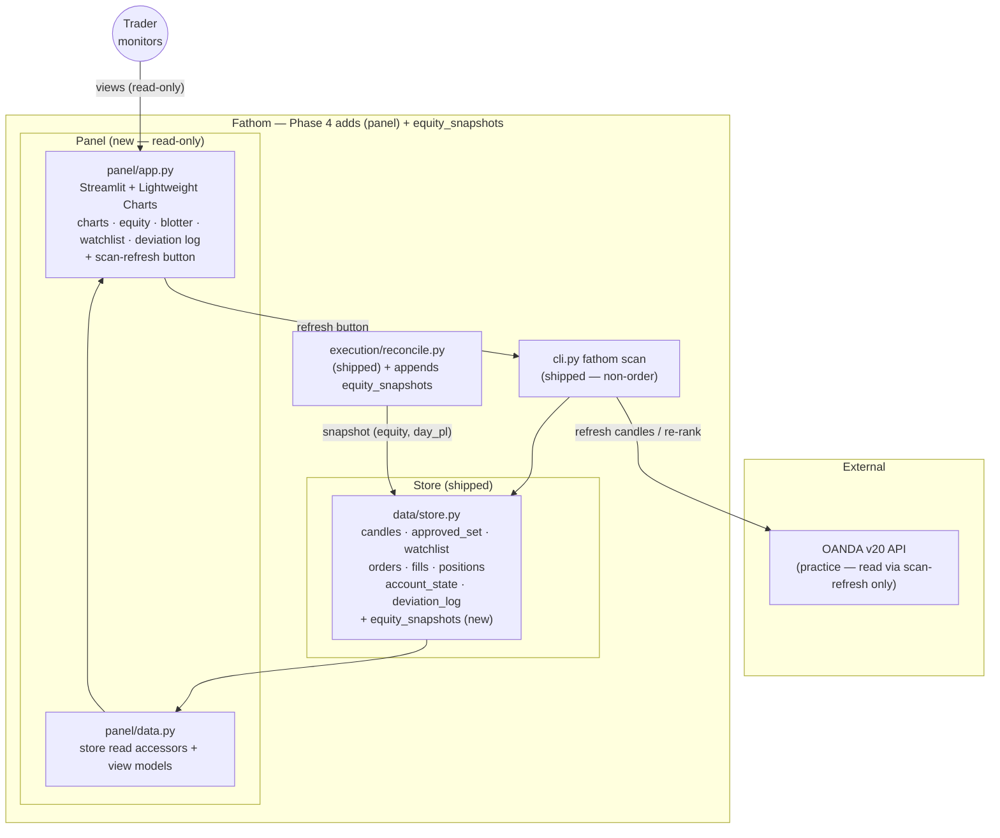

# Fathom — Phase 4: Admin Panel & Hardening (demo)

**Status:** Carved — planning. No code yet.
**Depends on:** [Phase 3](phase-3.md) — the execution/monitoring store tables (orders, fills, positions, account_state, deviation_log) and the watchlist/approved_set are populated.
**Unlocks:** Phase 5 (Go-Live decision — product-spec Phase 6).
**Spec layer:** [product-spec.md](../product-spec.md) ("Phase 5 — Admin Panel & Hardening") · [architecture-overview.md](../architecture-overview.md) (`panel/app.py`) · [forex-algo-trading-plan.md](../forex-algo-trading-plan.md) §2.10 · [invariants.md](../invariants.md)
**Maps to:** product-spec **Phase 5**. (impl-Phase 4 = the admin panel; go-live becomes impl-Phase 5.)

---

## Purpose

A single self-hosted screen for everything the system is doing — a **read-only**
Streamlit dashboard over the existing SQLite store: per-pair candle charts with the
proposed/active entry/stop/target overlays (TradingView Lightweight Charts™), an
equity curve + drawdown, a live blotter (open positions, P&L, risk-in-use vs
limits), the ranked watchlist (mirroring what Hermes delivered to Discord), and the
deviation log. Plus a single convenience action — a **refresh button** that runs
`fathom scan` to re-rank the watchlist.

The panel **monitors**; it does not trade. The only mutating action it exposes is
the scan-refresh (a non-order operation). Order authority stays the operator CLI
(`fathom execute`) — a UI that places trades is exactly what [INV-01](../invariants.md#inv-01--hermes-must-not-place-orders)
guards against.

**Demo only** ([INV-07](../invariants.md#inv-07--demo-first--no-live-trading-without-a-track-record)).

---

## Confirmed scope decisions (this kickoff)

| # | Decision | Choice |
|---|---|---|
| D-P4-1 | Panel scope | **Read-only dashboard + a scan-refresh button.** All views read the store/broker; the only action is triggering `fathom scan` (no order/execute action — INV-01). |
| D-P4-2 | Equity-curve data source | **Add an `equity_snapshots` table**; `reconcile` (already periodic) appends a timestamped `(equity, day_pl)` snapshot. The panel plots that time series. (`account_state` is a singleton row — no history today.) |
| D-P4-3 | Charting | **TradingView Lightweight Charts** via a Streamlit component, per the product spec — candles + our entry/stop/target/signal overlays + the required attribution. |

---

## Done When

- [ ] `panel/app.py` is a Streamlit app launchable on the private server (e.g. `streamlit run panel/app.py`), reading the same SQLite store — no separate datastore.
- [ ] **Per-pair charts:** candles rendered with Lightweight Charts, overlaid with the active/proposed entry, stop, and target and the signal marker; Apache-2.0 attribution shown.
- [ ] **Equity curve + drawdown:** plotted from the new `equity_snapshots` series.
- [ ] **Live blotter:** open positions, current unrealized P&L, today's realized P&L (`account_state.day_pl`), and risk-in-use vs the Phase 3 limits.
- [ ] **Watchlist view:** the latest ranked `Candidate[]` (mirrors the Discord watchlist, INV-13 shape).
- [ ] **Deviation log:** the `deviation_log` entries (the monitor's alerts + the triggering trades).
- [ ] **Refresh button** runs `fathom scan` and re-reads — no order/execute path reachable from the UI (INV-01).
- [ ] The panel is **read-only over execution**: it never imports `execution/orders.py`, `risk/`, or calls `fathom execute`; a test asserts no order/execution capability on the panel surface.
- [ ] All timestamps shown UTC (INV-03); no secret rendered or logged (INV-08); reads the demo store only (INV-07).
- [ ] The store-query/view-model layer is unit-tested against a seeded store (the Streamlit view code is thin over it).

---

## Strict-Subset Architecture Diagram

Adds to Phase 3: the `panel/` area + a small `equity_snapshots` capture in the
already-shipped reconcile path. Everything the panel shows already exists in the
store; the panel is a new read-only consumer.

**Not in this diagram / out of scope:** any order/execute action from the UI
(stays CLI, INV-01); auth/multi-user (single private-server operator); the go-live
endpoint (INV-07, impl-Phase 5).

---

## Components Added vs Phase 3

| File | What's new |
|---|---|
| `panel/app.py` | The Streamlit app: navigation/tabs, the 5 views, Lightweight Charts integration + attribution, the scan-refresh button, `--db-path`/config. The view layer — thin over `panel/data.py`. |
| `panel/data.py` | Read-only store accessors + view models the panel renders (blotter rows, equity series, watchlist rows, deviation-log rows, chart data). Pure-ish, unit-tested against a seeded store. |
| `data/store.py` (extend) | `equity_snapshots` table (`as_of`, `equity`, `day_pl`) + writer/loader; plus any missing read accessors the blotter needs (recent fills/orders). |
| `execution/reconcile.py` (extend) | Append an `equity_snapshots` row each reconcile (it already computes NAV + `day_pl`). Small, coordinator-serialized (shipped file). |
| `pyproject.toml` + `CLAUDE.md` | Add `streamlit` + the Lightweight Charts Streamlit component (coordinator-branch edit). |

---

## The Read-Only Boundary (critical — INV-01)

- **The panel never gains order authority.** `panel/` must not import `execution/orders.py` or `risk/`, must not call `fathom execute`, and exposes no execute/approve action. A reviewer + a test assert this.
- **The one action is scan-refresh** — `fathom scan` is a non-order operation (refresh candles → rank → persist watchlist). It places no trades and touches no order endpoint.
- **Execution stays the operator CLI.** Approving and placing a trade remains `fathom execute` at the terminal — deliberately not a UI button.
- **Read-only over the broker.** The panel reads the store; the only OANDA contact is via the scan-refresh's existing read path.

---

## Open Questions (resolve during spec drafting — not blocking the carve)

- **Lightweight Charts Streamlit component choice** — `streamlit-lightweight-charts` (community) is the likely path; confirm maintenance/version, or fall back to a minimal custom component. Pin in the panel-charts spec.
- **`equity_snapshots` cadence/retention** — one row per reconcile (startup + 5 min) could grow; propose keep-all for demo, revisit retention later.
- **Risk-in-use computation for the blotter** — reuse `risk/limits.py`'s book-risk sum (read-only call) vs recompute in `panel/data.py`. Propose a read-only reuse of the limits sum (no order construction).
- **Auth** — single-operator private server; propose no app-level auth for demo (bind localhost / server-level access control), documented.
- **Refresh-button UX** — synchronous scan (blocks with a spinner) vs background; propose synchronous with a spinner for demo simplicity.

---

## Invariants Active in Phase 4

- **INV-01** — the panel monitors only; no order/execute action; not an order-authority surface. **(This phase's main boundary test.)**
- **INV-03** — all displayed timestamps UTC RFC 3339.
- **INV-07** — demo store only; no live endpoint.
- **INV-08** — no secret rendered or logged in the UI.
- **INV-13** — the watchlist view renders the frozen `Candidate` shape unchanged.
- **INV-14/16** — the blotter/equity views read the frozen `Order`/`Fill`/`Position` + reconciled `account_state`/`equity_snapshots` as the broker-truth record.

---

## Non-goals

- No order/approve/execute action from the UI (INV-01) — execution stays the CLI.
- No auth/multi-user/RBAC (single private-server operator).
- No FastAPI/React rewrite (the product spec's "graduate later" path) — Streamlit first.
- No live endpoint (INV-07). Sustained demo track record is the operator acceptance, not code.

---

## TODO — Detailed Spec (drafted after this kickoff is approved)

- [ ] Feature spec: `equity-snapshots` (table + reconcile capture — backend enabler)
- [ ] Feature spec: `panel-data-layer` (`panel/data.py` read accessors + view models; store loaders)
- [ ] Feature spec: `admin-panel` (the Streamlit app: shell + 5 views + Lightweight Charts + scan-refresh; INV-01 read-only boundary)
- [ ] Task graph for Phase 4
