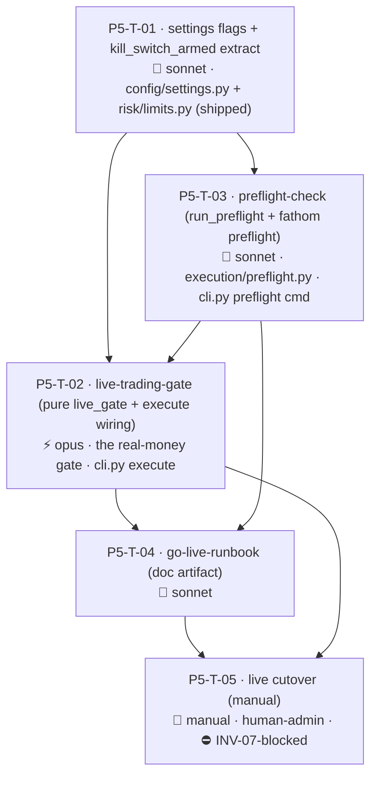

# Fathom — Phase 5 Task Graph (Go-Live Decision — guardrails only)

> **Status: awaiting human approval. Do NOT dispatch to workers until this graph is reviewed and signed off.** (Generated per `runbook-taskgraph-generation`; the session that generated it is not the gate.)

Maps to product-spec Phase 6. Source specs: the 3 `ready` Phase 5 specs (cross-spec audit passed 2026-05-30). See [phase-5.md](phase-5.md), [phase-5-spec-audit-2026-05-30.md](phase-5-spec-audit-2026-05-30.md).

## ⚠️ INV-07 — nothing in this graph goes live

Every task builds **go-live safety guardrails** and is fully demo-/offline-testable.
**No task connects to the live endpoint, requires the live token, or flips
`ENV=live`.** The actual cutover is the manual operator gate (P5-T-05), which stays
**blocked on the demo track record** (INV-07, not yet met) and is operator-only.

## Confirmed kickoff decisions (locked)

- **D-P5-1** build guardrails now, defer the cutover (operator-only). **D-P5-2** defense-in-depth gate (ENV=live + `live_trading_enabled` + preflight pass + typed confirm). **D-P5-3** reduced initial live size (`live_risk_fraction` 0.10%) ramping to the 0.25% cap.

## Summary

| | |
|---|---|
| Total tasks | 5 (4 auto/code + 1 manual gate) |
| Auto-verified | 4 (T-01…T-04) |
| Manual / human-admin | 1 (P5-T-05 live cutover — operator-only, **INV-07-blocked**) |
| Opus tasks | 1 (T-02 live-trading-gate — the real-money gate; a bug = an accidental live trade) |
| Sonnet tasks | 3 (T-01 settings+kill_switch_armed extract, T-03 preflight, T-04 go-live-runbook) |
| Critical path | 4 hops: T-01 → T-02 → T-03 → T-04 |
| Serialized (shipped files) | `config/settings.py` (T-01), `risk/limits.py` (T-01 extract), `cli.py` chained T-03 (`preflight`) → T-02 (`execute` gate) |
| Parallel slot | minimal — the chain is mostly serial (settings + extract land first; `cli.py` is single-writer across two tasks) |

> **Note on task vs spec mapping.** The audit's resolutions split the work slightly across spec boundaries: T-01 lands the settings fields (owned by `live-trading-gate`) **and** the `kill_switch_armed` extraction (needed by `preflight-check`) first, because both downstream tasks depend on them. T-02 then builds the pure gate + wires the `execute` gate; T-03 builds preflight + the `fathom preflight` command. The `cli.py` edits are serialized **preflight-command (T-03) → execute-gate (T-02)** per the spec; the graph encodes T-02 before T-03 for the *gate logic*, but the **`cli.py` execute-gate edit in T-02 is sequenced after T-03's `preflight` command edit** (see Tasks/notes). To keep `cli.py` single-writer-clean, T-02 and T-03's `cli.py` edits do not overlap (distinct subcommands) and are applied in the stated order.

## Dependency graph

**Waves.** **T-01 first** (settings flags + `kill_switch_armed` extraction — both downstream tasks need them; lands the `config/settings.py` + `risk/limits.py` shipped-file edits). Then **T-03** (preflight: pure `run_preflight` + `fathom preflight` command — the first `cli.py` edit) — it also provides `run_preflight`/`PreflightReport` that the gate calls. Then **T-02** (the pure `live_gate` + the `execute`-gate `cli.py` edit, after T-03's `preflight` command edit — `cli.py` serialized). Then **T-04** (the runbook doc, referencing the shipped controls). **T-05** (manual cutover) last — INV-07-blocked.

> Sequencing nuance: T-02's *pure `live_gate` module* depends only on T-01 + the `PreflightReport` shape; its *`cli.py execute` wiring* depends on T-03's `cli.py` `preflight` edit landing first (single-writer order). Dispatch T-03 before T-02's cli wiring.

## Tasks

### P5-T-01 — settings flags + kill_switch_armed extraction
| Field | Value |
|---|---|
| area | `config` + `risk` · surface backend · **model sonnet** — small additive edits, but touch shipped files |
| feature_spec | `docs/features/live-trading-gate.md` (settings) + `docs/features/preflight-check.md` (B-3 extract) |
| depends_on | — |
| worktree | **coordinator-serialized** — edits shipped `config/settings.py` + `risk/limits.py` |
| verification | auto — `live_trading_enabled: bool = False`; `live_risk_fraction: float = Field(default=0.001, gt=0.0, le=0.0025)` (a `Settings` with `live_risk_fraction <=0` or `>0.0025` raises `ValidationError` — both bounds tested, INV-05); `kill_switch_armed(account_state, now, config) -> (bool, reason)` extracted into `risk/limits.py` (present + fresh `as_of` within 10 min + `KillSwitchStatus.active is False`); **all existing settings + Phase 3 limits tests pass unchanged** |
| human_admin | false · library_defaults | n/a |

**notes:** lands first so T-02/T-03 read real fields (no `getattr` hedge, N-1).

### P5-T-02 — live-trading-gate
| Field | Value |
|---|---|
| area | `execution` + `cli` · surface backend · **model opus** — the real-money safety gate; a bug here = an accidental live trade. Default-refuse, exhaustive truth table |
| feature_spec | `docs/features/live-trading-gate.md` |
| depends_on | P5-T-01, P5-T-03 (`run_preflight`/`PreflightReport` + `cli.py` `preflight` edit first) |
| worktree | `../fathom-p5-T-02-livegate` · **`cli.py` execute-gate edit serialized AFTER T-03's `preflight` edit** |
| verification | auto — pure `execution/live_gate.py`: `assert_live_allowed` raises unless ALL four (`env=="live"`, `live_trading_enabled is True`, `preflight.go is True`, `confirmed is True`); **`None`/non-`PreflightReport`/non-`True` `.go` → refuse** (B-1); `effective_risk_fraction` = `live_risk_fraction` live / `DEFAULT_RISK_FRACTION` demo. `cmd_execute` (`cli.py:~1528`) passes `risk_fraction=effective_risk_fraction(settings)`; demo `size_position` receives exactly `0.0025` (B-2); live typed-account-id confirm is **separate + not `--yes`-bypassable** (N-3); `run_preflight` exception in the live path → refuse; demo path byte-identical (Phase 3); **no live endpoint/token in any test** (INV-07/08) |
| human_admin | false · library_defaults | n/a |

**notes:** the prerequisite-hub for safety — pure module + exhaustive truth table (incl. the B-1 bad-preflight rows) before the cli wiring.

### P5-T-03 — preflight-check
| Field | Value |
|---|---|
| area | `execution` + `cli` · surface backend · **model sonnet** — read-only readiness report |
| feature_spec | `docs/features/preflight-check.md` |
| depends_on | P5-T-01 (`kill_switch_armed` + the settings fields) |
| worktree | `../fathom-p5-T-03-preflight` · **owns the `cli.py` `preflight` subcommand (first cli edit)** |
| verification | auto (seeded store + stub client, no live HTTP) — `run_preflight` `go=True` only when all mechanical checks pass AND `attested=True`; `attested=False` → NO-GO (INV-07); kill-switch NO-GO on missing/stale/tripped (via `kill_switch_armed`); env/flag/token consistency; `fathom preflight` exits 0/non-zero; **places no order, writes no state** (read-only test); no token printed (INV-08); UTC (INV-03) |
| human_admin | false · library_defaults | n/a |

### P5-T-04 — go-live-runbook (doc)
| Field | Value |
|---|---|
| area | `docs` · **model sonnet** — documentation/config artifact |
| feature_spec | `docs/features/go-live-runbook.md` |
| depends_on | P5-T-02, P5-T-03 (references the real shipped controls) |
| worktree | `../fathom-p5-T-04-runbook` |
| verification | auto (artifact lint) — `docs/go-live-runbook.md` exists; states the INV-07 prerequisite as a hard gate (lists T-08/T-11/T-06); references ONLY shipped controls (`ENV`, `live_trading_enabled`, `fathom preflight`, `fathom execute`, `LIVE_RISK_FRACTION`, `run_monitor.py`, `fathom reconcile` — no invented commands); has rollback (flag-off instant + kill-switch backstop), small-size-start + manual-ramp, monitoring-during-cutover, and a dated go/no-go decision-record section |
| human_admin | false · library_defaults | n/a |

### P5-T-05 — live cutover (manual) ⛔ INV-07-blocked
| Field | Value |
|---|---|
| area | operator · **model n/a** — human-only · **human_admin true** · **blocked_on: INV-07 demo track record** |
| feature_spec | `docs/phases/phase-5.md` + `docs/go-live-runbook.md` |
| depends_on | P5-T-02, P5-T-04 **AND** the recorded positive demo track record (Phase 2 T-08, Phase 3 T-11, Phase 4 T-06 closed) |
| verification | manual |

**Checklist (operator-only, only once INV-07 is satisfied):** follow `go-live-runbook.md` — set the live token + `ENV=live`; `fathom preflight --attest-track-record` → GO; enable `live_trading_enabled`; `fathom execute` one small candidate (typed account-id confirm) at `live_risk_fraction`; confirm bracketed fill + monitor + reconcile; record the dated go/no-go decision. **No automated step performs this; the lead/agent never flips it.**

## Sanity checks

| Check | Result |
|---|---|
| DAG acyclic | ✓ T-01 → {T-03 → T-02} → T-04 → T-05 |
| Critical path | ✓ 4 hops (T-01 → T-03 → T-02 → T-04 → T-05 manual) |
| Parallel slots | minimal (mostly serial; settings + extract first, `cli.py` single-writer chained) |
| Dependency hubs | T-01 (settings + `kill_switch_armed` — both downstream need it); T-02 (the gate) |
| Invariant compliance | ✓ INV-07 (nothing live; cutover manual + blocked), INV-09 (amended clause: gate is the sanctioned env-reader; mechanics env-free — enforcement test in T-02), INV-05 (`live_risk_fraction` ≤ cap, validated), INV-04 (preflight bracket check), INV-08 (no token printed/logged) |
| Code-map / shipped-file edits | ✓ `config/settings.py` + `risk/limits.py` (T-01 only); `cli.py` chained T-03 `preflight` → T-02 `execute` gate (serialized, distinct subcommands); `execution/live_gate.py` + `execution/preflight.py` new |
| Coordinator-branch edits | ✓ T-01 (shipped settings/limits) coordinator-serialized; no new dep (anthropic/streamlit already in) |
| Manual/INV-07 gate | ✓ T-05 (live cutover, human-admin, blocked on the demo track record) |
| Reviewable in one sitting | ✓ 5 tasks |
| Model split w/ rationale | ✓ 1 opus (T-02 real-money gate), 3 sonnet (settings/extract, preflight, doc), 1 manual |
| Deep-chain risk | ⚠️ T-02 is the safety hub — its pure truth table (incl. B-1 bad-preflight rows) must pass before the cli wiring. Low overall risk: everything is demo/offline-tested; nothing live. |
| New-dep audit | ✓ no new dependency |

## Open decisions to resolve before dispatch

All defaulted in the specs (overridable at review). **None blocks code dispatch**; T-05 is the only blocked-on-human, and it is additionally **INV-07-blocked**.

| ID | Decision | Recommendation | Tasks |
|---|---|---|---|
| D-P5-A | "brackets/INV-04" preflight check form | static contract assertion (no dry-run order) | T-03 |
| D-P5-B | `account_state` staleness window | 10 min | T-01/T-03 |
| D-P5-C | confirm token | `oanda_account_id` (typed) | T-02 |
| D-P5-D | notional ceiling in addition to the fraction? | fraction-only for Phase 5 | T-02 |
| D-P5-E | runbook location | `docs/go-live-runbook.md` | T-04 |

## Post-approval handoff

On sign-off → `runbook-orchestration-kickoff`:
1. No coordinator dep edit (deps already present). Open 5 issues (`area:{config,risk,execution,cli,docs}` / `phase:p5` / `role:{opus,sonnet}`; T-05 `blocked-on-human`, no role, plus an **INV-07-blocked** note).
2. Dispatch **T-01** (settings + `kill_switch_armed`, coordinator-serialized) → **T-03** (preflight + the `cli.py` `preflight` command) → **T-02** (pure `live_gate` + the `cli.py` `execute` gate, after T-03's cli edit) → **T-04** (runbook). Each PR → fresh read-only `reviewer` → `gh pr merge --squash --delete-branch`.
3. **Reviewer focus for T-02 (real money):** the four-gate truth table incl. the B-1 bad-preflight rows; demo path byte-identical; `effective_risk_fraction` threaded (demo = 0.0025); live confirm not `--yes`-bypassable; no live endpoint/token in tests; INV-09 no-env-branch-in-mechanics enforcement test present.
4. **T-05 is operator-only and INV-07-blocked** — never dispatched/flipped by the lead/agent; it waits on the recorded demo track record.
