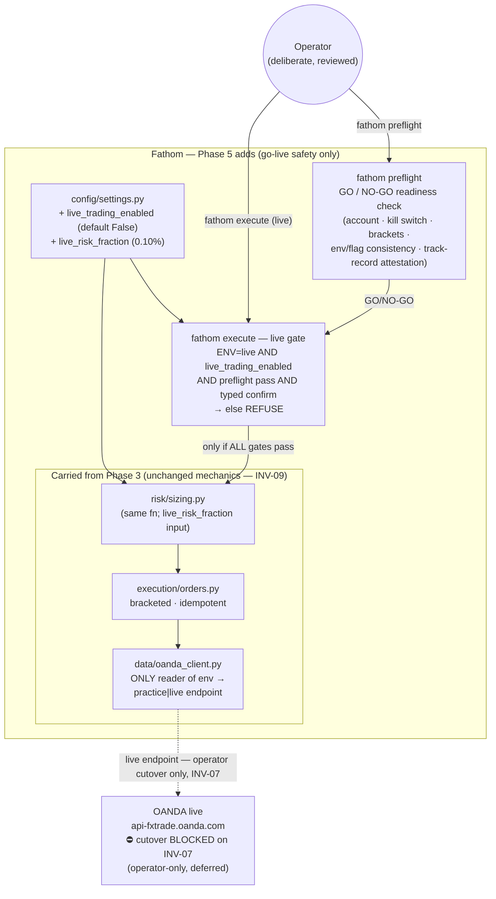

# Fathom — Phase 5: Go-Live Decision (real money)

**Status:** Carved — planning. No code yet. **Live cutover is INV-07-blocked (see below).**
**Depends on:** [Phase 4](phase-4.md) code-complete **AND** a recorded, sustained positive demo track record (the Phase 2/3/4 operator acceptances — T-08, T-11, T-06 — closed with a positive result). **This prerequisite is NOT yet met.**
**Unlocks:** ongoing live operation (out of the build-phase scope).
**Spec layer:** [product-spec.md](../product-spec.md) ("Phase 6 — Go-Live Decision") · [invariants.md](../invariants.md) (INV-07, INV-09, INV-05) · [architecture-overview.md](../architecture-overview.md) (Demo/Live switch).
**Maps to:** product-spec **Phase 6**. (impl-Phase 5 = go-live.)

---

## ⚠️ INV-07 gate — read first

[INV-07](../invariants.md#inv-07--demo-first--no-live-trading-without-a-track-record):
the system must not connect to the live OANDA account until a **sustained positive,
stable edge is demonstrated on demo AND the execution/monitoring plumbing has proven
reliable on fake money.** That track record **does not exist yet** — the Phase 2
(T-08 Discord), Phase 3 (T-11 live demo loop) and Phase 4 (T-06 panel) operator
acceptances are all still open.

**Therefore this phase builds the go-live *safety guardrails* only; it does NOT flip
anything to live.** The actual cutover is an **operator-only, manual, reviewed
decision** that remains blocked until the demo track record is recorded. No code in
this phase references or requires the live token; no automated step connects to
`api-fxtrade.oanda.com`.

Today the system is one env var (`ENV=live`) from real-money orders with no extra
guardrail. The point of this phase is to make that impossible-by-accident: replace
"one slip = live" with a deliberate, multi-gate, small-size, reviewed cutover.

---

## Purpose

Turn "the system *could* trade live" into "going live is a deliberate, gated,
small-size, reviewed step that cannot happen by accident." Concretely: add a
defense-in-depth live gate, a preflight readiness check, a reduced initial live
position size, and the go/no-go decision runbook — so that *when* the demo track
record justifies it, the operator can flip to live in one reviewed, well-guarded
action. Demo and live continue to share one execution/risk/monitoring code path
(INV-09); the gate is an operator-boundary safety layer, not a logic fork in the
trade mechanics.

---

## Confirmed scope decisions (this kickoff)

| # | Decision | Choice |
|---|---|---|
| D-P5-1 | INV-07 scope | **Build the go-live guardrails now; the live cutover is deferred + operator-only.** No live-token wiring, no live connection from any automated step. The cutover stays blocked on the recorded demo track record. |
| D-P5-2 | Live gate | **Defense-in-depth.** A live order requires ALL of: `ENV=live` **AND** `live_trading_enabled=True` (default False) **AND** a passing `fathom preflight` **AND** an interactive typed confirmation. Any one missing ⇒ refuse. |
| D-P5-3 | Initial live size | **Reduced cap, then ramp.** Live starts at a smaller per-trade risk than demo's 0.25% (default `live_risk_fraction = 0.001` = 0.10%) and/or an absolute small-notional cap; ramps toward 0.25% only after a live track record. "Small size, deliberate" (product-spec Phase 6). |

---

## Done When

- [ ] `config/settings.py` gains `live_trading_enabled: bool = False` and `live_risk_fraction: float = 0.001` (0.10%), documented; `ENV=live` alone is **insufficient** to place a live order.
- [ ] `fathom execute` in **live** context refuses unless ALL gates pass: `ENV=live` + `live_trading_enabled=True` + a passing preflight + a typed confirmation (e.g. type the account id or `LIVE`); the refusal names exactly which gate failed. On **demo** the path is unchanged (no new friction).
- [ ] Live sizing uses `live_risk_fraction` (≤ the 0.25% INV-05 cap), selected at the operator boundary — the **sizing function itself is unchanged** (INV-09: same mechanics, different config input).
- [ ] `fathom preflight` runs a go/no-go readiness check: account reachable, kill switch armed + not tripped, brackets/INV-04 enforced, env/flag/token consistency, and an **explicit operator track-record attestation** (preflight verifies mechanical readiness; it does not auto-judge edge quality — the human asserts the demo track record). Prints a clear GO / NO-GO with per-check status; exits non-zero on NO-GO.
- [ ] A **go-live runbook** (`docs/` or `hermes_integration/`-style doc) documents the deliberate reviewed cutover: prerequisites (INV-07 track record), the gate sequence, small-size start, rollback, and the monitoring-during-cutover plan.
- [ ] INV-09 preserved: only `oanda_client.py` selects the practice/live endpoint; the execution/risk/monitoring **mechanics** are identical demo vs live. The go-live gate is a sanctioned env-aware operator-boundary layer (see Open Questions / invariant note).
- [ ] No automated step connects to the live endpoint; no test requires the live token; the live cutover is documented as operator-only and INV-07-gated.

---

## Strict-Subset Architecture Diagram

Adds to Phase 4: a live-gate + preflight at the operator boundary, and the
reduced-live-size config — no new trade-mechanics. The execution/risk/monitoring
stack is unchanged (INV-09).

**Not in scope:** flipping `ENV=live` / wiring the live token (operator-only, deferred); any auto-judgement of "edge quality"; new strategies or execution mechanics.

---

## Components Added vs Phase 4

| File | What's new |
|---|---|
| `config/settings.py` (extend) | `live_trading_enabled: bool = False`; `live_risk_fraction: float = 0.001`; documented. |
| `cli.py` (extend) | the **live gate** in `fathom execute` (ENV=live + flag + preflight + typed confirm; selects `live_risk_fraction`); a new `fathom preflight` command. Single-writer on `cli.py`. |
| `execution/` or `risk/` (small) | a pure `live_gate` helper (is-live-allowed? + which risk_fraction) so the gate logic is unit-testable without the CLI; reused by execute. No change to `sizing`/`orders` mechanics. |
| go-live runbook (doc) | the deliberate reviewed cutover procedure + checklist (config/doc artifact, not code — like the Hermes job def). |

---

## The Live Boundary (critical — INV-07 + INV-09)

- **Nothing goes live in this phase.** The cutover (`ENV=live` + enabling the flag +
  the live token) is an operator action, deferred until the demo track record exists.
  No code requires the live token; no test connects live.
- **Defense-in-depth (D-P5-2):** four independent gates, all required. A single
  misconfiguration cannot place a real-money order.
- **Small size first (D-P5-3):** live starts well under the 0.25% cap; ramp only on a
  live track record.
- **INV-09 mechanics unchanged:** sizing/orders/reconcile/monitor are byte-identical
  demo vs live; only `oanda_client` selects the endpoint. The live gate + reduced
  fraction are an operator-boundary safety layer + a config input, not a logic fork
  in the mechanics.

---

## Open Questions (resolve during spec drafting — not blocking the carve)

- **INV-09 vs the env-aware gate.** INV-09 says "no `if env=='live'` branches in logic
  code; only `oanda_client` reads env." The go-live gate is intentionally env-aware.
  Propose an **invariant clarification** (audit/promotion candidate): INV-09's
  single-path rule governs the execution/risk/monitoring **mechanics**; the go-live
  **safety gate** (CLI preflight + live-enable + reduced-size *selection*) is a
  sanctioned operator-boundary layer that reads `settings.env`/flags but does not
  alter the mechanics. Decide at cross-spec audit.
- **Track-record attestation.** Preflight can't auto-judge "sustained positive edge."
  Propose: preflight checks mechanical readiness + requires an explicit operator
  attestation marker (a signed-off record referencing the closed demo acceptances);
  it never green-lights live on its own.
- **Reduced-size form.** `live_risk_fraction` (0.10%) vs an absolute small-notional
  cap vs both. Propose `live_risk_fraction` (reuses the sizing input) + optionally a
  notional ceiling; confirm.
- **Confirm token.** Type the account id, or a fixed `LIVE` string? Propose the
  account id (forces the operator to look at *which* account).

---

## Invariants Active in Phase 5

- **INV-07** — demo-first; **the live cutover is blocked on the demo track record (not yet met)**. This phase's defining gate.
- **INV-09** — one code path for the mechanics; only `oanda_client` selects the endpoint; the go-live gate is a sanctioned env-aware boundary layer (see Open Questions).
- **INV-05** — `live_risk_fraction` ≤ the 0.25% per-trade cap (smaller, never larger).
- **INV-04/14/15/16** — live trades use the same bracketed, idempotent, reconciled mechanics as demo.
- **INV-08** — the live token lives in `.env`, never committed/logged.

---

## Non-goals

- No live connection / live-token wiring (operator-only, deferred — INV-07).
- No auto-judgement of edge quality (human attestation).
- No new strategies, execution mechanics, or risk algorithms (Phase 5 is safety + gate only).
- No size ramp automation beyond the initial reduced cap (ramping is an operator decision on a live track record).

---

## TODO — Detailed Spec (drafted after this kickoff is approved)

- [ ] Feature spec: `live-trading-gate` (config flags + the defense-in-depth gate + reduced-size selection)
- [ ] Feature spec: `preflight-check` (`fathom preflight` GO/NO-GO readiness)
- [ ] Feature spec / doc: `go-live-runbook` (the deliberate reviewed cutover procedure)
- [ ] Task graph for Phase 5
