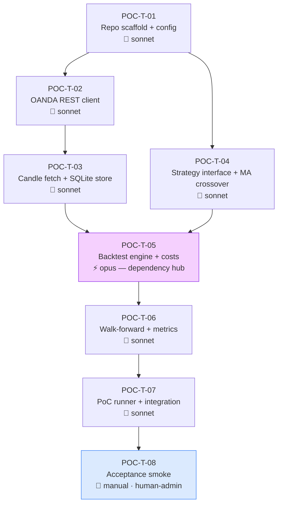

# Fathom PoC — Task Graph

> ✅ **PoC COMPLETE (2026-05-29)** — all 8 tasks done incl. T-08 live acceptance. Result: empty approved-set (honest negative for MA-crossover-alone); see [poc-results.md](poc-results.md). Decision: proceed to Phase 1.
> Orchestration kickoff ran 2026-05-28. All 7 code tasks merged to `main` via PR with fresh-reviewer gates. Decisions D-01/02/03 resolved.
>
> **Issue → PR map:** T-01 #2→PR#10 · T-02 #3→PR#12 · T-03 #4→PR#13 · T-04 #5→PR#11 · T-05 #6→PR#14 · T-06 #7→PR#15 · T-07 #8→PR#16 · T-08 #9 = **manual gate, open**
>
> **Integrated `main` verified:** 145 tests pass, mypy clean (25 files), `python scripts/poc_run.py --dry-run` exits 0.
>
> **Remaining:** T-08 (#9) is `blocked-on-human` — requires `.env` with a real OANDA demo token + account ID, then a human runs `python scripts/poc_run.py` against the live demo API and reviews the approved-set table. See "Post-Approval Handoff" / issue #9.

### Dispatch outcome notes

- **Lead ruling (T-06 approved-set criteria):** the gates are **per-window** — every OOS window must individually have Sharpe > 0 AND trade_count ≥ 5. (The AC phrase "across all OOS windows" was ambiguous; per-window is the consistent, statistically-honest reading. Overridable if intent was aggregate.)
- **Three tasks needed rework before passing review:** T-02 (INV-03: `CandleRow.time` → `AwareDatetime`), T-03 (empty-DataFrame dtype contract), T-06 (per-window gate + a test that didn't isolate the fix). The reviewer gate caught all three — none reached `main` unfixed.
- **Follow-up to track (non-blocking):** `backtest/costs.py` `apply_costs` accepts `spread_pips=0.0` directly; the engine path is gated by `CostParams(gt=0)`, but the bare public function could be hardened with a self-defending guard so INV-06 can't be bypassed by a future direct caller.

---

## Prerequisites Gap (resolve before dispatch)

Two expected inputs were absent; proceeding with substitutions noted:

1. **No individual feature spec files.** `docs/features/` contains only `INDEX.md`. The PoC taskgraph was generated from `docs/phases/poc.md`'s "Components in Scope" table, which contains sufficient detail to decompose. Before a Phase 1 taskgraph is generated, individual feature specs (`docs/features/data-layer.md`, etc.) should be written first per Layer 4.

2. **No `docs/code-map.md`.** The area map was reasoned from the repo layout in `docs/architecture-overview.md`. `code-map.md` should be created before Phase 1 orchestration. For the PoC (single developer, no parallel worktree conflicts), this is not blocking.

---

## Summary

| Item | Value |
|---|---|
| Total tasks | 8 |
| Auto-verified | 6 (T-01 through T-06 + T-07) |
| Manual | 1 (T-08 acceptance smoke) |
| Human-admin parking points | 1 (T-08 — requires OANDA demo `.env` populated) |
| Independent parallel slots | 1 — T-02 and T-04 after T-01 |
| Critical path | 7 hops: T-01 → T-02 → T-03 → T-05 → T-06 → T-07 → T-08 |
| Dependency hub | T-05 (backtest engine) — 3 downstream tasks stall if delayed |
| Opus tasks | 1 (T-05) |
| Platform-package tasks | 0 (not a monorepo) |
| Phase-rescope signal | None — 8 tasks, reviewable in one sitting, clear structure |

---

## Dependency Graph

**Parallel slot:** after T-01 completes, T-02 and T-04 can be dispatched concurrently — they touch different directories (`data/` vs `strategies/`) with no shared files.

---

## Open Decisions — Resolve Before Dispatch

### D-01 · OANDA client library ✅ RESOLVED
**Decision: `oandapyV20`** (confirmed 2026-05-28)
T-02 uses `oandapyV20`. All downstream tasks (`data/oanda_client.py` import) use the same library. No `httpx` alternative.

### D-02 · DataFrame library ✅ RESOLVED
**Decision: `pandas`** (confirmed 2026-05-28)
T-03 store read path, T-04 `Strategy.generate_signals(df: pd.DataFrame)` type annotation, and T-05 engine row iteration all use `pandas`. `pd.DataFrame` is the canonical type throughout the PoC.

### D-03 · Swap costs in PoC ✅ RESOLVED
**Decision: defer swap costs** (confirmed 2026-05-28)
T-05 `costs.py` implements spread + slippage only. `swap_pips=0.0`. Every `Metrics` and `ApprovedSetEntry` output carries `swap_modelled=False`. T-08 reviewer must note any multi-day trades in the approved set as uncosted for swap.

---

## Tasks

---

### POC-T-01 — Repo Scaffold + Config

| Field | Value |
|---|---|
| **id** | POC-T-01 |
| **title** | Repo scaffold, pyproject.toml, pydantic config, .env setup |
| **area** | infra |
| **feature_spec** | `docs/phases/poc.md` — Components in Scope: `config/settings.py` |
| **surface** | backend |
| **depends_on** | *(none)* |
| **model** | sonnet — mechanical scaffolding with no logic; tight spec |
| **verification** | auto — `python -c "from config.settings import Settings; Settings()"` passes with a populated .env; `pytest tests/test_config.py` |
| **human_admin** | false |
| **worktree** | `../fathom-poc-T-01-infra` |

**Acceptance criteria:**
- `pyproject.toml` exists with Python 3.11+ constraint and initial deps: `pydantic>=2`, `python-dotenv`, `oandapyV20` (pending D-01 resolution), `pandas` (pending D-02 resolution), `pytest`, `mypy`
- `config/settings.py` defines `Settings(BaseSettings)` with fields: `env: Literal["demo", "live"] = "demo"`, `oanda_api_token: SecretStr`, `oanda_account_id: str`, `oanda_base_url: str` (auto-derived from env); reads from `.env`
- `.env.example` lists all required keys by name with placeholder values; no real credentials
- `.gitignore` excludes `.env`, `__pycache__/`, `*.pyc`, `.mypy_cache/`, `.pytest_cache/`, `data/*.db`, `data/*.parquet`
- `Settings()` raises a clear validation error if required fields are missing (not a silent None)
- A test asserts that `.env.example` variables match the fields declared in `Settings` (prevents drift)

**library_defaults:**
- `pydantic v2`: `model_config` replaces inner `class Config`; `SecretStr.get_secret_value()` required to read token — do not access `.oanda_api_token` directly; `BaseSettings` now in `pydantic-settings`, separate install
- `python-dotenv`: `load_dotenv()` silently no-ops if `.env` is absent — `Settings` construction should fail on missing required fields regardless

**notes:**
- After T-01 merges, human must create `.env` from `.env.example` and populate with real OANDA demo credentials before T-08 can run
- `oanda_base_url` should be `"https://api-fxtrade.oanda.com"` for live and `"https://api-fxpractice.oanda.com"` for demo — derive from `env` field, do not require user to set both

---

### POC-T-02 — OANDA REST Client

| Field | Value |
|---|---|
| **id** | POC-T-02 |
| **title** | OANDA v20 REST client — candle endpoint only |
| **area** | data |
| **feature_spec** | `docs/phases/poc.md` — Components in Scope: `data/oanda_client.py` |
| **surface** | backend |
| **depends_on** | POC-T-01 |
| **model** | sonnet — REST boilerplate, well-specified |
| **verification** | auto — unit tests with `responses` or `pytest-httpx` mocking the OANDA v20 candle endpoint; assert correct URL construction, auth header, pagination |
| **human_admin** | false |
| **worktree** | `../fathom-poc-T-02-oanda-client` |

**Acceptance criteria:**
- `data/oanda_client.py` exposes `OandaClient(settings: Settings)` with one public method: `get_candles(instrument: str, granularity: str, count: int, from_time: datetime | None) -> list[CandleRow]`
- `CandleRow` is a pydantic model with fields: `instrument, granularity, time: datetime, open_bid, high_bid, low_bid, close_bid, open_ask, high_ask, low_ask, close_ask, open_mid, high_mid, low_mid, close_mid, volume: int, complete: bool` — all prices `Decimal` or `float`, time UTC-aware
- Paginates automatically: OANDA returns max 500 candles per request; `get_candles` must issue multiple requests and concatenate when `count > 500`
- Auth header `Authorization: Bearer {token}` is set from `settings.oanda_api_token.get_secret_value()`
- On HTTP 4xx/5xx, raises a typed `OandaAPIError(status_code, message)` — not a raw `requests.HTTPError`
- Unit tests cover: successful single-page response, multi-page pagination, 401 error, 400 bad instrument error
- No streaming methods, no order methods — PoC scope only

**library_defaults:**
- `oandapyV20`: `oandapyV20.API(access_token=..., environment="practice"|"live")` — must set `environment` explicitly, does not infer from base URL; `InstrumentsCandlesRequest` takes `params` dict including `granularity`, `count`, `from`, `price` — must set `price="BAM"` to get bid + ask + mid in one call

**notes:**
- `CandleRow.time` must be stored as UTC-aware `datetime` from the first touch (INV-03); OANDA returns ISO 8601 UTC strings — parse with `datetime.fromisoformat(...).replace(tzinfo=timezone.utc)` or `pandas.to_datetime(..., utc=True)`
- Do NOT use `datetime.now()` or any wall-clock call in this module — all timestamps come from OANDA responses

---

### POC-T-03 — Candle Fetch + SQLite Store

| Field | Value |
|---|---|
| **id** | POC-T-03 |
| **title** | Candle fetch/cache logic and SQLite persistence |
| **area** | data |
| **feature_spec** | `docs/phases/poc.md` — Components in Scope: `data/candles.py`, `data/store.py` |
| **surface** | backend |
| **depends_on** | POC-T-02 |
| **model** | sonnet — storage/cache logic with clear spec |
| **verification** | auto — tests assert idempotent fetch (second call does not hit OANDA), round-trip UTC timestamp integrity, correct schema, candle count for known date range |
| **human_admin** | false |
| **worktree** | `../fathom-poc-T-03-candles-store` |

**Acceptance criteria:**
- `data/store.py` initialises a SQLite DB at a configurable path; creates `candles` table: `(instrument TEXT, granularity TEXT, time TEXT, open_bid REAL, high_bid REAL, low_bid REAL, close_bid REAL, open_ask REAL, high_ask REAL, low_ask REAL, close_ask REAL, volume INTEGER, complete INTEGER, PRIMARY KEY (instrument, granularity, time))`
- All `time` values stored as UTC RFC 3339 strings (e.g. `"2024-01-15T14:00:00Z"`) — never as Unix epoch integers or local time strings (INV-03)
- `data/candles.py` exposes `fetch_and_cache(client: OandaClient, store: Store, instrument: str, granularity: str, start: datetime, end: datetime) -> pd.DataFrame` — fetches only missing rows (gap-aware), upserts to SQLite, returns full cached range as DataFrame
- A second call to `fetch_and_cache` for the same range does NOT make any HTTP requests (cache hit)
- DataFrame returned has columns: `time (datetime64[ns, UTC]), open_bid, high_bid, low_bid, close_bid, open_ask, high_ask, low_ask, close_ask, volume` — dtype-correct (pending D-02)
- `store.py` has a `load_candles(instrument, granularity, start, end) -> pd.DataFrame` method that reads from SQLite with the same dtype contract
- Tests include: round-trip (store → load → check timestamps are UTC-aware), cache-hit (no HTTP call on second fetch), partial gap fill (only missing range fetched)

**library_defaults:**
- `pandas.to_datetime()`: defaults to timezone-unaware — must use `pd.to_datetime(..., utc=True)` to preserve UTC awareness; do not use `tz_localize` after the fact
- `sqlite3` (stdlib): `detect_types=sqlite3.PARSE_DECLTYPES` can parse dates automatically but is fragile; prefer storing as TEXT strings and parsing explicitly in the load path

**notes:**
- PoC instruments: `["EUR_USD", "GBP_USD", "USD_JPY"]`, granularities: `["H1", "D"]`, history: 2 years from today
- The `complete: bool` field from OANDA marks whether a candle's period has closed — only `complete=True` candles should feed the backtester (prevents using a half-formed bar)

---

### POC-T-04 — Strategy Interface + MA Crossover

| Field | Value |
|---|---|
| **id** | POC-T-04 |
| **title** | `Strategy` ABC, `Signal` pydantic model, `MACrossover` implementation |
| **area** | strategies |
| **feature_spec** | `docs/phases/poc.md` — Components in Scope: `strategies/base.py`, `strategies/trend.py` |
| **surface** | backend |
| **depends_on** | POC-T-01 |
| **model** | sonnet — typed interface + one strategy; well-specified fields |
| **verification** | auto — unit tests: `MACrossover` generates long signal on golden cross, short on death cross, no signal on flat/chop; `Signal` model rejects missing required fields; parameterisation (fast/slow periods) works |
| **human_admin** | false |
| **worktree** | `../fathom-poc-T-04-strategy-interface` |

**Acceptance criteria:**
- `strategies/base.py` defines:
  - `Direction` enum: `LONG | SHORT | FLAT`
  - `Signal` pydantic model with fields: `instrument: str`, `direction: Direction`, `entry_ref: float`, `stop_distance: float`, `target_distance: float`, `strategy_name: str`, `timeframe: str`, `quality_score: float`, `generated_at: datetime` (UTC-aware)
  - `Strategy` abstract base class with abstract method `generate_signals(df: pd.DataFrame) -> list[Signal]` and `name: str` property
- `strategies/trend.py` implements `MACrossover(Strategy)` parameterised by `fast_period: int`, `slow_period: int`; produces `Signal(direction=LONG)` on golden cross (fast EMA crosses above slow EMA), `Signal(direction=SHORT)` on death cross; `quality_score` is the normalised EMA separation at crossover point (0–1)
- `stop_distance` is the ATR(14) value at signal bar — not zero, not None
- `target_distance` is `stop_distance * 1.5` (1.5:1 reward:risk ratio, configurable)
- `MACrossover` produces at most one signal per bar (no duplicate signals on same bar)
- Tested parameter combinations: `fast=10, slow=50`; `fast=20, slow=100`; `fast=20, slow=200`
- `Signal.generated_at` uses the bar's close timestamp, not `datetime.now()` (INV-03)

**library_defaults:**
- `pandas.ewm(span=...)` for EMA — default `adjust=True` produces a different result to the standard recursive EMA; set `adjust=False` for the recursive formulation that most charting tools use

**notes:**
- `stop_distance` and `target_distance` must never be zero or negative — the backtest engine (T-05) must assert this at Signal ingestion
- This task does NOT implement the vectorised backtest — it only generates signals from a DataFrame; the engine (T-05) is what runs those signals forward through time

---

### POC-T-05 — Backtest Engine + Costs

| Field | Value |
|---|---|
| **id** | POC-T-05 |
| **title** | Event-driven backtester with cost model — the thesis-proving component |
| **area** | backtest |
| **feature_spec** | `docs/phases/poc.md` — Components in Scope: `backtest/engine.py`, `backtest/costs.py` |
| **surface** | backend |
| **depends_on** | POC-T-03, POC-T-04 |
| **model** | **opus** — invariant-heavy; a look-ahead leak or zero-cost bug silently invalidates every backtest result produced by this project; the correctness standard here is higher than any test suite can fully guarantee |
| **verification** | auto — property-based tests: (1) engine never references a bar index > current bar (no look-ahead); (2) gross PnL always ≥ net PnL (costs are non-zero for every trade); (3) a known long trade with known spread reproduces the expected net PnL to 5 decimal places; (4) stops fill at the bar's low (long) or high (short), never at a price outside [low, high] |
| **human_admin** | false |
| **worktree** | `../fathom-poc-T-05-backtest-engine` |

**Acceptance criteria:**
- `backtest/costs.py` exposes `apply_costs(entry_price: float, exit_price: float, direction: Direction, spread_pips: float, slippage_pips: float, pip_value: float) -> CostResult` where `CostResult` has `net_entry, net_exit, total_cost_pips` — `total_cost_pips` must be strictly > 0 for any non-zero spread or slippage (INV-06)
- Spread model: half-spread added to entry (long buy at ask), half-spread subtracted from exit (long sell at bid); opposite for short
- Slippage model: configurable per-instrument pip offset applied on stop and target fills (not on limit entries)
- Swap: NOT implemented in PoC; `apply_costs` accepts `swap_pips=0.0`; all output labelled `swap_modelled=False` (per D-03)
- `backtest/engine.py` exposes `BacktestEngine(store: Store, cost_params: CostParams)` with method `run(strategy: Strategy, instrument: str, granularity: str, start: datetime, end: datetime) -> BacktestResult`
- Engine processes bars in strict chronological order; the strategy receives only bars up to and including the current bar — never future bars
- Intrabar fills: a stop is filled if the bar's low breaches it (long stop) or the bar's high breaches it (short stop); a target is filled if high breaches it (long) or low (short); if both breach in the same bar, stop fills (conservative)
- `BacktestResult` contains: `trades: list[Trade]`, `equity_curve: pd.Series`, `metadata: dict` including `swap_modelled: False`
- `Trade` model: `entry_time, exit_time, entry_price_gross, entry_price_net, exit_price_gross, exit_price_net, direction, pnl_pips, pnl_net_pips, cost_pips`
- Test suite MUST include: (a) a hand-crafted candle sequence with known cross and known stop — assert exact fill price and PnL; (b) assert `sum(trade.cost_pips) > 0` across any multi-trade run (costs are non-zero); (c) assert no future bar data was referenced during a run (inject a canary value in bar N+1, confirm it never appears in bar N's output)

**library_defaults:**
- No new external libraries — uses only `pandas` (from T-03) and stdlib

**notes:** 
- This is the load-bearing task. T-06, T-07, T-08 all depend on this being correct. **Dispatch this before parallelising anything else after T-03+T-04.**
- The no-look-ahead requirement is the hardest correctness property to test — property tests (hypothesis) are strongly recommended over example-based tests alone
- `BacktestEngine` must not mutate the input DataFrame — take a defensive copy at the start of `run()`

---

### POC-T-06 — Walk-Forward + Metrics

| Field | Value |
|---|---|
| **id** | POC-T-06 |
| **title** | Walk-forward validation engine and metrics calculator |
| **area** | backtest |
| **feature_spec** | `docs/phases/poc.md` — Components in Scope: `backtest/walkforward.py`, `backtest/metrics.py` |
| **surface** | backend |
| **depends_on** | POC-T-05 |
| **model** | sonnet — algorithmic but well-defined; formulae are standard and testable |
| **verification** | auto — unit tests against known equity curves: (1) Sharpe formula matches manual calculation; (2) max drawdown matches known series; (3) walk-forward produces correct number of windows for a known date range; (4) empty approved-set is valid output (not an error) |
| **human_admin** | false |
| **worktree** | `../fathom-poc-T-06-walkforward-metrics` |

**Acceptance criteria:**
- `backtest/metrics.py` exposes `compute_metrics(result: BacktestResult, risk_free_rate: float = 0.0) -> Metrics` where `Metrics` is a pydantic model with: `sharpe_ratio: float`, `sortino_ratio: float`, `max_drawdown_pct: float`, `max_drawdown_duration_bars: int`, `win_rate: float`, `profit_factor: float`, `avg_win_pips: float`, `avg_loss_pips: float`, `expectancy_pips: float`, `trade_count: int`, `swap_modelled: bool`
- Sharpe = mean daily return / std daily return × √252 (annualised); uses `net_pnl_pips` per bar, not gross
- Max drawdown = largest peak-to-trough drawdown in the equity curve (in both % and bar count)
- `trade_count < 20` emits a `warnings.warn()` — results with few trades are statistically meaningless
- `backtest/walkforward.py` exposes `WalkForwardValidator(engine: BacktestEngine, strategy: Strategy)` with method `run(instrument, granularity, start, end, train_months=12, test_months=3) -> WalkForwardResult`
- `WalkForwardResult` contains: `windows: list[WindowResult]`, `approved_set_entry: ApprovedSetEntry | None`
- `WindowResult`: `train_start, train_end, test_start, test_end, in_sample_metrics: Metrics, out_of_sample_metrics: Metrics`
- `ApprovedSetEntry` requires: out-of-sample Sharpe > 0 AND trade_count ≥ 5 across all out-of-sample windows; if criteria not met, `approved_set_entry = None`
- Walk-forward parameters for PoC: `train_months=12, test_months=3`, stepping 3 months — produces 5 test windows over 2 years of data
- Empty approved set (all `None`) is a valid, non-error result — the runner must handle it gracefully

**library_defaults:**
- No new external libraries

**notes:**
- The approved-set entry must carry the `swap_modelled: False` flag from the BacktestResult metadata (INV-06 label)
- Annualised Sharpe divisor (252 or 365) must be documented in a one-line comment at the formula — this is a known source of silent variation between implementations

---

### POC-T-07 — PoC Runner + Integration

| Field | Value |
|---|---|
| **id** | POC-T-07 |
| **title** | End-to-end PoC runner script and integration test |
| **area** | runner |
| **feature_spec** | `docs/phases/poc.md` — Components in Scope: `scripts/poc_run.py` |
| **surface** | backend |
| **depends_on** | POC-T-06 |
| **model** | sonnet — wiring code connecting already-tested components |
| **verification** | auto — integration test using cached SQLite fixtures (pre-populated by T-03 tests) runs `poc_run.py` in dry-run mode and asserts: non-error exit code, approved-set table printed to stdout, swap_modelled=False label present, all timestamps in output are UTC RFC 3339 format |
| **human_admin** | false |
| **worktree** | `../fathom-poc-T-07-poc-runner` |

**Acceptance criteria:**
- `scripts/poc_run.py` accepts CLI args: `--instruments EUR_USD,GBP_USD,USD_JPY`, `--granularities H1,D`, `--history-years 2`, `--fast-periods 10,20`, `--slow-periods 50,100,200`; defaults match poc.md parameters
- Fetches/loads candles for all instrument × granularity combinations
- Runs `MACrossover` with all parameter combinations through the walk-forward validator
- Prints approved-set table to stdout in a human-readable tabular format (instrument, granularity, fast, slow, OOS Sharpe, trade_count, swap_modelled)
- If the approved set is empty, prints a clear "No combinations passed walk-forward criteria" message and exits 0 (not 1 — an empty set is a valid result, not a failure)
- All timestamps in log output are UTC RFC 3339 (INV-03)
- No OANDA credentials printed or logged at any level (INV-08)
- `pytest tests/integration/test_poc_runner.py` uses pre-cached SQLite fixtures and mocked OANDA client (no live HTTP)

**library_defaults:**
- No new external libraries beyond what T-01 through T-06 introduced

**notes:**
- The integration test must NOT make live HTTP calls — use the same SQLite fixtures created by the T-03 test suite; mock `OandaClient.get_candles` to return empty (cache hit path)
- Add `--dry-run` flag that skips OANDA fetch entirely and runs only against cached data — this is what the integration test uses

---

### POC-T-08 — Acceptance Smoke (Manual)

| Field | Value |
|---|---|
| **id** | POC-T-08 |
| **title** | Acceptance smoke — run against real OANDA demo, review approved-set table |
| **area** | runner |
| **feature_spec** | `docs/phases/poc.md` — Done When checklist |
| **surface** | backend |
| **depends_on** | POC-T-07 |
| **model** | n/a — human execution and review |
| **verification** | manual |
| **human_admin** | true — requires `.env` populated with real OANDA demo API token and account ID |
| **worktree** | n/a — run from main branch |

**Acceptance checklist (human reviewer):**
- [ ] `.env` populated with demo API token and account ID
- [ ] `python scripts/poc_run.py` completes without errors or tracebacks
- [ ] Candles fetched and cached for all 6 combinations (3 pairs × 2 granularities)
- [ ] Approved-set table printed — review each entry: instrument, granularity, parameter pair, OOS Sharpe, trade_count
- [ ] All printed timestamps are UTC RFC 3339 formatted (not naive, not Unix epoch)
- [ ] `swap_modelled: False` label is present on every entry
- [ ] No API token or account ID visible in terminal output
- [ ] If approved set is non-empty: at least one entry has OOS Sharpe > 0 and trade_count ≥ 5
- [ ] If approved set is empty: note this — human decision required before starting Phase 1 (try different parameter ranges or accept hypothesis is unproven)
- [ ] Commit the `.gitignore` and `.env.example` and confirm no `.env` file was accidentally staged (`git status` shows `.env` as untracked, not staged)

**notes:**
- This is the stack-assembly verification task required for any phase that delivers a runnable stack
- Human approval of this task = PoC complete. The approved-set table produced here is the input the Phase 1 strategy expansion builds on.
- Save the approved-set table output (copy to `docs/phases/poc-results.md`) before starting Phase 1 — it is the out-of-sample evidence that justified proceeding

---

## Sanity Checks

| Check | Result |
|---|---|
| DAG — no cycles | ✓ Confirmed: T-01 → {T-02, T-04} → T-03 → T-05 → T-06 → T-07 → T-08 is acyclic |
| Critical path identified | ✓ 7 hops: T-01 → T-02 → T-03 → T-05 → T-06 → T-07 → T-08 |
| Parallel slots named | ✓ T-02 ∥ T-04 (after T-01; different directories: `data/` vs `strategies/`) |
| Dependency hubs flagged | ✓ T-05 — 3 downstream tasks (T-06, T-07, T-08) stall if T-05 is delayed or fails |
| Invariant compliance | ✓ INV-03 (UTC timestamps): enforced in T-02 ACs, T-03 ACs, T-04 ACs, T-07 ACs; INV-06 (non-zero costs): enforced in T-05 ACs with explicit test assertion; INV-08 (no secrets committed): enforced in T-01 ACs (.gitignore) and T-08 checklist |
| Platform-package tasks | ✓ None — not a monorepo; no shared package boundary issues |
| Safe-parallel rules | ✓ T-02 (`data/oanda_client.py`) and T-04 (`strategies/`) are in different directories with no shared imports at dispatch time |
| Stack-assembly verification task | ✓ T-08 is the manual acceptance smoke for this runnable-stack phase |
| Graph reviewable in one sitting | ✓ 8 tasks, clear structure, two independent branches, one hub |
| All tasks have `model` with rationale | ✓ T-01 through T-07 sonnet (mechanical/algorithmic); T-05 opus (invariant-heavy, correctness-critical); T-08 n/a (manual) |
| Deep-chain risk | ⚠️ T-05 is both the dependency hub and the Opus task — if T-05 is sent back for rework, T-06/T-07/T-08 are blocked. Mitigate: dispatch T-05 before everything else that shares the critical path; do not dispatch T-06 until T-05's tests pass |

---

## Post-Approval Handoff

Once the human has reviewed and signed off this graph:

1. Resolve the three open decisions (D-01, D-02, D-03) — update T-02, T-04, T-05 notes if decisions differ from recommendations
2. Populate `.env` from `.env.example` with OANDA demo credentials (required before T-08)
3. Dispatch workers per **runbook-orchestration-kickoff**: start T-01, then T-02 ∥ T-04, then T-03 (after T-02), then T-05 (after T-03 + T-04) — hold T-05 at the front of the queue and do not advance past it until its tests pass
4. T-08 requires human execution — schedule it as the phase gate, not an automated step

The task graph for Phase 1 should not be generated until T-08 is complete and `docs/phases/poc-results.md` exists.
