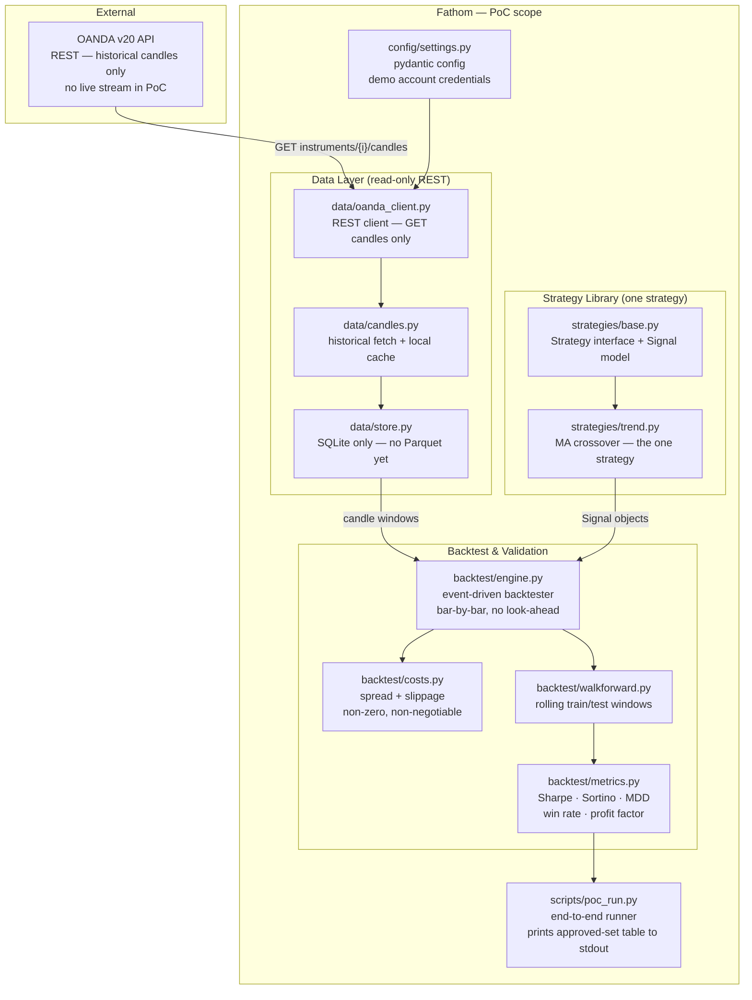

# Fathom — PoC

**Status:** Not started
**Depends on:** nothing — this is the foundation
**Unlocks:** [Phase 1](phase-1.md)
**Spec layer:** [product-spec.md](../product-spec.md) · [architecture-overview.md](../architecture-overview.md) · [invariants.md](../invariants.md)

---

## Purpose

Validate the two assumptions that determine whether the rest of the system is worth building:

1. **OANDA v20 is usable as a data source** — the REST API returns reliable historical candles for a representative set of pairs and timeframes, with the fidelity (bid/ask OHLC, correct timestamps, no gaps) required for honest backtesting.
2. **At least one quantitative strategy survives rigorous validation** — at least one (strategy, pair, timeframe) combination produces a positive Sharpe ratio in the out-of-sample window of a walk-forward backtest, after modelling spread and slippage costs.

If either assumption fails, the watchlist, execution, and monitoring infrastructure are waste. The PoC answers both questions with the minimum code that can do so honestly.

---

## Four-Question Diagnostic

| Question | Answer | Consequence |
|---|---|---|
| Natural demo points separated by weeks? | Yes — "data flows" and "edge exists" are distinct meaningful moments | Two clear checkpoints within the PoC |
| Load-bearing architectural thesis, risky enough to prove first? | Yes — strategy edge is the existential risk; no amount of infrastructure saves a system with no edge | PoC exists for exactly this reason |
| Independent dependency subgraphs? | Yes — research cluster (data + strategies + backtest) has no fan-out to signal, execution, or monitoring | PoC = research cluster only |
| Design thinking already converged on a split? | Yes — product spec Phase 1+2 maps directly to this scope | Trust it |

All four yes → this split is correct.

---

## Done When

- [ ] `fathom poc` script runs end-to-end without errors against the OANDA demo account
- [ ] Historical candles for at least 3 pairs (EURUSD, GBPUSD, USDJPY) at H1 and D timeframes are fetched, cached, and round-trip correctly from SQLite
- [ ] MA crossover strategy runs through the event-driven backtester on those pairs with costs applied (spread + slippage; both non-zero)
- [ ] Walk-forward validation report prints for at least one (strategy, pair, timeframe) combination
- [ ] Approved-set table is produced — even if empty (an empty table is a valid, honest PoC result)
- [ ] At least one entry in the approved-set has Sharpe ratio > 0 out-of-sample *(if none: revisit strategy parameters before starting Phase 1, do not proceed blindly)*
- [ ] All timestamps in output are UTC, RFC 3339 (INV-03)
- [ ] No OANDA credentials appear in any committed file (INV-08)

---

## Strict-Subset Architecture Diagram

Only components that exist and ship in the PoC. Everything greyed out in the full architecture is absent here.

**Not in this diagram (Phase 1+):** live stream, calendar/news, mean-reversion / momentum / breakout strategies, vectorised backtester, signal ranker, Hermes, CLI commands, risk module, execution engine, deviation monitor, admin panel.

---

## Components in Scope

| File | What it does in the PoC |
|---|---|
| `config/settings.py` | Pydantic `Settings` model: `env: demo\|live`, `oanda_api_token`, `oanda_account_id`, `oanda_base_url` (practice vs live). Read from `.env`. |
| `data/oanda_client.py` | Thin wrapper around `oandapyV20` (or `httpx`). PoC scope: `get_candles(instrument, granularity, count)` only. No streaming, no order methods. |
| `data/candles.py` | Fetch candles for a list of instruments × granularities. Cache to SQLite (skip fetch if cache row is fresh). Handles OANDA's 500-candle-per-request limit. |
| `data/store.py` | SQLite persistence. PoC schema: `candles(instrument, granularity, time, open_bid, high_bid, low_bid, close_bid, open_ask, …, volume)`. All timestamps UTC RFC 3339. |
| `strategies/base.py` | `Strategy` ABC with `generate_signals(df: DataFrame) -> list[Signal]`. `Signal` pydantic model: `instrument, direction, entry_ref, stop_distance, target_distance, strategy_name, timeframe, quality_score`. |
| `strategies/trend.py` | `MACrossover` strategy: short EMA crosses above/below long EMA → long/short signal. Parameterised by `fast_period`, `slow_period`. |
| `backtest/engine.py` | Event-driven engine. Iterates bar-by-bar in time order. Tracks open positions. Fills stops/targets intrabar (high/low breach). Calls `costs.py` on every fill. |
| `backtest/costs.py` | `apply_costs(signal, fill_price, direction) -> net_price`. Spread: half bid-ask spread on entry, half on exit. Slippage: configurable per-instrument fixed offset. No overnight swap in PoC (no multi-day positions yet). |
| `backtest/walkforward.py` | Rolling window walk-forward: `n` train periods + 1 test period, step forward by 1 period. Returns per-window metrics + aggregated out-of-sample equity. |
| `backtest/metrics.py` | Compute Sharpe, Sortino, max drawdown + duration, win rate, profit factor, average win/loss, expectancy, trade count. |
| `scripts/poc_run.py` | Ties it all together: fetch candles for target instruments → run MA crossover → walk-forward validation → print approved-set table (even if empty). |

---

## Explicitly Out of Scope

The following appear in the full architecture but are not built in the PoC. Do not add them.

- `data/stream.py` — live price stream (Phase 1)
- `data/calendar.py` — economic calendar + news (Phase 1)
- Parquet storage — SQLite is sufficient for PoC candle volumes (Phase 1)
- Instrument metadata fetch — hardcode the 3 PoC instruments (Phase 1)
- `strategies/mean_reversion.py`, `momentum.py`, `breakout.py` (Phase 1)
- Vectorised prototyping backtester (Phase 1, optional pre-screen tool)
- `signals/ranker.py`, `signals/portfolio.py` (Phase 2)
- `cli.py` with `fathom scan|watchlist|backtest|chart` (Phase 2)
- Hermes Agent integration (Phase 2)
- `hermes_integration/` — prompts, jobs, pre-trade check (Phase 2)
- `risk/` — sizing, limits, kill switch (Phase 3)
- `execution/` — orders, reconciliation (Phase 3)
- `monitoring/` — watcher, alerts (Phase 3)
- `panel/` — admin panel (Phase 4)

---

## PoC Instruments and Parameters

Start with a deliberately narrow scope to reduce fetch time and noise:

| Instrument | Granularities | History |
|---|---|---|
| EUR_USD | H1, D | 2 years |
| GBP_USD | H1, D | 2 years |
| USD_JPY | H1, D | 2 years |

MA crossover parameters to test: `fast=[10, 20]`, `slow=[50, 100, 200]` — 6 parameter combinations × 3 instruments × 2 timeframes = 36 walk-forward runs. Manageable, meaningful.

Walk-forward window: 12-month train / 3-month test, stepping 3 months. 5 test windows over 2 years of data.

---

## Open Questions

- **Swap costs in PoC?** MA crossover on H1 may produce multi-day positions. Leaving swap at zero in the PoC is acceptable *if* the approved-set table is labelled clearly as "no overnight financing modelled." Add swap before Phase 1 promotes any PoC-approved entries.
- **OANDA candle history depth?** OANDA's v20 API serves candle history in chunks; maximum depth is not officially documented. Empirically: D-granularity goes back years; M1 goes back months. The PoC uses H1 and D — these should have sufficient history.
- **Empty approved-set:** if no entry survives walk-forward, the PoC is still complete — it returned a valid answer. The project decision (try different strategies / different parameters / accept no edge exists) is a human call, not a code change.

---

## Invariants Active in PoC

- **INV-03** — all timestamps UTC, RFC 3339
- **INV-06** — backtest must model spread + slippage (at minimum; swap deferred, see above)
- **INV-08** — secrets in `.env`, never committed
