# Fathom — Architecture Overview

## Container Diagram

```mermaid
graph TD
    subgraph ext["External Systems"]
        OANDA["OANDA v20 API\nREST + HTTP stream"]
        LLM_API["LLM provider\nOpenAI-compatible (LLM_* env)"]
        CALENDAR["Economic Calendar\n+ News Feed"]
        TV["TradingView\nhuman dashboard — Pine paste (manual)"]
        DISCORD["Discord\ndeviation alerts only (webhook)"]
    end

    subgraph fathom["Fathom — standalone CLI"]
        CLI["cli.py\nfathom analyze | pine | scan | watchlist\nbacktest | execute | positions | reconcile | preflight"]

        subgraph data_layer["Data Layer"]
            CLIENT["oanda_client.py\nREST + streaming"]
            CANDLES["candles.py\nhistorical fetch + cache"]
            STREAM["stream.py\nlive price stream\nw/ reconnect + backoff"]
            CALENDAR_MOD["calendar.py\necon calendar + news"]
            STORE["store.py\nParquet + SQLite"]
        end

        subgraph strategy_layer["Strategy Library"]
            BASE["base.py\nStrategy interface + Signal model"]
            TREND["trend.py"]
            MR["mean_reversion.py"]
            MOM["momentum.py"]
            BRK["breakout.py"]
        end

        subgraph backtest_layer["Backtest & Validation"]
            ENGINE["engine.py\nevent-driven backtester"]
            COSTS["costs.py\nspread · slippage · commission · swap"]
            WF["walkforward.py"]
            METRICS["metrics.py"]
        end

        subgraph signal_layer["Signal Pipeline"]
            RANKER["ranker.py\nscore · filter · dedup · conflict policy"]
            PORTFOLIO["portfolio.py\ncorrelation + exposure limits"]
            SCAN["scan.py\norder-free run_scan"]
            PINE["pine.py\nwatchlist → Pine v6"]
        end

        subgraph ai_layer["AI Analysis (ai/)"]
            BRIEF["brief.py\nregime · market brief · session verdict"]
            NEWSRISK["news_risk.py\nin-process LLM + INV-02 parse"]
            NARRATE["narration.py\nadvisory text"]
            PRETRADE["pretrade_check.py\nin-process pre-trade veto"]
            LLM_CLIENT["llm_client.py\nOpenAICompatClient (INV-20)"]
        end

        subgraph risk_layer["Risk Module"]
            SIZING["sizing.py\nposition size from stop + 0.25% cap"]
            LIMITS["limits.py\nexposure · daily kill switch"]
        end

        subgraph exec_layer["Execution Engine"]
            ORDERS["orders.py\norder placement + brackets\nidempotency + retries"]
            RECONCILE["reconcile.py\nbroker-vs-db reconciliation"]
        end

        subgraph monitor_layer["Monitoring"]
            WATCHER["watcher.py\nalways-on deviation detection"]
            ALERTS["alerts.py\nDiscordWebhookClient"]
        end

        PANEL["panel/app.py\nStreamlit + TW Lightweight Charts\ncharts · blotter · equity · watchlist · deviation log"]
    end

    TRADER(("Trader"))

    %% External connections
    CLIENT -->|"REST + stream"| OANDA
    STREAM -->|"live ticks"| OANDA
    CALENDAR_MOD -->|"scheduled pull"| CALENDAR
    BRIEF & NEWSRISK & NARRATE & PRETRADE -->|"via LLM_CLIENT"| LLM_API
    ALERTS -->|"plain webhook"| DISCORD
    PINE -. "clipboard paste (human)" .-> TV
    ORDERS -->|"v20 REST"| OANDA
    RECONCILE -->|"v20 REST"| OANDA

    %% CLI entry
    CLI --> SCAN
    CLI --> RANKER
    CLI --> CANDLES
    CLI --> ENGINE
    CLI --> PINE
    CLI --> BRIEF
    CLI --> NEWSRISK
    CLI --> NARRATE
    CLI --> PRETRADE
    CLI --> SIZING
    CLI --> ORDERS
    CLI --> RECONCILE

    %% Internal flows
    CANDLES --> STORE
    STREAM --> STORE
    STORE --> ENGINE
    STORE --> RANKER
    STORE --> SCAN
    STORE --> PINE
    STORE --> PANEL
    BASE --> TREND & MR & MOM & BRK
    TREND & MR & MOM & BRK -->|"Signal objects"| RANKER
    ENGINE --> COSTS
    ENGINE --> WF
    ENGINE --> METRICS
    SCAN --> RANKER
    RANKER --> PORTFOLIO
    PORTFOLIO -->|"ranked candidates"| BRIEF
    BRIEF --> NEWSRISK --> NARRATE
    NEWSRISK & NARRATE -->|"analysis_log"| STORE
    PORTFOLIO -->|"Candidate[]"| PRETRADE
    PRETRADE -->|"proceed"| SIZING
    SIZING --> LIMITS
    LIMITS -->|"sized order"| ORDERS
    STREAM -->|"live feed"| WATCHER
    WATCHER --> ALERTS
    WATCHER --> PANEL
    ORDERS --> STORE

    %% User
    TRADER -->|"fathom analyze / pine / execute"| CLI
    TRADER -->|"pastes Pine"| TV
    TRADER -->|"monitors"| PANEL
```



---

## Architecture Decision Records

Load-bearing decisions, numbered and dated. Status: **accepted** (in force) or
**accepted — lands in phase-NN** (decided, implementation scheduled). A decision here
overrides any older prose elsewhere in this doc or in [spec.md](spec.md) that says
otherwise; the prose is redrawn when the implementing phase lands.

### ADR-001 — Standalone CLI platform; external orchestrator removed
**Date:** 2026-09-01 · **Status:** accepted (implemented in [phase-07](../phases/phase-07/phase.md))
Fathom is a self-contained CLI trading platform. The retired external Hermes Agent (cron
orchestration, Discord watchlist gateway) is gone; the LLM analysis it performed
(news-risk veto, narration) runs in-process on the ADR-002 adapter, and the daily
scheduled watchlist is replaced by on-demand analysis (ADR-004). INV-01 is unchanged in
substance — order authority stays behind the operator-only `fathom execute` gate; the
boundary is "no AI/analysis surface may import or invoke execution". **Supersedes**
spec.md Confirmed Decision #1 (Discord-via-Hermes delivery) and the Hermes half of
Decision #2 and #6.

### ADR-002 — Provider-agnostic OpenAI-compatible LLM adapter
**Date:** 2026-08-31 · **Status:** accepted (implemented in phase-06 / Workstream 1)
All LLM calls go through one `OpenAICompatClient` speaking the OpenAI chat-completions
wire format over httpx, selected via `LLM_API_KEY` / `LLM_BASE_URL` / `LLM_MODEL`
(OpenAI, Groq, NIM, OpenRouter, Ollama, …). No `anthropic` SDK dependency; no
per-provider code paths. INV-02 parse boundaries with fail-closed safe defaults wrap
every automated call; advisory surfaces use deterministic display fallbacks (INV-20).

### ADR-003 — TradingView posture: Pine Script out, nothing TradingView-derived in
**Date:** 2026-09-01 · **Status:** accepted (implemented in [phase-07](../phases/phase-07/phase.md))
TradingView has no retail write API; third-party "TradingView MCP" servers are
ToS-violating scrapers. Therefore **no TradingView-derived data ever enters the automated
pipeline** (settled in [implementation-plan.md](../implementation-plan.md) Workstream 2),
and the one sanctioned TradingView surface is *outbound*: Fathom generates a Pine v6
indicator from the persisted watchlist which the operator manually pastes into their own
charts. This replaces PNG chart rendering as the presentation layer (operator-confirmed
unused). Execution and market data stay on OANDA v20 exclusively.

### ADR-004 — On-demand analysis at trade time; no built-in scheduler
**Date:** 2026-09-01 · **Status:** accepted (implemented in [phase-07](../phases/phase-07/phase.md))
Analysis runs when the operator sits down to trade — one `fathom analyze` command (scan →
session brief / regime tags → news-risk → narration → Pine) — not on a cron schedule, and
with no scheduler daemon inside Fathom. Discord watchlist delivery is retired (ADR-001);
terminal + TradingView is the delivery surface. (The deviation *monitor's* webhook
alerting is a separate concern and keeps its Discord channel.)

---

## Key Boundaries

### The AI / Analysis Boundary
`ai/` (brief, news-risk, narration, pretrade_check) and `signals/analyze` / `signals/pine`
may rank, annotate, veto, and explain — they **never** import or invoke execution. Order
authority lives solely behind operator-run `fathom execute`. See
[INV-01](invariants.md#inv-01--no-aianalysis-surface-may-place-orders).

### The LLM Boundary
LLM calls go through `ai/llm_client.py::OpenAICompatClient` only (INV-20):
1. **News/event-risk assessment** — in-process; structured `{event_risk, reason, suggest_action}` JSON per candidate; malformed → skip (INV-02).
2. **Session brief / regime / narration** — advisory; offline or parse failure → deterministic display fallback ("analysis unavailable"), never a trade veto.
3. **Pre-trade sanity check** — in-process immediately before order submission; veto aborts the trade; malformed → abort (INV-02).

### The Risk Gate
Every signal from the ranker passes through `risk/sizing.py` (0.25% equity cap, stop-derived lot size) and `risk/limits.py` (exposure, correlation, daily kill switch) before reaching the execution engine. The gate is deterministic Python, fully unit-tested, and cannot be bypassed. See [INV-04](invariants.md#inv-04--every-trade-has-a-bracket-stop-loss--take-profit) and [INV-05](invariants.md#inv-05--per-trade-risk-capped-at-025-of-equity).

### The Demo/Live Switch
One code path; two endpoints. The `env: demo | live` switch in config selects the OANDA practice vs live endpoint and token. `oanda_client.py` is the only reader of `env` for **endpoint** selection. Execution/risk/monitoring **mechanics** stay env-free; the sanctioned `cli.py` / `live_gate.py` / `signals/analyze.py` exceptions are listed on [INV-09](invariants.md#inv-09--demo-and-live-share-one-code-path) (operator-boundary go-live gate + demo-only measurement-write skip until INV-07).

---

## Data Flow — On-demand Analyze (`fathom analyze`)

```
Operator runs fathom analyze
  → signals.scan.run_scan (order-free)
      → refresh candles + calendar as needed
      → rank approved (strategy, pair, timeframe) combos
      → PortfolioLimiter → persist watchlist
  → ai.brief.session_analysis (full watchlist context)
  → per candidate: ai.news_risk.news_risk_check (INV-02 skip default)
  → survivors: ai.narration.narrate
  → append analysis_log rows
  → signals.pine → stdout + clipboard (paste into TradingView)
```

Offline (`LLM_API_KEY` unset): zero network; news-risk → skip; advisory surfaces →
deterministic fallback text.

## Data Flow — Trade Execution (demo)

```
Operator: fathom execute <candidate-ref>
  → load candidate from latest watchlist
  → fresh reconcile
  → ai.pretrade_check (INV-02 abort default)
  → risk/sizing.py → risk/limits.py
  → execution/orders.py: bracket order to OANDA v20 REST
  → store.py: record fill
  → monitor/watcher.py: track against live stream
```

---

## Repository Layout

```
fathom/
├── CLAUDE.md
├── cli.py                         # fathom analyze|pine|scan|watchlist|backtest|execute|…
├── pyproject.toml
├── .env.example
├── config/
│   └── settings.py                # pydantic config, demo/live switch
├── data/
│   ├── oanda_client.py
│   ├── candles.py
│   ├── stream.py
│   ├── calendar.py
│   └── store.py
├── strategies/
│   ├── base.py                    # Strategy interface + Signal model
│   ├── trend.py
│   ├── mean_reversion.py
│   ├── momentum.py
│   └── breakout.py
├── backtest/
│   ├── engine.py
│   ├── costs.py
│   ├── walkforward.py
│   └── metrics.py
├── signals/
│   ├── ranker.py
│   ├── portfolio.py
│   ├── scan.py
│   ├── analyze.py
│   └── pine.py
├── ai/
│   ├── llm_client.py
│   ├── brief.py
│   ├── news_risk.py
│   ├── narration.py
│   ├── pretrade_check.py
│   └── prompts/
├── risk/
│   ├── sizing.py
│   └── limits.py
├── execution/
│   ├── orders.py
│   └── reconcile.py
├── monitoring/
│   ├── watcher.py
│   └── alerts.py
├── panel/
│   └── app.py
├── docs/
│   ├── product/
│   ├── features/
│   ├── phases/
│   └── reference/
└── tests/
```

---

## Technology Stack

| Layer | Technology | Notes |
|---|---|---|
| Language | Python 3.11+ | Typed (`pydantic`), structured logging |
| OANDA | `oandapyV20` / `httpx` | v20 REST + HTTP streaming (not WebSocket) |
| Data | `pandas` / `numpy` | Parquet via `pyarrow` |
| Backtest | custom event-driven engine + walk-forward | Full-cost; no look-ahead |
| Orchestration | none in-process | Operator CLI only (ADR-001 / ADR-004) |
| LLM | OpenAI-compatible adapter over httpx | `LLM_*` env; INV-02 / INV-20 |
| Presentation | Pine Script v6 (stdout + clipboard) | Manual TradingView paste (ADR-003) |
| Config + models | `pydantic` v2 | All Signal/Order/Candidate objects; config validation |
| Storage | SQLite → PostgreSQL/TimescaleDB; Parquet | Operational state + candle/tick archive |
| Admin panel | Streamlit + TradingView Lightweight Charts | Apache 2.0; attribution logo required |
| Alerts | Discord webhook (optional) | Deviation monitor only — not watchlist delivery |
| Quality | `pytest`, mypy, CI | Heavy coverage on risk + execution + AI parse boundaries |
