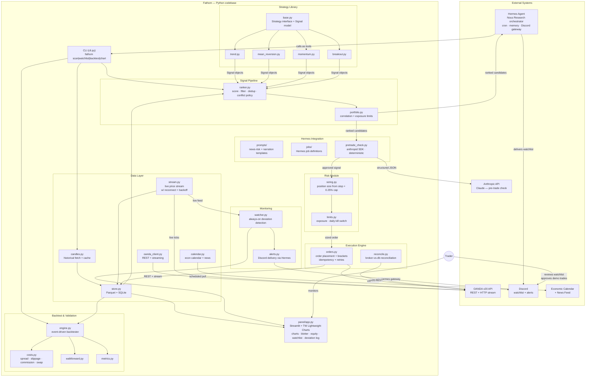

# Fathom — Architecture Overview

## Container Diagram



---

## Architecture Decision Records

Load-bearing decisions, numbered and dated. Status: **accepted** (in force) or
**accepted — lands in phase-NN** (decided, implementation scheduled). A decision here
overrides any older prose elsewhere in this doc or in [spec.md](spec.md) that says
otherwise; the prose is redrawn when the implementing phase lands.

### ADR-001 — Standalone CLI platform; Hermes orchestrator removed
**Date:** 2026-09-01 · **Status:** accepted — lands in [phase-07](../phases/phase-07/phase.md)
Fathom becomes a self-contained CLI trading platform. The external Hermes Agent (cron
orchestration, Claude calls, Discord gateway) is removed; the LLM analysis it performed
(news-risk veto, narration) moves in-process onto the ADR-002 adapter, and the daily
scheduled watchlist is replaced by on-demand analysis (ADR-004). INV-01 is unchanged in
substance — order authority stays behind the operator-only `fathom execute` gate; the
"Hermes must not place orders" boundary becomes "no AI/analysis surface may import or
invoke execution". **Supersedes** spec.md Confirmed Decision #1 (Discord-via-Hermes
delivery) and the Hermes half of Decision #2 and #6.

### ADR-002 — Provider-agnostic OpenAI-compatible LLM adapter
**Date:** 2026-08-31 · **Status:** accepted (implemented in phase-06 / Workstream 1)
All LLM calls go through one `OpenAICompatClient` speaking the OpenAI chat-completions
wire format over httpx, selected via `LLM_API_KEY` / `LLM_BASE_URL` / `LLM_MODEL`
(OpenAI, Groq, NIM, OpenRouter, Ollama, …). No `anthropic` SDK dependency; no
per-provider code paths. INV-02 parse boundaries with fail-closed safe defaults wrap
every call.

### ADR-003 — TradingView posture: Pine Script out, nothing TradingView-derived in
**Date:** 2026-09-01 · **Status:** accepted — Pine output lands in [phase-07](../phases/phase-07/phase.md)
TradingView has no retail write API; third-party "TradingView MCP" servers are
ToS-violating scrapers. Therefore **no TradingView-derived data ever enters the automated
pipeline** (settled in [implementation-plan.md](../implementation-plan.md) Workstream 2),
and the one sanctioned TradingView surface is *outbound*: Fathom generates a Pine v6
indicator from the persisted watchlist which the operator manually pastes into their own
charts. This replaces PNG chart rendering as the presentation layer (operator-confirmed
unused). Execution and market data stay on OANDA v20 exclusively.

### ADR-004 — On-demand analysis at trade time; no built-in scheduler
**Date:** 2026-09-01 · **Status:** accepted — lands in [phase-07](../phases/phase-07/phase.md)
Analysis runs when the operator sits down to trade — one `fathom analyze` command (scan →
news-risk → regime tag → market brief → session verdict → narration → Pine) — not on a
cron schedule, and with no scheduler daemon inside Fathom. Discord watchlist delivery is
retired with the Hermes job (ADR-001); terminal + TradingView is the delivery surface.
(The deviation *monitor's* webhook alerting is a separate concern and keeps its channel.)

---

## Key Boundaries

### The Hermes Boundary
Hermes Agent orchestrates everything up to and including the ranked watchlist. It calls `fathom scan` / `fathom chart` as CLI tools, runs Claude to assess news/event risk and write rationale, and delivers the result to Discord. **Hermes's authority ends at the watchlist.** It never calls the execution engine or places orders. See [INV-01](invariants.md#inv-01--hermes-must-not-place-orders).

### The Claude Boundary
Claude is used in exactly two ways inside the Fathom pipeline:
1. **News/event-risk assessment** — inside Hermes sessions; produces a structured `{event_risk, reason, suggest_action}` JSON payload per pair.
2. **Pre-trade sanity check** — a deterministic call via the `anthropic` SDK immediately before order submission; a veto blocks the trade. Both return structured JSON; malformed → safe default (skip). See [INV-02](invariants.md#inv-02--all-claude-outputs-feeding-automation-must-be-structured-json-with-safe-defaults).

### The Risk Gate
Every signal from the ranker passes through `risk/sizing.py` (0.25% equity cap, stop-derived lot size) and `risk/limits.py` (exposure, correlation, daily kill switch) before reaching the execution engine. The gate is deterministic Python, fully unit-tested, and cannot be bypassed. See [INV-04](invariants.md#inv-04--every-trade-has-a-bracket-stop-loss--take-profit) and [INV-05](invariants.md#inv-05--per-trade-risk-capped-at-025-of-equity).

### The Demo/Live Switch
One code path; two endpoints. The `env: demo | live` switch in config selects the OANDA practice vs live endpoint and token. `oanda_client.py` is the only reader of `env` for **endpoint** selection. Execution/risk/monitoring **mechanics** stay env-free; the sanctioned `cli.py` / `live_gate.py` / `signals/analyze.py` exceptions are listed on [INV-09](invariants.md#inv-09--demo-and-live-share-one-code-path) (operator-boundary go-live gate + demo-only measurement-write skip until INV-07).

---

## Data Flow — Daily Watchlist Run

```
Hermes cron trigger
  → fathom scan
      → data layer refreshes candles + calendar
      → strategy library evaluates all approved (strategy, pair, timeframe) combos
      → signal ranker scores, filters, de-duplicates, applies portfolio limits
      → returns ranked candidate list
  → Hermes: Claude assesses news/event risk per candidate, writes rationale
  → fathom chart <pair> per surviving candidate
  → Hermes delivers ranked watchlist + charts to Discord
```

## Data Flow — Trade Execution (demo, Phase 4+)

```
Trader approves watchlist entry (on demo)
  → pretrade_check.py: final Claude sanity check via anthropic SDK
      → malformed or veto → abort
  → risk/sizing.py: lot size from stop distance + 0.25% equity cap
  → risk/limits.py: exposure + correlation + daily-loss checks
      → any limit breached → reject
  → execution/orders.py: submit bracket order to OANDA v20 REST
      → idempotent (client order ID); retries on network error
  → store.py: record fill
  → monitor/watcher.py: begins tracking against live stream
```

---

## Repository Layout

```
fathom/
├── CLAUDE.md
├── cli.py                         # fathom scan|watchlist|backtest|chart
├── pyproject.toml
├── .env.example
├── config/
│   └── settings.py                # pydantic config, demo/live switch
├── data/
│   ├── oanda_client.py
│   ├── candles.py
│   ├── stream.py
│   ├── calendar.py
│   └── store.py
├── strategies/
│   ├── base.py                    # Strategy interface + Signal model
│   ├── trend.py
│   ├── mean_reversion.py
│   ├── momentum.py
│   └── breakout.py
├── backtest/
│   ├── engine.py
│   ├── costs.py
│   ├── walkforward.py
│   └── metrics.py
├── signals/
│   ├── ranker.py
│   └── portfolio.py
├── hermes_integration/
│   ├── prompts/
│   ├── jobs/
│   └── pretrade_check.py
├── risk/
│   ├── sizing.py
│   └── limits.py
├── execution/
│   ├── orders.py
│   └── reconcile.py
├── monitoring/
│   ├── watcher.py
│   └── alerts.py
├── panel/
│   └── app.py
├── docs/
│   ├── product-spec.md            # scope, decisions, build phases
│   ├── invariants.md              # non-negotiable cross-cutting rules
│   ├── architecture-overview.md   # this file
│   ├── features/INDEX.md          # one-line feature summaries
│   └── forex-algo-trading-plan.md # original design narrative
└── tests/
```

---

## Technology Stack

| Layer | Technology | Notes |
|---|---|---|
| Language | Python 3.11+ | Typed (`pydantic`), `structlog` for logging |
| OANDA | `oandapyV20` / `httpx` | v20 REST + HTTP streaming (not WebSocket) |
| Data | `pandas` / `numpy` / `polars` | Parquet via `pyarrow` |
| Backtest | `backtesting.py` / `vectorbt` + custom event-driven | Prototype → validate |
| Orchestration | Hermes Agent (Nous Research) | Cron, memory, Discord gateway, Claude routing |
| LLM | Claude via Hermes + `anthropic` SDK | Hermes for daily reasoning; SDK for pre-trade check |
| Config + models | `pydantic` v2 | All Signal/Order objects; config validation |
| Storage | SQLite → PostgreSQL/TimescaleDB; Parquet | Operational state + candle/tick archive |
| Admin panel | Streamlit + TradingView Lightweight Charts | Apache 2.0; attribution logo required |
| Quality | `pytest`, mypy/pyright, CI | Heavy coverage on risk + execution |
